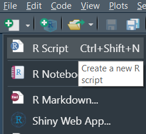

# Setup and Installation {#setup}

Every part of this document can be run on any computer that has R installed

You can also follow along with the tutorial without running the individual steps yourself. In that case, [**you can move on to the next page where the tutorial actually begins**](#overview).

## Option 1 - Run in the Cloud

If you do not currently have R and RStudio installed on your computer, you can run all of the code from your web browser one step at a time here: <a href="https://gesis.mybinder.org/binder/v2/gh/ries9112/Research-Paper-Example/0a23077a85848af214976c87d7d5d2472df700ee?filepath=Jupyter%2FCryptocurrency%20Research.ipynb" target="_blank">**this mobile friendly link**</a>.

This can take up to 30 seconds to load, and once it has you should see a page that looks like this:


**From here, you can run the code one cell at a time:**


*You can also use `Shift` + `Enter` to run an individual code cell*

**Or run all code cells at once:**


**If you feel lost and are not familiar with Jupyter Notebooks, you can do a quick interactive walkthrough under *Help --\> User Interface Tour*:**


## Option 2 - Run Locally

If you want to follow along from your own computer directly (recommended option), please follow the installation instructions below. Afterwards, you will be able to run the code. You only need to follow these instructions **once**. If you have followed these steps once already, [**skip ahead to the next section**](#overview).

### Setup R

If you do not already have **R** and **R Studio** installed on your computer, you will need to:

1.  [**Install R**](https://cran.revolutionanalytics.com/).


2.  [**Install RStudio**](https://rstudio.com/products/rstudio/download/). This step is optional, but it is **very recommended** that you use an integrated development environment [(IDE)](https://en.wikipedia.org/wiki/Integrated_development_environment) like RStudio as you follow along, rather than just using the R console as it was installed in step 1 above.


3.  Once RStudio is installed, run the application on your computer and you are ready to run the code as it is shown below and in the rest of this document!

You can run your code directly through the **Console** (what you are prompted to write code into when RStudio boots up), or create a new document to save your code as you go along: 

You will then be able to save your document with the .R extension on your computer and re-run your code line by line.

### Installing and Loading Packages {#installing-and-loading-packages}

[ADD HERE] describe how to install packages, what they are, etc... like high-level version.

```{r install_pacman, eval=F}
install.packages('pacman')
```

Load pacman:

```{r load_pacman}
library(pacman)
```

Install other packages:

```{r install_all_other_packages}
p_load('pins','tidyverse','skimr','tsibble','doParallel','DT', 'caret','anytime', # Data Exploration + Data Prep
       'ggTimeSeries','gifski','av', 'magick', 'ggthemes', 'plotly', 'ggpubr', # VIsualization
       'ggforce','gganimate', 'transformr', # Visualization continued
       'xgboost','gbm','deepnet') # Predictive Modeling
```

Nice work! Now you have everything you need to [follow along with this example](#overview).

### GitHub Repository

Because this document is produced through a free **C**ontinuous **I**ntegration (CI) tool called **GitHub Actions**, it is also really easy for anyone to use the same code on their own computer to produce this document using the latest available data (or even automate their own process).

If you wanted to render this document in its entirety yourself, here is how you would do it using the application RStudio:

1.  Create a copy of the GitHub project on your own computer by clicking on the button in the top right of the user interface to create a **New Project**: <!-- [TODO - ADD SCREENSHOT] -->

2.  Run the code **`install.packages('bookdown')`** to install the [**Bookdown**]{style="color: orange;"} package.

3.  Now you can run this document you are currently seeing on your own computer by running the command **`bookdown::render_book('index.Rmd')`**, which should take about one hour to execute. Once it is finished, the results will update in the \*\*\_book\*\* folder, and you can view the document by clicking on any .html file contained within that folder.

    -   You can find more information around using and editing the **bookdown** format here: https://bookdown.org/yihui/bookdown/introduction.html
    
    - Feel free to open an **issue** on the GitHub Repository if you are running into any problems: https://github.com/ries9112/cryptocurrencyresearch-org/issues
