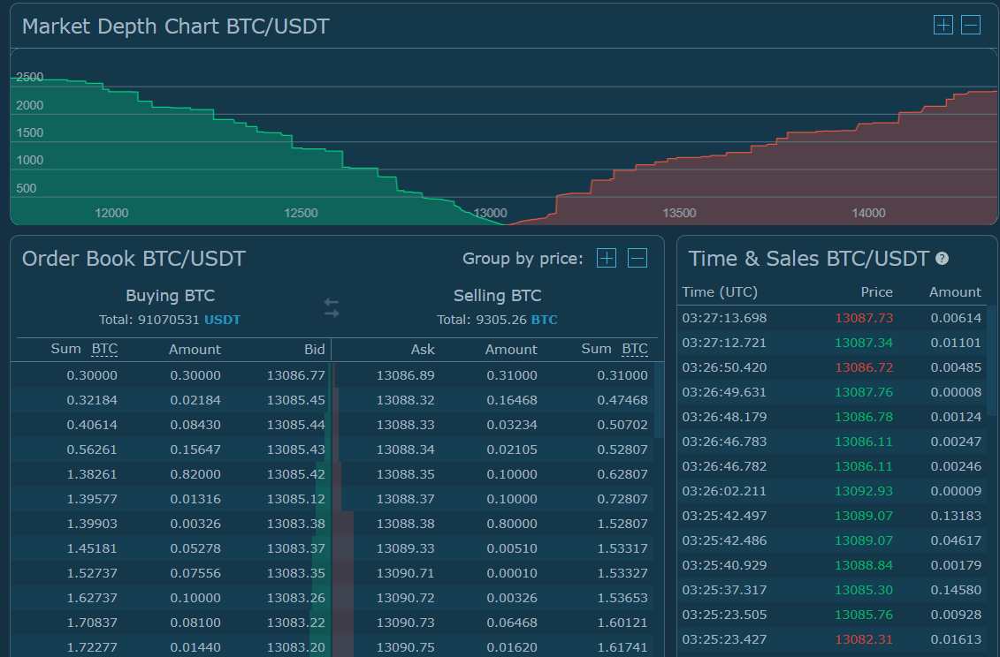

# Explore the Data {#explore-data}

```{r load_pacman}
library(pacman)
```

[**pacman**]{style="color: #ae7b11;"} does not refer to the videogame, and stands for [***pac***]{style="color: #ae7b11;"}***kage*** [***man***]{style="color: #ae7b11;"}***ager***. After we importing this package, we can now use new functions that come with it. 

### Install All Other Packages
We can use [**p_load()**]{style="color: green;"} to install the remaining packages we will need for the rest of the tutorial. The advantage to using the new function, is the installation will happen in a “smarter” way, where **if you already have a package in your library, it will not be installed again**.


```{r install_all_other_packages, warning=F, message=F}
p_load('pins', 'skimr', 'DT', 'httr', 'jsonlite', # Data Exploration 
       'tidyverse', 'tsibble', 'anytime', # Data Prep
       'ggTimeSeries', 'gifski', 'av', 'magick', 'ggthemes', 'plotly', # Visualization
       'ggpubr', 'ggforce', 'gganimate', 'transformr', # Visualization continued
       'caret', 'doParallel', 'xgboost', 'gbm', 'deepnet', # Predictive Modeling
       'hydroGOF', 'formattable', 'knitr') # Evaluate Model Performance
```

## Pull the Data

The first thing we will need to do is download the latest data. We will do this by using the [**pins**]{style="color: #ae7b11;"} package [@R-pins], which has already been loaded into our session [in the previous section](#installing-and-loading-packages).

First, we will need to connect to a public GitHub repository (anyone can post their code to the GitHub website and make a "repository" with code for their project) and ***register*** the ***board*** that the data is ***pinned*** to by using the [**board_register()**]{style="color: green;"} function:

```{r hitBTC_register}
board_register(name = "pins_board", 
               url = "https://raw.githubusercontent.com/predictcrypto/pins/master/", 
               board = "datatxt")
```

By running the [**board_register()**]{style="color: green;"} command on the URL where the data is located, we can now ***"ask"*** for the data we are interested in, which is called [**hitBTC_orderbook**]{style="color: blue;"}, by using the [**pin_get()**]{style="color: green;"} command:

```{r pull_data, eval=FALSE}
cryptodata <- pin_get(name = "hitBTC_orderbook")
```

<!-- Couldn't hide the progress bar so split it into a hidden code chunk instead -->

```{r pull_data_hidden_exec, include=FALSE}
cryptodata <- pin_get(name = "hitBTC_orderbook")
```

The data has been saved to the [**cryptodata**]{style="color: blue;"} object.

## Data Preview {#data-preview}

```{r disable_scientific_notation, include=F}
options(scipen=999)
```

Below is a preview of the data:

```{r show_cryptodata, echo=F, message=FALSE, warning=FALSE}
library(DT)
datatable(head(relocate(cryptodata, date_time_utc, .before = pair), 2000),  style = "default", 
          options = list(scrollX = TRUE, pageLength=3, lengthMenu = c(3, 5, 10)), rownames = F)
```

*Only the first 2,000 rows of the data are shown in the table above. There are `r nrow(cryptodata)` rows in the actual full dataset. The latest data is from `r max(cryptodata$date, na.rm =T )` (UTC timezone).*

This is [[***tidy***]{style="color: purple;"} ***data***](https://tidyr.tidyverse.org/articles/tidy-data.html), meaning:

1.  Every column is a variable.

2.  Every row is an observation.

3.  Every cell is a single value relating to a specific variable and observation.

The data is collected once per hour. Each row is an observation of an individual cryptocurrency, and the same cryptocurrency is tracked on an hourly basis, each time presented as a new row in the dataset.

## The definition of a "price" {#the-definition-of-a-price}

When we are talking about the price of a cryptocurrency, there are several different ways to define it and there is a lot more than meets the eye. Most people check cryptocurrency "prices" on websites that aggregate data across thousands of exchanges, and have ways of computing a global average that represents the current "price" of the cryptocurrency. This is what happens on the very popular website coinmarketcap.com, but is this the correct approach for our use case?

Before we even start programming, a crucial step of any successful predictive modeling process is defining the problem in a way that makes sense in relation to the actions we are looking to take. If we are looking to trade a specific cryptocurrency on a specific exchange, using the global average price is not going to be the best approach because we might create a model that believes we could have traded at certain prices when this was actually not the case. If this was the only data available we could certainly try and extrapolate trends across all exchanges and countries, but a better alternative available to us is to define the price as the price that we could have **actually purchased** the cryptocurrency at. If we are interested in purchasing a cryptocurrency, we should consider data for the price we could have actually purchased it at.

### Order Book

A cryptocurrency exchange works by having a constantly evolving [[***order book***]{style="color: purple;"}](https://www.investopedia.com/terms/o/order-book.asp), where traders can post specific trades they want to make to either sell or buy a cryptocurrency specifying the price and quantity. When someone posts a trade to sell a cryptocurrency at a price that someone else is looking to purchase it at, a trade between the two parties will take place.

**You can find the live order book for the exchange we will be using here: <https://hitbtc.com/btc-to-usdt>**

From that page you can scroll down to view specific information relating to the orderbooks: 


#### Market Depth
Let's focus on the **Market Depth Chart** for now: 

Here, the x-axis shows the price of the cryptocurrency, with the lower prices on the left and the higher ones on the right, while the y-axis shows the cumulative volume (here in terms of Bitcoins) of orders that could currently be triggered on each side (the "liquidity" of the market).

In the screenshot above, around the \$13,000 price point the market essentially "runs out" of people willing to buy the cryptocurrency, and for prices past that point people are looking to sell the asset. The screenshot shows there are many orders that are waiting to be fulfilled, around the \$12,500 price point shown for example the chart tells us that if we wanted to buy the cryptocurrency BTC at that price there would have to be about 1,500 BTC sold for more expensive prices before the order was triggered. The market will fulfill trades that are posted to the order book and match buyers and sellers. The price at which the two sides of the orderbook converge is the price we could currently trade the cryptocurrency on this exchange at.

Because the price works this way, we couldn't simply buy 1,500 BTC at the \$13,000 price point because we would run out of people who are willing to sell their BTC at that price point, and to fulfill the entire order we would need to pay more than what we would consider to be the "price" depending on how much we were looking to purchase. **This is [one of the many reasons for why any positive results shown here wouldn't necessarily produce an effective trading strategy if put into practice in the real world](#considerations). There is a meaningful difference between predicting price movements for the cryptocurrency markets, and actually performing effective trades, so please experiment and play around with the data as much as you'd like, but hold back the urge to use this data to perform real trades.**


#### Live Order Book

Below the Market Depth Chart we can find the actual data relating to the order books visualized above:


**The data we will be working with is comprised by the top 5 price points of the order book on each side**. We have access to the 5 highest [**bid**]{style="color: purple;"} prices (on the side looking to buy), and the 5 lowest [**ask**]{style="color: purple;"} prices (from traders looking to sell). In relation to the screenshot above, the data we are using would be made up of the first 5 rows shown only.

### In Summary

To summarize the implications of what was explained above, the data we are using gives us the 5 nearest prices on both sides of where the red and green lines connect on the Market Depth Chart, as well as the quantity available to purchase or sell at that given price point.

In order to make predictive models to predict the price of a cryptocurrency, we will first need to define the price as the lowest available price that allows us to buy "enough" of it based on the current orderbook data as described above.

## Data Quality {#data-quality}

Before jumping into actually cleaning your data, it's worth spending time doing some [**Exploratory Data Analysis (EDA)**]{style="color: purple;"}, which is the process of analyzing the data itself for issues before starting on any other process. Most data science and business problems will require you to have a deep understanding of your dataset and all of its caveats and issues, and without those fundamental problems understood and accounted for no model will make sense. In our case this understanding mostly comes from understanding how the price of a cryptocurrency is defined, which [we reviewed above](#the-definition-of-a-price), and there isn't too much else for us to worry about in terms of the quality of the raw data, but in other cases doing EDA will be a more involved process doing things like visualizing the different columns of the data. There are a *lot* of tools that can be used for this, but as an example we can use one of the [packages we already imported into the R session in the setup section](#installing-and-loading-packages) called [**skimr**]{style="color: #ae7b11;"} [@R-skimr] to get a quick overview/summary of the "quality" of the different columns that make up the data.

We can use the [**skim()**]{style="color: green;"} function on the [cryptodata]{style="color: blue;"} dataframe to get a summary of the data to help locate any potential data quality issues:

```{r skimr}
skim(cryptodata)
```

This summary helps us understand things like how many rows with missing values there are in a given column, or how the values are distributed. In this case there shouldn't be any major data quality issues, for example the majority of values should not be NA/missing. If you are noticing something different please [create an issue on the GitHub repository for the project](https://github.com/ries9112/cryptocurrencyresearch-org/issues).

One more optional section below for anyone who wants even more specific details around the entire process by which the data is collected and made available. Move on to the [next section](#data-prep), where we make the adjustments necessary to the data before we can start making visualizations and predictive models.

## Data Source Additional Details

**This section is optional for anyone who wants to know the** ***exact*** **process of how the data is sourced and refreshed**. 

The data is pulled without authentication requirements using a public API endpoint made available by the HitBTC cryptocurrency exchange (the one we are using). See the code below for an actual example of how the data was sourced that runs every time this document runs. Below is an example pulling the Ethereum (ETH) cryptocurrency, if you followed the [setup steps](#install-all-other-packages) you should be able to run the code below for yourself to pull the live order book data:

<!-- ```{r orderbooks_live_example_function} -->
<!-- get_response_content <- function(api_response) { -->
<!--   fromJSON(content(api_response, -->
<!--                    type = "text", -->
<!--                    encoding = "UTF-8"), -->
<!--           simplifyDataFrame = FALSE) -->
<!-- } -->
<!-- ``` -->

```{r show_orderbooks_live_example}
fromJSON(content(GET("https://api.hitbtc.com/api/2/public/orderbook/ETHUSD",
                     query=list(limit=5)),
                 type = "text",
                 encoding = "UTF-8"))
```

The data is collected by a script running on a private server (RStudio) that iterates through all cryptocurrency options one by one at the start of every hour, and writes all of the data to a private database. Once the data is in the database, a different script gets kicked off every hour to publish the latest data from the database to the publicly available data source [discussed at the beginning of this section](#pull-the-data).

***The chart shown below will be outlined digitally very soon (this is a note for Kai and Chandler)***: 
{width="600"}
