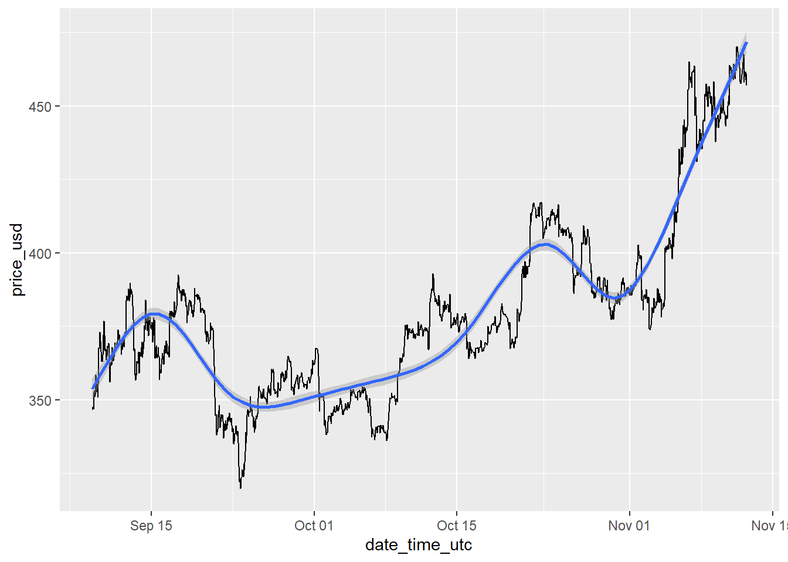
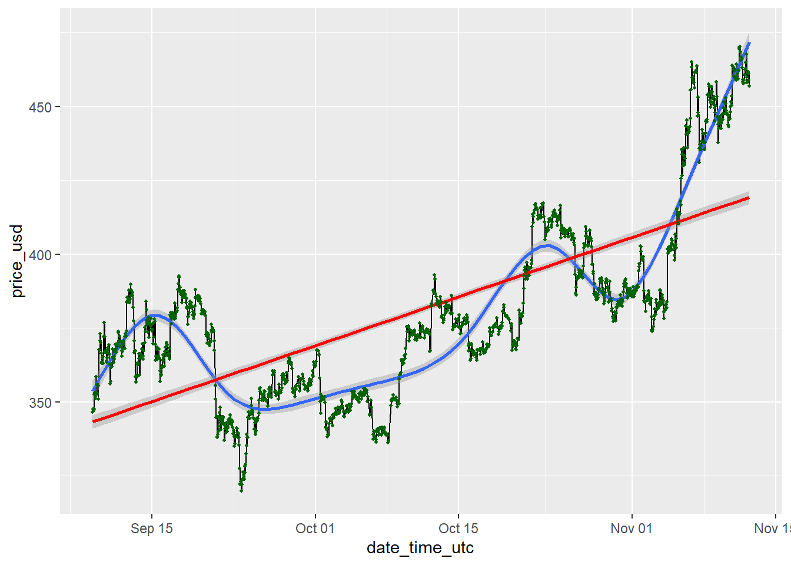
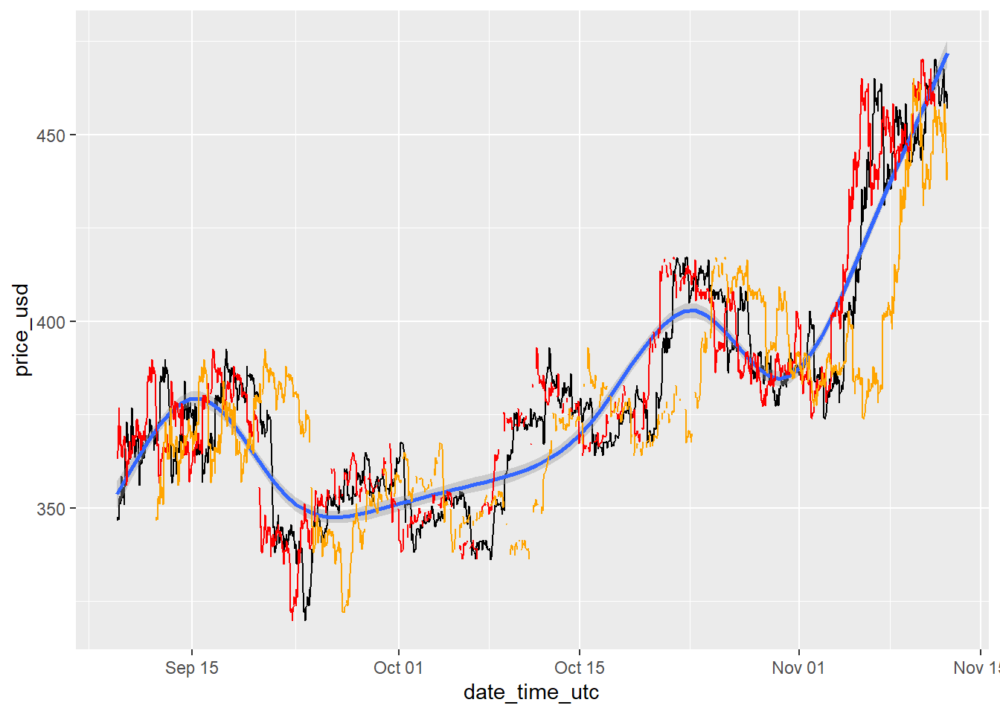

# Introduction {#introduction}


Welcome to this programming tutorial on machine learning!

In this tutorial we will use the latest data from the cryptocurrency markets to provide a hands-on and complete example that anyone can follow along with.

## What will I learn?

-   You will learn about the value of "reproducible" research.

-   In this tutorial you will primarily learn about tools for the R programming language developed by [RStudio](https://rstudio.com/) and more specifically the [`tidyverse`](https://www.tidyverse.org/). If you are not familiar with these open source products, don't worry. We'll introduce these throughout the tutorial as needed.

-   The focus of the tutorial is on supervised machine learning, a process for building models that can predict future events, such as cryptocurrency prices. You will learn how to use the [`caret`](https://topepo.github.io/caret/index.html) package to make many different predictive models, and tools to evaluate their performance.

-   Before we can make the models themselves, we will need to "clean" the data. You will learn how to perform "group by" operations on your data using the [`dplyr`](https://dplyr.tidyverse.org/) package and to clean and modify grouped data.

<!-- -   You will be exposed to some useful data pre-processing R packages. -->

-   You will learn to visualize data using the [`ggplot2`](https://ggplot2.tidyverse.org/) package, as well as some powerful [tools to extend the functionality of ggplot2](https://exts.ggplot2.tidyverse.org/).

-   You will gain a better understanding of the steps involved in any supervised machine learning process, as well as considerations you might need to keep in mind based on your specific data and the way you plan on acting on the predictions you have made. Each problem comes with a unique set of challenges, but there are steps that are necessary in creating any supervised machine learning model, and questions you should ask yourself regardless of the specific problem at hand.

<!-- - [TODO - Add note on cross validation] -->

-   You will also learn a little about cryptocurrencies themselves, but **this is not a tutorial centered around trading or blockchain technology**.

## Before Getting Started

You can toggle the sidebar on the left side of the page by clicking on the menu button in the top left, or by pressing on the **s** key on your keyboard. You can read this document as if it were a book, scrolling to the bottom of the page and going to the next "chapter", or navigating between sections using the sidebar.

This document is the tutorial itself, but in order to make the tutorial more accessible to people with less programming experience (or none) we created a [high-level version of this tutorial](https://cryptocurrencyresearch.org/high-level/), which simplifies both the problem at hand (what we want to predict) and the specific programming steps, but uses the same tools and methodology providing easier to digest examples on one cryptocurrency using a static dataset that does not get updated over time.

### High-Level Version {#high-level-version}

We recommend for everyone to run the code in the [high-level version first](https://cryptocurrencyresearch.org/high-level/) to get more comfortable with the tools we will be using. If you are not very familiar with programming in either R or Python, or are not sure what cryptocurrencies are, you should **definitely** work your way through the [high-level version first](https://cryptocurrencyresearch.org/high-level/).

Below is an embedded version of the high-level version, you can click on the presentation below and press the **`f`** button on your keyboard to full-screen it, or use any of the links above to view it in its own window:

<iframe src="https://cryptocurrencyresearch.org/high-level/" width="672" height="400px"></iframe>

\BeginKnitrBlock{infoicon}<div class="infoicon">When following along with the high-level tutorial embedded above, the results will be completely reproducible and the document is static and does not update over time meaning your results will exactly match those shown. The document you are currently reading this text on on the other hand updates every 12 hours. You will be able to access the same data source, but it updates hourly by the 8th minute of every hour with the most recent data, so this document and your results won't perfectly match.</div>\EndKnitrBlock{infoicon}

<!-- ### Approach taken -->

<!-- It is also worth mentioning that we will be taking a very practical approach to machine learning. Because we are modeling many cryptocurrencies independently at the same time and the dataset evolves as time passes, it becomes difficult to make a decision across the board in terms of what the "best model" to use is because it may change based on the specific cryptocurrency in question and/or over time. -->

<!-- [TODO - KEEP ADDING HERE?] -->

## Format Notes

-   You can hide the sidebar on the left by pressing the ***s*** key on your keyboard.

-   The cryptocurrency data was chosen to produce results that change over time and because these markets don't have any downtime (unlike the stock market).

<!-- [TODO - JUST LIKE THE HIGH LEVEL VERSION, WE WILL USE COLOR CODING] -->

-   Whenever an **R package** is referenced, the text will be [**colored orange**]{style="color: #ae7b11;"}. We will discuss ***R packages*** and the rest of the terms below later in this document, but if you are not familiar with these terms please look through the [high-level version first](https://cryptocurrencyresearch.org/high-level/).

-   Whenever a **function** is referenced, it will be [**colored green**]{style="color: green;"}.

-   Whenever an **R object** is referenced, it will be [**colored blue**]{style="color: blue;"}. We will also refer to the **parameters** of functions in [**blue**]{style="color: blue;"}.

-   When a **term** is particularly common in machine learning or data science, we will call it out with [**purple text**]{style="color: purple;"}, but only the first time it appears.

-   Whenever text is **`highlighted this way`**, that means it is a snippet of R code, which will usually be done to bring attention to specific parts of a longer piece of code.


## Plan of Attack

How will we generate predictive models to predict cryptocurrency prices? At a high level, here are the steps we will be taking:

1.  [Setup guide](#setup). Installation guide on getting the tools used installed on your machine.

2.  [Explore data](#explore-data). What ***is*** the data we are working with? How "good" is the "quality"?

3.  [Prepare the data](#data-prep). Make adjustments to "clean" the data based on the findings from the previous section to avoid running into problems when making models to make predictions.

4.  [Visualize the data](#visualization). Visualizing the data can be an effective way to understand relationships, trends and outliers before creating predictive models, and is generally useful for many different purposes. Definitely the most fun section!

5.  [Make predictive models](#predictive-modeling). Now we are ready to take the data available to us and use it to make predictive models that can be used to make predictions about future price movements using the latest data.

6.  [Evaluate the performance of the models](#evaluate-model-performance). Before we can use the predictive models to make predictions on the latest data, we need to understand how well we expect them to perform, which is also essential in detecting issues.

## Who is this example for?

Are you a Bob, Hosung, or Jessica below? This section provides more information on how to proceed with this tutorial.

-   **Bob (beginner)**: Bob is someone who understands the idea of predictive analytics at a high level and has heard of cryptocurrencies and is interested in learning more about both, but he has never used R. Bob would want to [opt for the more high-level version of this tutorial](https://cryptocurrencyresearch.org/high-level/). Bob might benefit from reading the free book ["R for Data Science"](https://r4ds.had.co.nz/) as well before attempting this tutorial.

-   **Hosung (intermediate)**: Hosung is a statistician who learned to use R 10 years ago. He has heard of the tidyverse, but doesn't regularly use it in his work and he usually sticks to base R as his preference. Hosung should start with the [**high-level version of this tutorial**](https://cryptocurrencyresearch.org/high-level/) and later return to this version.

-   **Jessica (expert)**: Jessica is a business analyst who has experience with both R and the Tidyverse and uses the pipe operator (**`%\>%`**) regularly. Jessica should skim over the high-level version before [**moving onto the next section**](#introduction) for the detailed tutorial.


## Reproducibility

One of the objectives of this document is to showcase the power of [**reproducibility**]{style="color: purple;"}. This tutorial does not provide coded examples on making code reproducible, but it's worth a quick discussion. The term itself is defined in different ways:

-   We can think of something as reproducible if anyone can run the exact same analysis and end up with our exact same results. This is how the [high-level version of the tutorial](#high-level-version) works.

-   Depending on our definition, we may consider something reproducible if we can run the same analysis that is shown on a newer subset of the data without running into problems. This is how this version works, where the analysis done on your own computer would be between 1 and 12 hours newer than the one shown on this document.

### The cost of non-reproducible research

Reproducibility is especially important for research in many fields, but is a valuable tool for anyone who works with data, even within a large corporation. If you work with Excel files or any kind of data, there are tools to be aware of that can save you a lot of time and money. Even if you do things that are "more involved", for example using your data to run your analysis separately and then putting together a presentation with screenshots of your results with commentary, this is also something you can automate for the future. If you do any kind of repeated manual process in Excel, chances are you would be better off creating a script that you can simply kick off to generate new results. 

Reproducibility is all about making the life of anyone who needs to run the analysis as simple as possible, including and especially for the author herself. When creating a one-time analysis, the tool used should be great for the specific task as well as have the side-effect of being able to run again with the click of a button. In our case are using a tool called [**R Markdown**]{style="color: purple;"} [@R-rmarkdown].
<!-- because if important discoveries are made others will want to perform their own experiments and analysis before they start being accepted as fact. -->

Not being transparent about the methodology and data (when possible) used is a quantifiable cost that should be avoided, both in research and in business. A study conducted in 2015 for example approximated that for preclinical research (mostly on pharmaceuticals) alone the economy suffers a cost of $28 Billion a year associated with non-reproducible research in the United States [@freedman_economics_2015]:

<embed src="images/TheEconomicsOfReproducibilityInPreclinicalRe.pdf" width="800px" height="460px" type="application/pdf" />

Reproducibility as discussed in the paper embedded above relates to many aspects of the specific field of preclinical research, but in their work they identified 4 main categories that drove costs associated with irreproducibility as it pertains to preclinical research in the United States: 


The "Data Analysis and Reporting" aspect (circled in red in the screenshot above) of a project is shared across many disciplines. As it related to preclinical research, in their breakdown they attribute roughly $7.19 Billion of the costs of irreproducible preclinical research to data analysis and reporting, which could potentially be avoided through the usage of open source tools that we are utilizing for this tutorial. These costs should pale in comparison to the other three categories, and this example is meant to show that there currently exists a costly lack of awareness around these tools; the tutorial itself is meant as an example to showcase the power of these free tools.

<!-- In business reproducibility can be really valuable as well, being able to run an analysis with the click of a button can save a business a lot of money, and the open source tools available through R and Python  -->

### GitHub

<!-- To that end, rather than saying "this document can be refreshed at any point", the tutorial itself is not only reproducible (in terms of performing the same analysis for the future), but is in fact run on a recurring schedule. -->

As of 2020, the most popular way of sharing open source data science work is through a website called [[**GitHub**](https://github.com/)]{style="color: purple;"} which allows users to publicly share their code and do much more. This document gets refreshed using a tool called [[**Github Actions**](https://github.com/features/actions)]{style="color: purple;"} that runs some code and updates the file you are looking at on the public **GitHub** [**Repository**]{style="color: purple;"} for the project. The website then updates to show the latest version every time the document is refreshed on the GitHub repository.

<!-- [TODO - INTRODUCE GITHUB HERE] -->

#### GitHub Repository

The public **GitHub Repository** associated with this tutorial is not only a website for us to easily distribute all the code behind this document for others to view and use, but also where it actually runs. By clicking on the option that looks like an eye in the options given at the top of the document, you can view the raw code for the page you are currently viewing on the GitHub repository. Every 12 hours, a process gets kicked off on the page associated with our project on GitHub.com and refreshes these results. Anyone can view the latest runs as they execute over time here: <https://github.com/ries9112/cryptocurrencyresearch-org/actions>

In the [next section](#setup) we will talk more about the GitHub Repository for this tutorial, for now you can check on the latest run history for this document, which is expected to update every 12 hours every day: <https://github.com/ries9112/cryptocurrencyresearch-org/actions>

<!-- If you are seeing ✅ associated with the most recent runs at the link above, that means you are looking at a version that refreshed in the last 12 hours. If you are seeing red ❌ on the latest runs, you may be looking at an older analysis, but that should not be the case, check the timestamp at the top of this document to be sure. -->

If you are running into problems using the code or notice any problems, please let us know by creating an ***issue*** on the GitHub repository: <https://github.com/ries9112/cryptocurrencyresearch-org/issues>

Go to the [next section](#setup) for instruction on getting setup to follow along with the code run in the tutorial. You can run every step either in the cloud on your web browser, or in your own R session. You can even make a copy of the GitHub Repository on your computer and run this "book" on the latest data (updated hourly), and make changes wherever you would like. All explained in the next section ➡️

## Disclaimer

\BeginKnitrBlock{rmdimportant}<div class="rmdimportant">This tutorial is made available for learning and educational purposes only and the information to follow does not constitute trading advice in any way shape or form. We avoid giving any advice when it comes to trading strategies, as this is a very complex ecosystem that is out of the scope of this tutorial; we make no attempt in this regard, and if this, rather than data science, is your interest, your time would be better spent following a different tutorial that aims to answer those questions.</div>\EndKnitrBlock{rmdimportant}

It should also be noted that this tutorial has nothing to do with trading itself, and that there is a difference between predicting crypotcurrency prices and creating an effective trading strategy. [See this later section for more details on why the results shown in this document mean nothing in terms of the effectiveness of a trading strategy](#considerations).

In this document we aimed to predict the change in cryptocurrency prices, and **it is very important to recognize that this is not the same as being able to successfully make money trading on the cryptocurrency markets**. 


<!--chapter:end:index.Rmd-->

# Setup and Installation {#setup}

Every part of this document can be run on any computer either through a cloud notebook or locally.

You can also follow along with the tutorial without running the individual steps yourself. In that case, [**you can move on to the next page where the tutorial actually begins**](#overview).

## Option 1 - Run in the Cloud {#run-in-the-cloud}

If you do not currently have R and RStudio installed on your computer, you can run all of the code from your web browser one step at a time here: <a href="https://gesis.mybinder.org/binder/v2/gh/ries9112/Research-Paper-Example/0a23077a85848af214976c87d7d5d2472df700ee?filepath=Jupyter%2FCryptocurrency%20Research.ipynb" target="_blank">**this mobile friendly link**</a>.

This can take up to 30 seconds to load, and once it has you should see a page that looks like this:


**From here, you can run the code one cell at a time:**


*You can also use `Shift` + `Enter` to run an individual code cell*

**Or run all code cells at once:**


**If you feel lost and are not familiar with Jupyter Notebooks, you can do a quick interactive walkthrough under *Help --\> User Interface Tour*:**


## Option 2 - Run Locally

If you want to follow along from your own computer directly (recommended option), please follow the installation instructions below. Afterwards, you will be able to run the code. You only need to follow these instructions **once**. If you have followed these steps once already, [**skip ahead to the next section**](#overview).

### Setup R

If you do not already have **R** and **R Studio** installed on your computer, you will need to:

1.  [**Install R**](https://cran.revolutionanalytics.com/).


2.  [**Install RStudio**](https://rstudio.com/products/rstudio/download/). This step is optional, but it is **very recommended** that you use an integrated development environment [(IDE)](https://en.wikipedia.org/wiki/Integrated_development_environment) like RStudio as you follow along, rather than just using the R console as it was installed in step 1 above.


3.  Once RStudio is installed, run the application on your computer and you are ready to run the code as it is shown below and in the rest of this document!

You can run your code directly through the **Console** (what you are prompted to write code into when RStudio boots up), or create a new document to save your code as you go along: 

You will then be able to save your document with the .R extension on your computer and re-run your code line by line.

### Install and Load Packages {#installing-and-loading-packages}

Packages are collections of functions and data that other users have made shareable outside of the functionality provided by the *base* functionality of R that comes pre-loaded every time a new session is started. We can install these packages into our own library of R tools and load them into our R session, which can enable us to write powerful code with minimal effort compared to writing the same code without the additional packages. Many packages are simply time savers for things we could do with the default/base functionality of R, but sometimes if we want to do something like make a static chart interactive when hovering over points on the chart, we are better off using a package someone already came up with rather than re-inventing the wheel for a difficult task.

### Install Pacman

Let's start by installing the [**pacman**]{style="color: #ae7b11;"} package [@R-pacman] using the function [**install.packages()**]{style="color: green;"}:


```r
install.packages('pacman')
```
We only need to install any given package once on any given computer, kind of like installing an application (like RStudio or Google Chrome) once before being able to use it. When you boot-up your computer it doesn't open every application you have installed and similarly here we choose what functionality we need for our current session by importing packages. All functionality that is made available at the start (foundational functions like [mean()]{style="color: green;"} and [max()]{style="color: green;"}) of an R session is referred to as *Base R*, functionality from other packages needs to be loaded using the [**library()**]{style="color: green;"} function.

### Load Pacman
We can load the [**pacman**]{style="color: #ae7b11;"} package using the [**library()**]{style="color: green;"} function:


```r
library(pacman)
```

[**pacman**]{style="color: #ae7b11;"} does not refer to the videogame, and stands for [***pac***]{style="color: #ae7b11;"}***kage*** [***man***]{style="color: #ae7b11;"}***ager***. After we importing this package, we can now use new functions that come with it. 

### Install All Other Packages
We can use [**p_load()**]{style="color: green;"} to install the remaining packages we will need for the rest of the tutorial. The advantage to using the new function, is the installation will happen in a “smarter” way, where **if you already have a package in your library, it will not be installed again**.


```r
p_load('pins', 'skimr', 'DT', 'httr', 'jsonlite', # Data Exploration 
       'tidyverse', 'tsibble', 'anytime', # Data Prep
       'ggTimeSeries', 'gifski', 'av', 'magick', 'ggthemes', 'plotly', # Visualization
       'ggpubr', 'ggforce', 'gganimate', 'transformr', # Visualization continued
       'caret', 'doParallel', 'parallel', 'xgboost', 'gbm', 'deepnet', # Predictive Modeling
       'hydroGOF', 'formattable', 'knitr') # Evaluate Model Performance
```
***It is normal for this step to take a long time, as it will install every package you will need to follow along with the rest of the tutorial.*** The next time you run this command it would be much faster because it would skip installing the already installed packages.

Running **p\_load()** is equivalent to running [**install.packages()**]{style="color: green;"} on each of the packages listed **(but only when they are not already installed on your computer)**, and then running [library()]{style="color: green;"} for each package in quotes separated by commas to import the functionality from the package into the current R session. **Both commands are wrapped inside the single function call to** [**p\_load()**]{style="color: green;"}. We could run each command individually using base R and create our own logic to only install packages not currently installed, but we are better off using a package that has already been developed and scrutinized by many expert programmers; the same goes for complex statistical models, we don't need to create things from scratch if we understand how to properly use tools developed by the open source community. Open source tools have become particularly good in recent years and can be used for any kind of work, including commercial work, most large corporations have started using open source tools available through R and Python.

Nice work! Now you have everything you need to [follow along with this example](#overview) ➡️.

<!-- ### GitHub (KEEP OR DEL?) -->

<!-- Because this document is produced through a free **C**ontinuous **I**ntegration (CI) tool called **GitHub Actions**, it is also really easy for anyone to use the same code on their own computer to produce this document using the latest available data (or even automate their own process). -->

<!-- If you wanted to render this document in its entirety yourself, here is how you would do it using the application RStudio: -->

<!-- 1.  Create a copy of the GitHub project on your own computer by clicking on the button in the top right of the user interface to create a **New Project**: <!-- [TODO - ADD SCREENSHOT] -->

<!-- 2.  Run the code **`install.packages('bookdown')`** to install the [**Bookdown**]{style="color: orange;"} package. -->

<!-- 3.  Now you can run this document you are currently seeing on your own computer by running the command **`bookdown::render_book('index.Rmd')`**, which should take about one hour to execute. Once it is finished, the results will update in the \*\*\_book\*\* folder, and you can view the document by clicking on any .html file contained within that folder. -->

<!--     -   You can find more information around using and editing the **bookdown** format here: https://bookdown.org/yihui/bookdown/introduction.html -->

<!--     - Feel free to open an **issue** on the GitHub Repository if you are running into any problems: https://github.com/ries9112/cryptocurrencyresearch-org/issues -->

<!--chapter:end:01-Setup.Rmd-->

# Explore the Data {#explore-data}

## Pull the Data

The first thing we will need to do is download the latest data. We will do this by using the [**pins**]{style="color: #ae7b11;"} package [@R-pins], which has already been loaded into our session [in the previous section](#installing-and-loading-packages).

First, we will need to connect to a public GitHub repository (anyone can post their code to the GitHub website and make a "repository" with code for their project) and ***register*** the ***board*** that the data is ***pinned*** to by using the [**board_register()**]{style="color: green;"} function:


```r
board_register(name = "pins_board", 
               url = "https://raw.githubusercontent.com/predictcrypto/pins/master/", 
               board = "datatxt")
```

By running the [**board_register()**]{style="color: green;"} command on the URL where the data is located, we can now ***"ask"*** for the data we are interested in, which is called [**hitBTC_orderbook**]{style="color: blue;"}, by using the [**pin_get()**]{style="color: green;"} command:


```r
cryptodata <- pin_get(name = "hitBTC_orderbook")
```

<!-- Couldn't hide the progress bar so split it into a hidden code chunk instead -->


The data has been saved to the [**cryptodata**]{style="color: blue;"} object.

## Data Preview {#data-preview}


Below is a preview of the data:

preserve0886b0bc5fd1d2fb

*Only the first 2,000 rows of the data are shown in the table above. There are 237872 rows in the actual full dataset. The latest data is from 2020-11-11 (UTC timezone).*

This is [[***tidy***]{style="color: purple;"} ***data***](https://tidyr.tidyverse.org/articles/tidy-data.html), meaning:

1.  Every column is a variable.

2.  Every row is an observation.

3.  Every cell is a single value relating to a specific variable and observation.

The data is collected once per hour. Each row is an observation of an individual cryptocurrency, and the same cryptocurrency is tracked on an hourly basis, each time presented as a new row in the dataset.

## The definition of a "price" {#the-definition-of-a-price}

When we are talking about the price of a cryptocurrency, there are several different ways to define it and there is a lot more than meets the eye. Most people check cryptocurrency "prices" on websites that aggregate data across thousands of exchanges, and have ways of computing a global average that represents the current "price" of the cryptocurrency. This is what happens on the very popular website coinmarketcap.com, but is this the correct approach for our use case?

Before we even start programming, a crucial step of any successful predictive modeling process is defining the problem in a way that makes sense in relation to the actions we are looking to take. If we are looking to trade a specific cryptocurrency on a specific exchange, using the global average price is not going to be the best approach because we might create a model that believes we could have traded at certain prices when this was actually not the case. If this was the only data available we could certainly try and extrapolate trends across all exchanges and countries, but a better alternative available to us is to define the price as the price that we could have **actually purchased** the cryptocurrency at. If we are interested in purchasing a cryptocurrency, we should consider data for the price we could have actually purchased it at.

### Order Book

A cryptocurrency exchange works by having a constantly evolving [[***order book***]{style="color: purple;"}](https://www.investopedia.com/terms/o/order-book.asp), where traders can post specific trades they want to make to either sell or buy a cryptocurrency specifying the price and quantity. When someone posts a trade to sell a cryptocurrency at a price that someone else is looking to purchase it at, a trade between the two parties will take place.

**You can find the live order book for the exchange we will be using here: <https://hitbtc.com/btc-to-usdt>**

From that page you can scroll down to view specific information relating to the orderbooks: 


#### Market Depth
Let's focus on the **Market Depth Chart** for now: 

Here, the x-axis shows the price of the cryptocurrency, with the lower prices on the left and the higher ones on the right, while the y-axis shows the cumulative volume (here in terms of Bitcoins) of orders that could currently be triggered on each side (the "liquidity" of the market).

In the screenshot above, around the \$13,000 price point the market essentially "runs out" of people willing to buy the cryptocurrency, and for prices past that point people are looking to sell the asset. The screenshot shows there are many orders that are waiting to be fulfilled, around the \$12,500 price point shown for example the chart tells us that if we wanted to buy the cryptocurrency BTC at that price there would have to be about 1,500 BTC sold for more expensive prices before the order was triggered. The market will fulfill trades that are posted to the order book and match buyers and sellers. The price at which the two sides of the orderbook converge is the price we could currently trade the cryptocurrency on this exchange at.

Because the price works this way, we couldn't simply buy 1,500 BTC at the \$13,000 price point because we would run out of people who are willing to sell their BTC at that price point, and to fulfill the entire order we would need to pay more than what we would consider to be the "price" depending on how much we were looking to purchase. **This is [one of the many reasons for why any positive results shown here wouldn't necessarily produce an effective trading strategy if put into practice in the real world](#considerations). There is a meaningful difference between predicting price movements for the cryptocurrency markets, and actually performing effective trades, so please experiment and play around with the data as much as you'd like, but hold back the urge to use this data to perform real trades.**


#### Live Order Book

Below the Market Depth Chart we can find the actual data relating to the order books visualized above:


**The data we will be working with is comprised by the top 5 price points of the order book on each side**. We have access to the 5 highest [**bid**]{style="color: purple;"} prices (on the side looking to buy), and the 5 lowest [**ask**]{style="color: purple;"} prices (from traders looking to sell). In relation to the screenshot above, the data we are using would be made up of the first 5 rows shown only.

### In Summary

To summarize the implications of what was explained above, the data we are using gives us the 5 nearest prices on both sides of where the red and green lines connect on the Market Depth Chart, as well as the quantity available to purchase or sell at that given price point.

In order to make predictive models to predict the price of a cryptocurrency, we will first need to define the price as the lowest available price that allows us to buy "enough" of it based on the current orderbook data as described above.

## Data Quality {#data-quality}

Before jumping into actually cleaning your data, it's worth spending time doing some [**Exploratory Data Analysis (EDA)**]{style="color: purple;"}, which is the process of analyzing the data itself for issues before starting on any other process. Most data science and business problems will require you to have a deep understanding of your dataset and all of its caveats and issues, and without those fundamental problems understood and accounted for no model will make sense. In our case this understanding mostly comes from understanding how the price of a cryptocurrency is defined, which [we reviewed above](#the-definition-of-a-price), and there isn't too much else for us to worry about in terms of the quality of the raw data, but in other cases doing EDA will be a more involved process doing things like visualizing the different columns of the data. There are a *lot* of tools that can be used for this, but as an example we can use one of the [packages we already imported into the R session in the setup section](#installing-and-loading-packages) called [**skimr**]{style="color: #ae7b11;"} [@R-skimr] to get a quick overview/summary of the "quality" of the different columns that make up the data.

We can use the [**skim()**]{style="color: green;"} function on the [cryptodata]{style="color: blue;"} dataframe to get a summary of the data to help locate any potential data quality issues:


```r
skim(cryptodata)
```


Table: (\#tab:skimr)Data summary

|                         |           |
|:------------------------|:----------|
|Name                     |cryptodata |
|Number of rows           |237872     |
|Number of columns        |27         |
|_______________________  |           |
|Column type frequency:   |           |
|character                |5          |
|Date                     |1          |
|numeric                  |20         |
|POSIXct                  |1          |
|________________________ |           |
|Group variables          |           |


**Variable type: character**

|skim_variable  | n_missing| complete_rate| min| max| empty| n_unique| whitespace|
|:--------------|---------:|-------------:|---:|---:|-----:|--------:|----------:|
|pair           |         0|             1|   5|   9|     0|      218|          0|
|symbol         |         0|             1|   2|   6|     0|      218|          0|
|quote_currency |         0|             1|   3|   3|     0|        1|          0|
|pkDummy        |       618|             1|  13|  13|     0|     2229|          0|
|pkey           |       618|             1|  15|  19|     0|   236974|          0|


**Variable type: Date**

|skim_variable | n_missing| complete_rate|min        |max        |median     | n_unique|
|:-------------|---------:|-------------:|:----------|:----------|:----------|--------:|
|date          |       618|             1|2020-08-10 |2020-11-11 |2020-09-27 |       94|


**Variable type: numeric**

|skim_variable  | n_missing| complete_rate|      mean|          sd| p0|   p25|    p50|     p75|         p100|hist                                     |
|:--------------|---------:|-------------:|---------:|-----------:|--:|-----:|------:|-------:|------------:|:----------------------------------------|
|ask_1_price    |        43|             1|  29694.33| 14353760.25|  0|  0.01|   0.06|    0.59| 7000000000.0|▇▁▁▁▁ |
|ask_1_quantity |        43|             1| 200240.57|  5168568.38|  0| 19.60| 430.00| 3903.00|  455776000.0|▇▁▁▁▁ |
|ask_2_price    |        85|             1|    244.80|     6974.35|  0|  0.01|   0.06|    0.59|     999999.0|▇▁▁▁▁ |
|ask_2_quantity |        85|             1| 217008.80|  4674842.73|  0| 20.00| 490.00| 5523.00|  459459000.0|▇▁▁▁▁ |
|ask_3_price    |       279|             1|    263.32|     7724.11|  0|  0.01|   0.06|    0.60|     999000.0|▇▁▁▁▁ |
|ask_3_quantity |       279|             1| 265796.72|  5041350.90|  0| 15.90| 426.00| 7200.00|  518082000.0|▇▁▁▁▁ |
|ask_4_price    |       374|             1| 206529.73| 38002449.10|  0|  0.01|   0.06|    0.60| 7000000000.0|▇▁▁▁▁ |
|ask_4_quantity |       374|             1| 280342.46|  4963470.55|  0| 13.40| 451.05| 7767.12|  546546000.0|▇▁▁▁▁ |
|ask_5_price    |       440|             1|    190.95|     1443.33|  0|  0.01|   0.07|    0.61|      24000.0|▇▁▁▁▁ |
|ask_5_quantity |       440|             1| 287041.99|  5283641.12|  0| 12.66| 440.00| 8897.30|  549312000.0|▇▁▁▁▁ |
|bid_1_price    |       456|             1|    187.93|     1431.36|  0|  0.00|   0.05|    0.50|      20298.0|▇▁▁▁▁ |
|bid_1_quantity |       456|             1| 162690.06|  2673100.20|  0| 28.37| 651.45| 7660.00|  296583000.0|▇▁▁▁▁ |
|bid_2_price    |       515|             1|    187.78|     1430.82|  0|  0.00|   0.05|    0.50|      20269.5|▇▁▁▁▁ |
|bid_2_quantity |       515|             1| 166211.48|  3201411.82|  0| 22.95| 509.00| 6215.50|  562697873.0|▇▁▁▁▁ |
|bid_3_price    |       517|             1|    187.48|     1430.00|  0|  0.00|   0.05|    0.49|      20231.5|▇▁▁▁▁ |
|bid_3_quantity |       517|             1| 225366.07|  3272070.29|  0| 13.55| 400.00| 6279.50|  347366000.0|▇▁▁▁▁ |
|bid_4_price    |       517|             1|    187.13|     1429.04|  0|  0.00|   0.04|    0.47|      20227.4|▇▁▁▁▁ |
|bid_4_quantity |       517|             1| 286940.33|  3710342.72|  0| 10.00| 400.00| 7501.00|  331285000.0|▇▁▁▁▁ |
|bid_5_price    |       519|             1|    186.64|     1427.36|  0|  0.00|   0.04|    0.45|      20210.4|▇▁▁▁▁ |
|bid_5_quantity |       519|             1| 335870.58|  4405535.68|  0| 10.00| 395.20| 8593.00|  384159000.0|▇▁▁▁▁ |


**Variable type: POSIXct**

|skim_variable | n_missing| complete_rate|min                 |max                 |median              | n_unique|
|:-------------|---------:|-------------:|:-------------------|:-------------------|:-------------------|--------:|
|date_time_utc |       618|             1|2020-08-10 04:29:09 |2020-11-11 06:03:24 |2020-09-27 14:02:25 |   210265|

This summary helps us understand things like how many rows with missing values there are in a given column, or how the values are distributed. In this case there shouldn't be any major data quality issues, for example the majority of values should not be NA/missing. If you are noticing something different please [create an issue on the GitHub repository for the project](https://github.com/ries9112/cryptocurrencyresearch-org/issues).

One more optional section below for anyone who wants even more specific details around the entire process by which the data is collected and made available. Move on to the [next section](#data-prep), where we make the adjustments necessary to the data before we can start making visualizations and predictive models.

## Data Source Additional Details

**This section is optional for anyone who wants to know the** ***exact*** **process of how the data is sourced and refreshed**. 

The data is pulled without authentication requirements using a public API endpoint made available by the HitBTC cryptocurrency exchange (the one we are using). See the code below for an actual example of how the data was sourced that runs every time this document runs. Below is an example pulling the Ethereum (ETH) cryptocurrency, if you followed the [setup steps](#install-all-other-packages) you should be able to run the code below for yourself to pull the live order book data:

<!-- ```{r orderbooks_live_example_function} -->
<!-- get_response_content <- function(api_response) { -->
<!--   fromJSON(content(api_response, -->
<!--                    type = "text", -->
<!--                    encoding = "UTF-8"), -->
<!--           simplifyDataFrame = FALSE) -->
<!-- } -->
<!-- ``` -->


```r
fromJSON(content(GET("https://api.hitbtc.com/api/2/public/orderbook/ETHUSD",
                     query=list(limit=5)),
                 type = "text",
                 encoding = "UTF-8"))
```

```
## $symbol
## [1] "ETHUSD"
## 
## $timestamp
## [1] "2020-11-11T06:54:19.474Z"
## 
## $batchingTime
## [1] "2020-11-11T06:54:19.496Z"
## 
## $ask
##     price    size
## 1 460.177  1.2937
## 2 460.178 30.0000
## 3 460.192  0.4000
## 4 460.233  3.7625
## 5 460.268  1.0800
## 
## $bid
##     price   size
## 1 460.158 0.4000
## 2 460.098 0.3600
## 3 460.091 1.0800
## 4 460.083 0.3450
## 5 460.076 5.6250
```

The data is collected by a script running on a private server (RStudio) that iterates through all cryptocurrency options one by one at the start of every hour, and writes all of the data to a private database. Once the data is in the database, a different script gets kicked off every hour to publish the latest data from the database to the publicly available data source [discussed at the beginning of this section](#pull-the-data).

***The chart shown below will be outlined digitally very soon (this is a note for Kai and Chandler)***: 
{width="600"}

<!--chapter:end:02-ExploreData.Rmd-->

# Data Prep {#data-prep}

Next we will do some data cleaning to make sure our data is in the format we need it to be in. For a gentler introduction to data prep using the [**dplyr**]{style="color: #ae7b11;"} package [@R-dplyr] [consult the high-level version](https://cryptocurrencyresearch.org/high-level/#/data-prep).

## Remove Nulls {#remove-nulls}

First off, we aren't able to do anything at all with a row of data if we don't know ***when*** the data was collected. The specific price doesn't matter if we can't tie it to a timestamp, given by the [**date_time_utc**]{style="color: blue;"} field. 

We can exclude all rows where the [**date_time_utc**]{style="color: blue;"} field has a Null (missing) value by using the [**filter()**]{style="color: green;"} function from the [**dplyr**]{style="color: #ae7b11;"} package:


```r
cryptodata <- filter(cryptodata, !is.na(date_time_utc))
```


This step removed 618 rows from the data on the latest run (2020-11-11). The [**is.na()**]{style="color: green;"} function finds all cases where the [**date_time_utc**]{style="color: blue;"} field has a Null value. The function is preceded by the [**!**]{style="color: blue;"} operator, which tells the [**filter()**]{style="color: green;"} function to exclude these rows from the data.

By the same logic, if we don't know what the price was for any of the rows, the whole row of data is useless and should be removed. But how will we define the price of a cryptocurrency?

## Calculate `price_usd` Column

In the [previous section we discussed the intricacies of a cryptocurrency's price](#the-definition-of-a-price). We could complicate our definition of a price by considering both the [**bid**]{style="color: blue;"} and [**ask**]{style="color: blue;"} prices from the perspective of someone who wants to perform trades, but [**this is not a trading tutorial**](#considerations). Instead, we will define the price of a cryptocurrency as the price we could purchase it for. We will calculate the [**price_usd**]{style="color: blue;"} field using the cheapest price available from the [**ask**]{style="color: blue;"} side where at least \$15 worth of the cryptocurrency are being sold.

Therefore, let's figure out the lowest price from the order book data that would allow us to purchase at least \$15 worth of the cryptocurrency. To do this, for each [**ask**]{style="color: blue;"} price and quantity, let's figure out the value of the trade in US Dollars. We can create each of the new [**trade_usd**]{style="color: blue;"} columns using the [**mutate()**]{style="color: green;"} function. The [**trade_usd_1**]{style="color: blue;"} should be calculated as the [**ask_1_price**]{style="color: blue;"} multiplied by the [**ask_1_quantity**]{style="color: blue;"}. The next one [**trade_usd_1**]{style="color: blue;"} should consider the [**ask_2_price**]{style="color: blue;"}, but be multiplied by the sum of [**ask_1_quantity**]{style="color: blue;"} and [**ask_2_quantity**]{style="color: blue;"} because at the [**ask_2_price**]{style="color: blue;"} pricepoint we can also purchase the quantity available at the [**ask_1_price**]{style="color: blue;"} pricepoint:


```r
cryptodata <- mutate(cryptodata, 
                     trade_usd_1 = ask_1_price * ask_1_quantity,
                     trade_usd_2 = ask_2_price * (ask_1_quantity + ask_2_quantity),
                     trade_usd_3 = ask_3_price * (ask_1_quantity + ask_2_quantity + ask_3_quantity),
                     trade_usd_4 = ask_4_price * (ask_1_quantity + ask_2_quantity + ask_3_quantity + ask_4_quantity),
                     trade_usd_5 = ask_5_price * (ask_1_quantity + ask_2_quantity + ask_3_quantity + ask_4_quantity + ask_5_quantity))
```
<!-- *For a more in-depth explanation of how [**mutate()**]{style="color: green;"} works, [see the high-level version of the tutorial](https://cryptocurrencyresearch.org/high-level/#/mutate-function---dplyr)* -->

We can confirm that the [**trade_usd_1**]{style="color: blue;"} field is calculating the $ value of the lowest ask price ans quantity:

```r
head(select(cryptodata, symbol, date_time_utc, ask_1_price, ask_1_quantity, trade_usd_1))
```

```
## # A tibble: 6 x 5
##   symbol date_time_utc       ask_1_price ask_1_quantity trade_usd_1
##   <chr>  <dttm>                    <dbl>          <dbl>       <dbl>
## 1 BTC    2020-11-11 00:00:00   15295.             0.108      1659. 
## 2 ETH    2020-11-11 00:00:01     450.             5.62       2534. 
## 3 EOS    2020-11-11 00:00:01       2.50          87.5         219. 
## 4 LTC    2020-11-11 00:00:02      57.9            3.75        217. 
## 5 BSV    2020-11-11 00:00:03     157.             0.6          94.3
## 6 ADA    2020-11-11 00:00:04       0.106        775            82.0
```

Now we can use the [**mutate()**]{style="color: green;"} function to create the new field [**price_usd**]{style="color: blue;"} and find the lowest price at which we could have purchased at least \$15 worth of the cryptocurrency. We can use the [**case_when()**]{style="color: green;"} function to find the first [**trade_usd**]{style="color: blue;"} value that is greater or equal to 15, and assign the correct [**ask_price**]{style="color: blue;"} for the new column [**price_usd**]{style="color: blue;"}:


```r
cryptodata <- mutate(cryptodata, 
                     price_usd = case_when(
                       cryptodata$trade_usd_1 >= 15 ~ cryptodata$ask_1_price,
                       cryptodata$trade_usd_2 >= 15 ~ cryptodata$ask_2_price,
                       cryptodata$trade_usd_3 >= 15 ~ cryptodata$ask_3_price,
                       cryptodata$trade_usd_4 >= 15 ~ cryptodata$ask_4_price,
                       cryptodata$trade_usd_5 >= 15 ~ cryptodata$ask_5_price))
```

Let's also remove any rows that have Null values for the new [**price_usd**]{style="color: blue;"} field [like we did for the [**date_time_utc**]{style="color: blue;"} field in a previous step](#remove-nulls). These will mostly be made up of rows where the value of trades through the 5th lowest ask price was lower than \$15.


```r
cryptodata <- filter(cryptodata, !is.na(price_usd))
```


This step removed 14562 rows on the latest run.


## Clean Data by Group {#clean-data-by-group}

In the [high-level version of this tutorial](https://cryptocurrencyresearch.org/high-level/) we only dealt with one cryptocurrency. In this version however, we will be creating independent models for each cryptocurrency. Because of this, **we need to ensure data quality not only for the data as a whole, but also for the data associated with each individual cryptocurrency**. Instead of considering all rows when applying a transformation, we can [**group**]{style="color: purple;"} the data by the individual cryptocurrency and apply the transformation to each group. This will only work with compatible functions from [**dplyr**]{style="color: #ae7b11;"} and the [**tidyverse**]{style="color: #ae7b11;"}.

For example, we could count the number of observations by running the [**count()**]{style="color: green;"} function on the data:

```r
count(cryptodata)
```

```
## # A tibble: 1 x 1
##        n
##    <int>
## 1 222692
```

But what if we wanted to know how many observations in the data are associated with each cryptocurrency separately?

We can group the data using the [**group_by()**]{style="color: green;"} function from the [**dplyr**]{style="color: #ae7b11;"} package and group the data by the cryptocurrency [**symbol**]{style="color: blue;"}:


```r
cryptodata <- group_by(cryptodata, symbol)
```

Now if we run the same operation using the [**count()**]{style="color: green;"} function, the operation is performed grouped by the cryptocurrency symbol:


```r
count(cryptodata)
```

```
## # A tibble: 216 x 2
## # Groups:   symbol [216]
##    symbol     n
##    <chr>  <int>
##  1 AAB     1073
##  2 ACAT    1836
##  3 ACT     1595
##  4 ADA     1119
##  5 ADX      393
##  6 ADXN     665
##  7 ALGO       1
##  8 AMB      557
##  9 AMM     1014
## 10 APL      701
## # ... with 206 more rows
```

We can remove the grouping at any point by running the [**ungroup()**]{style="color: green;"} function:

```r
count(ungroup(cryptodata))
```

```
## # A tibble: 1 x 1
##        n
##    <int>
## 1 222692
```


### Remove symbols without enough rows

Because this dataset evolves over time, we will need to be proactive about issues that may arise even if they aren't currently a problem. 

What happens if a new cryptocurrency gets added to the cryptocurrency exchange? If we only had a couple days of data for an asset, not only would that not be enough information to build effective predictive models, but we may run into actual errors since the data will be further split into more groups to validate the results of the models against several datasets using [**cross validation**]{style="color: purple;"}, more to come on that later.

To ensure we have a reasonable amount of data for each individual cryptocurrency, let's filter out any cryptocurrencies that don't have at least 1,000 observations using the [**filter()**]{style="color: green;"} function:


```r
cryptodata <- filter(cryptodata, n() >= 1000)
```


The number of rows for the `cryptodata` dataset before the filtering step was 222692 and is now 178403. This step removed 96 cryptocurrencies from the analysis that did not have enough observations associated with them.

### Remove symbols without data from the last 3 days

If there was no data collected for a cryptocurrency over the last 3 day period, let's exclude that asset from the dataset since we are only looking to model data that is currently flowing through the process. If an asset is removed from the exchange (if a project is a scam for example) or is no longer being actively captured by the data collection process, we can't make new predictions for it, so might as well exclude these ahead of time as well.


```r
cryptodata <- filter(cryptodata, max(date) > Sys.Date()-3)
```


The number of rows for the `cryptodata` dataset before this filtering step was 150055 and is now 178403.

## Calculate Target

Our goal is to be able to make predictions on the price of each cryptocurrency 24 hours into the future from when the data was collected. Therefore, the [**target variable**]{style="color: purple;"} that we will be using as *what we want to predict* for the predictive models, is the price 24 hours into the future relative to when the data was collected. 

To do this we can create a new column in the data that is the [**price_usd**]{style="color: blue;"} offset by 24 rows (one for each hour), but before we can do that we need to make sure there are no gaps anywhere in the data.

### Convert to tsibble {#convert-to-tsibble}

We can fill any gaps in the data using the [**tsibble**]{style="color: #ae7b11;"} package [@R-tsibble], which was covered in more detail in the [high level version of the tutorial](https://cryptocurrencyresearch.org/high-level/#/timeseries-data-prep).

#### Convert to hourly data

The data we are using was collected between the 0th and the 5th minute of every hour; it is collected in the same order every hour to try and get the timing as consistent as possible for each cryptocurrency, but the cadence is not exactly one hour. Therefore, if we convert the data now to a [**tsibble**]{style="color: blue;"} object, it would recognize the data as being collected on the wrong cadence. 

To fix this issue, let's create a new column called [**ts_index**]{style="color: blue;"} using the [**mutate()**]{style="color: green;"} function which will keep the information relating to the date and hour collected, but generalize the minutes and seconds as "00:00", which will be correctly recognized by the [**tsibble**]{style="color: #ae7b11;"} package as being data collected on an hourly basis. The [**pkDummy**]{style="color: blue;"} field contains the date and hour, so we can add the text ":00:00" to the end of that field, and then convert the new string to a date time object using the [**anytime()**]{style="color: green;"} function from the [**anytime**]{style="color: #ae7b11;"} package [@R-anytime]:

```r
cryptodata <- mutate(cryptodata, ts_index = anytime(paste0(pkDummy,':00:00')))
```

Before we can convert the data to be a [**tsibble**]{style="color: blue;"} and easily fill in the gaps, we also need to make sure there are no duplicate values in the [**ts_index**]{style="color: blue;"} column for each cryptocurrency. There shouldn't be any duplicates, but just in case any make their way into the data somehow, we can use the [**distinct()**]{style="color: green;"} function from the [**dplyr**]{style="color: #ae7b11;"} package to prevent the issue from potentially arising:


```r
cryptodata <- distinct(cryptodata, symbol, ts_index, .keep_all=TRUE)
```

Now we can finally convert the table to a [**tsibble**]{style="color: blue;"} data type by using the [**as_tsibble()**]{style="color: green;"} function from the [**tsibble**]{style="color: #ae7b11;"} package [@R-tsibble], and providing the [**symbol**]{style="color: blue;"} column for the [**key**]{style="color: blue;"} parameter to preserve the grouped structure:   


```r
cryptodata <- as_tsibble(cryptodata, index = ts_index, key = symbol)
```

Notice how the preview of the data below looks a bit different from the summary we were seeing up to this point, and now it says "A tsibble", and next to the table dimensions says **[1h]**, indicating the observations are 1 hour apart from each other. The second row tells us the "Key" of the [**tsibble**]{style="color: blue;"} is the [**symbol**]{style="color: blue;"} column

```r
cryptodata
```

```
## # A tsibble: 149,835 x 34 [1h] <UTC>
## # Key:       symbol [96]
## # Groups:    symbol [96]
##    pair  symbol quote_currency ask_1_price ask_1_quantity ask_2_price
##    <chr> <chr>  <chr>                <dbl>          <dbl>       <dbl>
##  1 AABU~ AAB    USD                  0.390           104.       0.39 
##  2 AABU~ AAB    USD                  0.390           104.       0.39 
##  3 AABU~ AAB    USD                  0.390           104.       0.39 
##  4 AABU~ AAB    USD                  0.390           104.       0.39 
##  5 AABU~ AAB    USD                  0.390           104.       0.39 
##  6 AABU~ AAB    USD                  0.390           104.       0.39 
##  7 AABU~ AAB    USD                  0.390           104.       0.39 
##  8 AABU~ AAB    USD                  0.390           104.       0.390
##  9 AABU~ AAB    USD                  0.390           104.       0.390
## 10 AABU~ AAB    USD                  0.390           104.       0.390
## # ... with 149,825 more rows, and 28 more variables: ask_2_quantity <dbl>,
## #   ask_3_price <dbl>, ask_3_quantity <dbl>, ask_4_price <dbl>,
## #   ask_4_quantity <dbl>, ask_5_price <dbl>, ask_5_quantity <dbl>,
## #   bid_1_price <dbl>, bid_1_quantity <dbl>, bid_2_price <dbl>,
## #   bid_2_quantity <dbl>, bid_3_price <dbl>, bid_3_quantity <dbl>,
## #   bid_4_price <dbl>, bid_4_quantity <dbl>, bid_5_price <dbl>,
## #   bid_5_quantity <dbl>, date_time_utc <dttm>, date <date>, pkDummy <chr>,
## #   pkey <chr>, trade_usd_1 <dbl>, trade_usd_2 <dbl>, trade_usd_3 <dbl>,
## #   trade_usd_4 <dbl>, trade_usd_5 <dbl>, price_usd <dbl>, ts_index <dttm>
```


<!-- ### Scan gaps -->

<!-- Now we can use the [**scan_gaps()**]{style="color: green;"} function to return   -->
<!-- ```{r} -->
<!-- scan_gaps(cryptodata) -->
<!-- ``` -->

### Fill gaps

Now we can use the [**fill_gaps()**]{style="color: green;"} function from the [**tsibble**]{style="color: #ae7b11;"} package to fill any gaps found in the data, as being implicitly Null. Meaning, we will add these rows into the data with NA values for everything except for the date time field. This will allow us to safely compute the target price found 24 hours into the future relative to when each row was collected.


```r
cryptodata <- fill_gaps(cryptodata)
```


Now looking at the data again, there are 20177 additional rows that were added as implicitly missing in the data:


```r
cryptodata
```

```
## # A tsibble: 170,012 x 34 [1h] <UTC>
## # Key:       symbol [96]
## # Groups:    symbol [96]
##    pair  symbol quote_currency ask_1_price ask_1_quantity ask_2_price
##    <chr> <chr>  <chr>                <dbl>          <dbl>       <dbl>
##  1 AABU~ AAB    USD                  0.390           104.       0.39 
##  2 AABU~ AAB    USD                  0.390           104.       0.39 
##  3 AABU~ AAB    USD                  0.390           104.       0.39 
##  4 AABU~ AAB    USD                  0.390           104.       0.39 
##  5 AABU~ AAB    USD                  0.390           104.       0.39 
##  6 AABU~ AAB    USD                  0.390           104.       0.39 
##  7 AABU~ AAB    USD                  0.390           104.       0.39 
##  8 AABU~ AAB    USD                  0.390           104.       0.390
##  9 AABU~ AAB    USD                  0.390           104.       0.390
## 10 AABU~ AAB    USD                  0.390           104.       0.390
## # ... with 170,002 more rows, and 28 more variables: ask_2_quantity <dbl>,
## #   ask_3_price <dbl>, ask_3_quantity <dbl>, ask_4_price <dbl>,
## #   ask_4_quantity <dbl>, ask_5_price <dbl>, ask_5_quantity <dbl>,
## #   bid_1_price <dbl>, bid_1_quantity <dbl>, bid_2_price <dbl>,
## #   bid_2_quantity <dbl>, bid_3_price <dbl>, bid_3_quantity <dbl>,
## #   bid_4_price <dbl>, bid_4_quantity <dbl>, bid_5_price <dbl>,
## #   bid_5_quantity <dbl>, date_time_utc <dttm>, date <date>, pkDummy <chr>,
## #   pkey <chr>, trade_usd_1 <dbl>, trade_usd_2 <dbl>, trade_usd_3 <dbl>,
## #   trade_usd_4 <dbl>, trade_usd_5 <dbl>, price_usd <dbl>, ts_index <dttm>
```

Now that all of the gaps have been filled in, let's convert the data back to be in the structure of a [[**tibble**]{style="color: #ae7b11;"}](https://tibble.tidyverse.org/), which is the data structure that supports the [grouping structure we discussed previously](#clean-data-by-group), and let's group the data by the [**symbol**]{style="color: blue;"} again:


```r
cryptodata <- group_by(as_tibble(cryptodata), symbol)
```


### Calculate Target

Now we finally have everything we need to calculate the **target variable** containing the price 24 hours into the future relative to when the data was collected. We can use the usual [**mutate()**]{style="color: green;"} function to add a new column to the data called [**target_price_24h**]{style="color: blue;"}, and use the [**lead()**]{style="color: green;"} function from [**dplyr**]{style="color: #ae7b11;"} to offset the [**price_usd**]{style="color: blue;"} column by 24 hours:


```r
cryptodata <- mutate(cryptodata, 
                     target_price_24h = lead(price_usd, 24, order_by=ts_index))
```

### Calculate Lagged Prices

What about doing the opposite? If we added a new column showing the price from 24 hours earlier, could the price movement between then and when the data was collected help us predict where the price is headed next? If the price has gone down significantly over the previous 24 hours, is the price for the next 24 hours more likely to increase or decrease? What if the price has gone down significantly over the previous 24 hours, but has increased significantly since the past hour? 

These relationships around the sensitivity of a price to recent price changes may help our models come up with more accurate forecasts about the future, so let's go ahead and add some lagged prices using the same methodology used to calculate the target variable, but this time using the [**lag()**]{style="color: green;"} function to get past observations instead of the [**lead()**]{style="color: green;"} function used before:


```r
cryptodata <- mutate(cryptodata,
                     lagged_price_1h  = lag(price_usd, 1, order_by=ts_index),
                     lagged_price_2h  = lag(price_usd, 2, order_by=ts_index),
                     lagged_price_3h  = lag(price_usd, 3, order_by=ts_index),
                     lagged_price_6h  = lag(price_usd, 6, order_by=ts_index),
                     lagged_price_12h = lag(price_usd, 12, order_by=ts_index),
                     lagged_price_24h = lag(price_usd, 24, order_by=ts_index),
                     lagged_price_3d  = lag(price_usd, 24*3, order_by=ts_index))
```
*This step can be thought of as [**data engineering**]{style="color: purple;"} more than data cleaning, because rather than fixing an issue we are enhancing the dataset with columns that may help with the forecasts.*

Let's view an example of the oldest 30 rows of data associated with the Bitcoin cryptocurrency (`symbol == "BTC"`). With the oldest data starting from the top, the [**lagged_price_1h**]{style="color: blue;"} field should have a NA value for the first row because we don't have any prices before that point. By that same logic, the [**lagged_price_24h**]{style="color: blue;"} column should be missing the first 24 values and have the last 6 values showing the first 6 rows of the [**price_usd**]{style="color: blue;"} column. The [**target_price_24h**]{style="color: blue;"} would values for the oldest data because the opposite is true and we don't know the values for data for the most recent 24 rows of the data:


```r
print(select(filter(cryptodata, symbol == 'BTC'), 
             ts_index, price_usd, lagged_price_1h, 
             lagged_price_24h, target_price_24h), n=30)
```

```
## # A tibble: 2,235 x 6
## # Groups:   symbol [1]
##    symbol ts_index            price_usd lagged_price_1h lagged_price_24h
##    <chr>  <dttm>                  <dbl>           <dbl>            <dbl>
##  1 BTC    2020-08-10 04:00:00    11997.             NA               NA 
##  2 BTC    2020-08-10 05:00:00    11986.          11997.              NA 
##  3 BTC    2020-08-10 06:00:00    11973.          11986.              NA 
##  4 BTC    2020-08-10 07:00:00    11994.          11973.              NA 
##  5 BTC    2020-08-10 08:00:00    11984.          11994.              NA 
##  6 BTC    2020-08-10 09:00:00    11962.          11984.              NA 
##  7 BTC    2020-08-10 10:00:00    11989.          11962.              NA 
##  8 BTC    2020-08-10 11:00:00    11709.          11989.              NA 
##  9 BTC    2020-08-10 12:00:00    11721.          11709.              NA 
## 10 BTC    2020-08-10 13:00:00    11890.          11721.              NA 
## 11 BTC    2020-08-10 14:00:00    11908.          11890.              NA 
## 12 BTC    2020-08-10 15:00:00    11889.          11908.              NA 
## 13 BTC    2020-08-10 16:00:00    11918.          11889.              NA 
## 14 BTC    2020-08-10 17:00:00    11855.          11918.              NA 
## 15 BTC    2020-08-10 18:00:00    11887.          11855.              NA 
## 16 BTC    2020-08-10 19:00:00    11878.          11887.              NA 
## 17 BTC    2020-08-10 20:00:00    11855.          11878.              NA 
## 18 BTC    2020-08-10 21:00:00    11847.          11855.              NA 
## 19 BTC    2020-08-10 22:00:00    11820.          11847.              NA 
## 20 BTC    2020-08-10 23:00:00    11805.          11820.              NA 
## 21 BTC    2020-08-11 00:00:00    11906.          11805.              NA 
## 22 BTC    2020-08-11 01:00:00    11863.          11906.              NA 
## 23 BTC    2020-08-11 02:00:00    11901.          11863.              NA 
## 24 BTC    2020-08-11 03:00:00    11868.          11901.              NA 
## 25 BTC    2020-08-11 04:00:00    11840.          11868.           11997.
## 26 BTC    2020-08-11 05:00:00    11820.          11840.           11986.
## 27 BTC    2020-08-11 06:00:00    11847.          11820.           11973.
## 28 BTC    2020-08-11 07:00:00    11774.          11847.           11994.
## 29 BTC    2020-08-11 08:00:00    11761.          11774.           11984.
## 30 BTC    2020-08-11 09:00:00    11753.          11761.           11962.
## # ... with 2,205 more rows, and 1 more variable: target_price_24h <dbl>
```

We can wrap the code used above in the [**tail()**]{style="color: green;"} function to show the most recent data and see the opposite dynamic with the new fields we created:


```r
print(tail(select(filter(cryptodata, symbol == 'BTC'), 
                  ts_index, price_usd, lagged_price_1h, 
                  lagged_price_24h, target_price_24h),30), n=30)
```

```
## # A tibble: 30 x 6
## # Groups:   symbol [1]
##    symbol ts_index            price_usd lagged_price_1h lagged_price_24h
##    <chr>  <dttm>                  <dbl>           <dbl>            <dbl>
##  1 BTC    2020-11-10 01:00:00    15299           15327.           15548 
##  2 BTC    2020-11-10 02:00:00    15388.          15299            15513.
##  3 BTC    2020-11-10 03:00:00    15339.          15388.           15466.
##  4 BTC    2020-11-10 04:00:00    15335.          15339.           15433.
##  5 BTC    2020-11-10 05:00:00    15390.          15335.           15381.
##  6 BTC    2020-11-10 06:00:00    15362.          15390.           15468.
##  7 BTC    2020-11-10 07:00:00    15281.          15362.           15376.
##  8 BTC    2020-11-10 08:00:00    15283.          15281.           15312.
##  9 BTC    2020-11-10 09:00:00    15370.          15283.           15400.
## 10 BTC    2020-11-10 10:00:00    15385.          15370.           15408.
## 11 BTC    2020-11-10 11:00:00    15309.          15385.           15474.
## 12 BTC    2020-11-10 12:00:00    15274.          15309.           15803.
## 13 BTC    2020-11-10 13:00:00    15283.          15274.           15569.
## 14 BTC    2020-11-10 14:00:00    15305.          15283.           15282.
## 15 BTC    2020-11-10 15:00:00    15220.          15305.           15104.
## 16 BTC    2020-11-10 16:00:00    15162.          15220.           15006.
## 17 BTC    2020-11-10 17:00:00    15243.          15162.           15108.
## 18 BTC    2020-11-10 18:00:00    15312.          15243.           15227.
## 19 BTC    2020-11-10 19:00:00    15266.          15312.           15314.
## 20 BTC    2020-11-10 20:00:00    15299.          15266.           15359.
## 21 BTC    2020-11-10 21:00:00    15285.          15299.           15371.
## 22 BTC    2020-11-10 22:00:00    15376.          15285.           15365.
## 23 BTC    2020-11-10 23:00:00    15365.          15376.           15241.
## 24 BTC    2020-11-11 00:00:00    15295.          15365.           15327.
## 25 BTC    2020-11-11 01:00:00    15473.          15295.           15299 
## 26 BTC    2020-11-11 02:00:00    15433.          15473.           15388.
## 27 BTC    2020-11-11 03:00:00    15393.          15433.           15339.
## 28 BTC    2020-11-11 04:00:00    15405.          15393.           15335.
## 29 BTC    2020-11-11 05:00:00    15370.          15405.           15390.
## 30 BTC    2020-11-11 06:00:00    15369.          15370.           15362.
## # ... with 1 more variable: target_price_24h <dbl>
```

Reading the code shown above is less than ideal. One of the more popular tools introduced by the [tidyverse](https://www.tidyverse.org/) is the [**%>%**]{style="color: purple;"} operator, which works by starting with the object/data you want to make changes to first, and then apply each transformation step by step. It's simply a way of re-writing the same code in a way that is easier to read by splitting the way the function is called rather than adding functions onto each other into a single line that becomes really hard to read. In the example above it becomes difficult to keep track of where things begin, the order of operations, and the parameters associated with the specific functions. Compare that to the code below:


```r
# Start with the object/data to manipulate
cryptodata %>% 
  # Filter the data to only the BTC symbol
  filter(symbol == 'BTC') %>% 
  # Select columns to display
  select(ts_index, price_usd, lagged_price_1h, lagged_price_24h, target_price_24h) %>% 
  # Show the last 30 elements of the data
  tail(30) %>% 
  # Show all 30 elements instead of the default 10 for a tibble dataframe
  print(n = 30)
```

```
## # A tibble: 30 x 6
## # Groups:   symbol [1]
##    symbol ts_index            price_usd lagged_price_1h lagged_price_24h
##    <chr>  <dttm>                  <dbl>           <dbl>            <dbl>
##  1 BTC    2020-11-10 01:00:00    15299           15327.           15548 
##  2 BTC    2020-11-10 02:00:00    15388.          15299            15513.
##  3 BTC    2020-11-10 03:00:00    15339.          15388.           15466.
##  4 BTC    2020-11-10 04:00:00    15335.          15339.           15433.
##  5 BTC    2020-11-10 05:00:00    15390.          15335.           15381.
##  6 BTC    2020-11-10 06:00:00    15362.          15390.           15468.
##  7 BTC    2020-11-10 07:00:00    15281.          15362.           15376.
##  8 BTC    2020-11-10 08:00:00    15283.          15281.           15312.
##  9 BTC    2020-11-10 09:00:00    15370.          15283.           15400.
## 10 BTC    2020-11-10 10:00:00    15385.          15370.           15408.
## 11 BTC    2020-11-10 11:00:00    15309.          15385.           15474.
## 12 BTC    2020-11-10 12:00:00    15274.          15309.           15803.
## 13 BTC    2020-11-10 13:00:00    15283.          15274.           15569.
## 14 BTC    2020-11-10 14:00:00    15305.          15283.           15282.
## 15 BTC    2020-11-10 15:00:00    15220.          15305.           15104.
## 16 BTC    2020-11-10 16:00:00    15162.          15220.           15006.
## 17 BTC    2020-11-10 17:00:00    15243.          15162.           15108.
## 18 BTC    2020-11-10 18:00:00    15312.          15243.           15227.
## 19 BTC    2020-11-10 19:00:00    15266.          15312.           15314.
## 20 BTC    2020-11-10 20:00:00    15299.          15266.           15359.
## 21 BTC    2020-11-10 21:00:00    15285.          15299.           15371.
## 22 BTC    2020-11-10 22:00:00    15376.          15285.           15365.
## 23 BTC    2020-11-10 23:00:00    15365.          15376.           15241.
## 24 BTC    2020-11-11 00:00:00    15295.          15365.           15327.
## 25 BTC    2020-11-11 01:00:00    15473.          15295.           15299 
## 26 BTC    2020-11-11 02:00:00    15433.          15473.           15388.
## 27 BTC    2020-11-11 03:00:00    15393.          15433.           15339.
## 28 BTC    2020-11-11 04:00:00    15405.          15393.           15335.
## 29 BTC    2020-11-11 05:00:00    15370.          15405.           15390.
## 30 BTC    2020-11-11 06:00:00    15369.          15370.           15362.
## # ... with 1 more variable: target_price_24h <dbl>
```

There are several advantages to writing code *the* ***tidy*** *way*, but while some love it others hate it, so we won't force anyone to have to understand how the **%>%** operator works and we have stayed away from its use for the rest of the code shown, but we do encourage the use of this tool: https://magrittr.tidyverse.org/reference/pipe.html

</br>

Move on to the [next section](#visualization) ➡️ to learn some amazing tools to visualize data.

<!--chapter:end:03-DataPrep.Rmd-->

# Visualization 📉

Making visualizations using the [**ggplot2**]{style="color: #ae7b11;"} package [@R-ggplot2] is one of the very best tools available in the R ecosystem. The ***gg*** in [**ggplot2**]{style="color: #ae7b11;"} stands for the [***Grammar of Graphics***]{style="color: purple;"}, which is essentially the idea that many different types of charts share the same underlying building blocks, and that they can be put together in different ways to make charts that look very different from each other. [In Hadley Wickham's (the creator of the package) own words,](https://qz.com/1007328/all-hail-ggplot2-the-code-powering-all-those-excellent-charts-is-10-years-old/) ***"a pie chart is just a bar chart drawn in polar coordinates", "They look very different, but in terms of the grammar they have a lot of underlying similarities."***

## Basics - ggplot2

So how does [**ggplot2**]{style="color: #ae7b11;"} actually work? ***"...in most cases you start with [**ggplot()**]{style="color: green;"}, supply a dataset and aesthetic mapping (with [**aes()**]{style="color: green;"}). You then add on layers (like [**geom_point()**]{style="color: green;"} or [**geom_histogram()**]{style="color: green;"}), scales (like [**scale_colour_brewer()**]{style="color: green;"}), faceting specifications (like [**facet_wrap()**]{style="color: green;"}) and coordinate systems (like [**coord_flip()**]{style="color: green;"})."*** - [ggplot2.tidyverse.org/](https://ggplot2.tidyverse.org/).

Let's break this down step by step.

***"start with [**ggplot()**]{style="color: green;"}, supply a dataset and aesthetic mapping (with [**aes()**]{style="color: green;"})***

Using the [**ggplot()**]{style="color: green;"} function we supply the dataset first, and then define the aesthetic mapping (the visual properties of the chart) as having the [**date_time_utc**]{style="color: blue;"} on the x-axis, and the [**price_usd**]{style="color: blue;"} on the y-axis:


```r
ggplot(data = cryptodata, aes(x = date_time_utc, y = price_usd))
```


We were expecting a chart showing price over time, but the chart now shows up but is blank because we need to perform an additional step to determine how the data points are actually shown on the chart: ***"You then add on layers (like [**geom_point()**]{style="color: green;"} or [**geom_histogram()**]{style="color: green;"})..."***

We can take the exact same code as above and add ***+ [**geom_point()**]{style="color: green;"}*** to show the data on the chart as points:


```r
ggplot(data = cryptodata, aes(x = date_time_utc, y = price_usd)) +
       # adding geom_point():
       geom_point()
```


The most expensive cryptocurrency being shown, "" in this case, makes it difficult to take a look at any of the other ones. Let's try *zooming-in* on a single one by using the same code but making an adjustment to the [**data**]{style="color: blue;"} parameter to only show data for the cryptocurrency with the symbol **ETH**.

Let's filter the data down to the *ETH* cryptocurrency only and make the new dataset [**eth_data**]{style="color: blue;"}:


```r
eth_data <- subset(cryptodata, symbol == 'ETH')
```

We can now use the exact same code from earlier supplying the new filtered dataset for the [**data**]{style="color: blue;"} argument:


```r
ggplot(data = eth_data, 
       aes(x = date_time_utc, y = price_usd)) + 
       geom_point()
```


<!-- *The axis automatically adjusted to the new data.* -->

This is better, but [**geom_point()**]{style="color: green;"} might not be the best choice for this chart, let's change [**geom_point()**]{style="color: green;"} to instead be [**geom_line()**]{style="color: green;"} and see what that looks like:


```r
ggplot(data = eth_data, 
       aes(x = date_time_utc, y = price_usd)) + 
       # changing geom_point() into geom_line():
       geom_line()
```


Let's save the results as an object called [**crypto_chart**]{style="color: blue;"}:


```r
crypto_chart <- ggplot(data = eth_data, 
                       aes(x = date_time_utc, y = price_usd)) + 
                       geom_line()
```

We can add a line showing the trend over time adding [**stat_smooth()**]{style="color: green;"} to the chart:


```r
crypto_chart <- crypto_chart + stat_smooth()
```

And we can show the new results by calling the [**crypto_chart**]{style="color: blue;"} object again:


```r
crypto_chart
```



One particularly nice aspect of using the ggplot framework, is that we can keep adding as many elements and transformations to the chart as we would like with no limitations.

We will not save the result shown below this time, but to illustrate this point, we can add a new line showing a linear regression fit going through the data using **`stat_smooth(method = 'lm')`**. And let's also show the individual points in green. We could keep layering things on as much as we want:


```r
crypto_chart + 
        # Add linear regression line
        stat_smooth(method = 'lm', color='red') + 
        # Add points
        geom_point(color='dark green', size=0.8)
```



By not providing any [**method**]{style="color: blue;"} option, the [**stat_smooth()**]{style="color: green;"} function defaults to use the [**method**]{style="color: blue;"} called [**`loess`**, which shows the local trends](https://www.rdocumentation.org/packages/stats/versions/3.6.2/topics/loess), while the **`lm`** model fits the best fitting linear regression line for the data as a whole. The results shown above were not used to overwrite the [**crypto_chart**]{style="color: blue;"} object.

Before doing some additional formatting to the [**crypto_chart**]{style="color: blue;"} object, let's show one more example adding a new [red]{style="color: red;"} line for the [**target_price_24h**]{style="color: blue;"} column which we will aim to [predict in the predictive modeling section](#predictive-modeling), as well as an [orange]{style="color: orange;"} line showing the price 3 days in the past using the column [**lagged_price_3d**]{style="color: blue;"}. Again, we are **not overwriting** the results for the [**crypto_chart**]{style="color: blue;"} object:

```r
crypto_chart + 
        # red line showing target
        geom_line(aes(x=date_time_utc, y = target_price_24h), color = 'red') + 
        # orange line showing price 3 days before
        geom_line(aes(x=date_time_utc, y = lagged_price_3d), color = 'orange')
```



It is of course important to add other components that make a visualization effective, let's add labels to the chart now using [**xlab()**]{style="color: green;"} and [**ylab()**]{style="color: green;"}, as well as [**ggtitle()**]{style="color: green;"} to add a title and subtitle:


```r
crypto_chart <- crypto_chart +
                  xlab('Date Time (UTC)') +
                  ylab('Price ($)') +
                  ggtitle(paste('Price Change Over Time -', eth_data$symbol),
                          subtitle = paste('Most recent data collected on:', 
                                           max(eth_data$date_time_utc),
                                           '(UTC)'))
# display the new chart
crypto_chart
```


The [**ggplot2**]{style="color: #ae7b11;"} package comes with a large amount of functionality that we are not coming even close to covering here. You can find a full reference of the functions you can use here:

<iframe src="https://ggplot2.tidyverse.org/reference/" width="672" height="400px"></iframe>

[*https://ggplot2.tidyverse.org/reference/*](https://ggplot2.tidyverse.org/reference/){.uri}

What makes the [**ggplot2**]{style="color: #ae7b11;"} package **even better** is the fact that [it also comes with a framework for anyone to develop their own extensions](https://cran.r-project.org/web/packages/ggplot2/vignettes/extending-ggplot2.html). Meaning there is a lot more functionality that the community has created that can be added in importing other packages that provide extensions to ggplot.

## Using Extensions

### ggthemes

To use an extension, we just need to import it into our R session like we did with [**ggplot2**]{style="color: #ae7b11;"} and the rest of the packages we want to use. We [already loaded the [**ggthemes**]{style="color: #ae7b11;"} [@R-ggthemes] package in the Setup section](#setup) so we do not need to run **`library(ggthemes)`** to import the package into the session.

We can apply a *theme* to the chart now and change the way it looks:


```r
crypto_chart <- crypto_chart + theme_economist()
# display the new chart
crypto_chart
```


See below for a full list of themes you can test. If you followed to this point try running the code **`crypto_chart + theme_excel()`** or any of the other options listed below instead of **`+ theme_excel()`**:

<iframe src="https://yutannihilation.github.io/allYourFigureAreBelongToUs/ggthemes/" width="672" height="500px"></iframe>

[*https://yutannihilation.github.io/allYourFigureAreBelongToUs/ggthemes/*](https://yutannihilation.github.io/allYourFigureAreBelongToUs/ggthemes/){.uri}

### plotly

In some cases, it's helpful to make a chart responsive to a cursor hovering over it. We can convert any ggplot into an interactive chart by using the [**plotly**]{style="color: #ae7b11;"} [@R-plotly] package, and it is super easy!

We already imported the [**plotly**]{style="color: #ae7b11;"} package [in the setup section](#setup), so all we need to do is wrap our chart in the function [**ggplotly()**]{style="color: green;"}:


```r
ggplotly(crypto_chart)
```

preserveb867083df979b268

**Use your mouse to hover over specific points on the chart above**. Also notice that we did not overwrite the [**crypto_chart**]{style="color: blue;"} object, but are just displaying the results.

If you are not looking to convert a ggplot to be interactive, plotly also provides its own framework for making charts from scratch, you can find out more about it here:

<iframe src="https://plotly.com/r/" width="672" height="400px"></iframe>

[***https://plotly.com/r/***](https://plotly.com/r/){.uri}

<!-- NOT WORKING ANYMORE ON 10/21/2020: -->

### ggpubr

The [**ggpubr**]{style="color: #ae7b11;"} [@R-ggpubr] extension provides a lot of functionality that we won't cover here, but one function we can use from this extension is [**stat_cor**]{style="color: green;"}, which allows us to add a correlation coefficient (R) and p-value to the chart.


```r
crypto_chart <- crypto_chart + stat_cor()
# Show chart
crypto_chart
```


We will dive deeper into these metrics in [the section where we evaluate the performance of the models](#evaluate-model-performance).

### ggforce

The [**ggforce**]{style="color: #ae7b11;"} package [@R-ggforce] is a useful tool for annotating charts. We can annotate outliers for example:


```r
crypto_chart +
        geom_mark_ellipse(aes(filter = price_usd == max(price_usd),
                              label = date_time_utc,
                              description = paste0('Price spike to $', price_usd))) +
        # Now the same to circle the minimum price:
        geom_mark_ellipse(aes(filter = price_usd == min(price_usd),
                              label = date_time_utc,
                              description = paste0('Price drop to $', price_usd)))
```

```
## Error: `scale_id` must not be `NA`
```


When using the [**geom_mark_ellipse()**]{style="color: green;"} function we are passing the [**data**]{style="color: blue;"} argument, the [**label**]{style="color: blue;"} and the [**description**]{style="color: blue;"} through the [**aes()**]{style="color: green;"} function. We are marking two points, one for the minimum price during the time period, and one for the maximum price. For the first point we filter the data to only the point where the [**price_usd**]{style="color: blue;"} was equal to the **`max(price_usd)`** and add the labels accordingly. The same is done for the second point, but showing the lowest price point for the given date range.

Now view the new chart:


```r
crypto_chart
```


Notice that this chart is specifically annotated around these points, but we never specified the specific dates to circle, and we are always circling the maximum and minimum values regardless of the specific data. One of the points of this document is to show the idea that when it comes to data analysis, visualizations, and reporting, most people in the workplace approach these as one time tasks, but with the proper (open source/free) tools automation and reproducibility becomes a given, and any old analysis can be run again to get the exact same results, or could be performed on the most recent view of the data using the same exact methodology.

### gganimate

We can also extend the functionality of ggplot by using the [**gganimate**]{style="color: #ae7b11;"} [@R-gganimate] package, which allows us to create an animated GIF that iterates over groups in the data through the use of the [**transition_states()**]{style="color: green;"} function.


```r
animated_prices <- ggplot(data = mutate(cryptodata, groups=symbol),
                          aes(x = date_time_utc, y = price_usd)) +
                          geom_line() +
                          theme_economist() +
                          transition_states(groups) + 
                          ggtitle('Price Over Time',subtitle = '{closest_state}') +
                          stat_smooth() +
                          view_follow() # this adjusts the axis based on the group
# Show animation (slowed to 1 frame per second):
animate(animated_prices,fps=1)
```

<!-- -->

We recommend consulting this documentation for simple and straightforward examples on using [**gganimate**]{style="color: #ae7b11;"}: <https://gganimate.com/articles/gganimate.html>

### ggTimeSeries

The [**ggTimeSeries**]{style="color: #ae7b11;"} [@R-ggTimeSeries] package has functionality that is helpful in plotting time series data. We can create a calendar heatmap of the price over time using the [**ggplot_calendar_heatmap()**]{style="color: green;"} function:


```r
calendar_heatmap <- ggplot_calendar_heatmap(eth_data,'date_time_utc','price_usd') #or do target_percent_change here?
```

```
## Error in seq.int(0, to0 - from, by): 'to' must be a finite number
```

```r
calendar_heatmap
```

```
## Error in eval(expr, envir, enclos): object 'calendar_heatmap' not found
```

*DoW on the y-axis stands for **D**ay **o**f the **W**eek*

To read this chart in the correct date order start from the top left and work your way down and to the right once you reach the bottom of the column. The lighter the color the higher the price on the specific day.

### Rayshader

The previous chart is helpful, but a color scale like that can be a bit difficult to interpret. We could convert the previous chart into a 3d figure that is easier to visually interpret by using the amazing [**rayshader**]{style="color: #ae7b11;"} [@R-rayshader] package.

**This document runs automatically through GitHub Actions, which [does not have a graphical environment to run the code below](https://github.community/t/installation-of-xquartz-not-found/139804), which prevents it from refreshing the results with the latest data. We are showing old results for the [**rayshader**]{style="color: #ae7b11;"} section below. If you have gotten to this point, it is worth running the code below yourself on the latest data to see this amazing package in action!**


```r
# First remove the title from the legend to avoid visual issues
calendar_heatmap <- calendar_heatmap + theme(legend.title = element_blank())
# Add the date to the title to make it clear these refresh twice daily
calendar_heatmap <- calendar_heatmap + ggtitle(paste0('Through: ',substr(max(eth_data$date_time_utc),1,10)))
# Convert to 3d plot
plot_gg(calendar_heatmap, zoom = 0.60, phi = 35, theta = 45)
# Render snapshot
render_snapshot('rayshader_image.png')
# Close RGL (which opens on plot_gg() command in a separate window)
rgl.close()
```


This is the same two dimensional [calendar heatmap that was made earlier](#calendar-heatmap).

Because we can programmatically adjust the camera as shown above, that means that we can also create a snapshot, move the camera and take another one, and keep going until we have enough to make it look like a video! This is not difficult to do using the `render_movie()` function, which will take care of everything behind the scenes for the same plot as before:


```r
# This time let's remove the scale too since we aren't changing it:
calendar_heatmap <- calendar_heatmap + theme(legend.position = "none")
# Same 3d plot as before
plot_gg(calendar_heatmap, zoom = 0.60, phi = 35, theta = 45)
# Render movie
render_movie('rayshader_video.mp4')
# Close RGL
rgl.close()
```

*Click on the video below to play the output*


We also recommend checking out the [incredible work done by Tyler Morgan Wall on his website using [**rayshader**]{style="color: #ae7b11;"} and [**rayrender**]{style="color: #ae7b11;"}](https://www.tylermw.com/).

</br>

Awesome work! Move on to the [next section](#model-validation-plan) ➡️ to start focusing our attention on making predictive models.


<!--chapter:end:04-Visualization.Rmd-->

# Model Validation Plan

Before making predictive models, we need to be careful in considering the ways by which we will be able to define a predictive model as being "good" or "bad". We **do not** want to deploy a predictive model before having a good understanding of how we expect the model to perform once used in the real world. We will likely never get a 100% accurate representation of what the model will actually perform like in the real world without actually tracking those results over time, but there are ways for us to get a sense of whether something works or not ahead of time, as well as ensuring no blatant mistakes were made when training the models. 

## Testing Models

The simplest method of getting a sense of the efficacy of a predictive model is to take a majority of the data (usually around 80% of the observations) and assign it to be the [**train dataset**]{style="color: purple;"}, which the predictive models use to learn the statistical patterns in the data that can then be used to make predictions about the future. Using the rest of the data which has not yet been seen by the statistical models (referred to as the [**test dataset**]{style="color: purple;"}), we can assess if the statistical models work on the new data in the way that we would expect based on the results obtained on the train dataset. If the results are consistent between the two, this is a good sign. 

## Cross Validation

If we do this multiple times (a process referred to as [**cross validation**]{style="color: purple;"}) we have even more information at our disposal to understand how good the model is at predicting data it has not seen before. If the results on the test data are much worse than those obtained on the train data, this could be a sign of [[**overfitting**]{style="color: purple;"}](https://en.wikipedia.org/wiki/Overfitting) which means the model created overspecialized itself on the training data, and it is not very good at predicting new data because it learned the exact patterns of the training data instead of understanding the actual relationships between the different variables. **Always beware of results that are too good to be true. It is more likely a mistake was made somewhere in the process**. This is a longer discussion in its own right, but it is also important to consider how the data used to trained the model will be utilized in the context of making a new prediction; if a variable used to train the model is not available when making a new prediction, that is simply not going to work. 

In our context, it is also important to consider the date/time aspect of the data. For example, if we used data later into the future for the train dataset relative to the test data, could this give the model more information that would actually be available to it when it is time to make a new prediction? It absolutely could because the columns with the lagged prices represent prices from the past, which could be "giving away the solution" to the test data in a way that could not be leveraged when it is time to make new predictions. Therefore, when splitting the data into train/test datasets we will keep track of when the data was collected using [**time aware cross validation**]{style="color: purple;"}.

### Time Aware Cross Validation

Because of the issues just discussed above, we will need to make sure that the train data was always collected before the test data was. This is what we mean by "time aware".

We will then use "cross validation" in the sense that we will create **5 different train/test splits to assess the accuracy of the models**. From those 5, we will take the test split containing the most recent data, and consider this to be our [**holdout dataset**]{style="color: purple;"}. The holdout dataset represents the most recent version of the world that we can compare the performance of the models against, and will give us an additional way of assessing their accuracy.

This will leave us with:

- 5 train datasets to build predictive models from.

- 4 test datasets to assess the performance of the first 4 trained models against. Is the model able to predict price movements accurately and consistently when trained and tested on 4 independent subsets of the data?

- 1 holdout dataset to assess the performance of all 5 trained models. How accurate are the models at predicting the most recent subset of the data that we can assess?

**The explanation above is really important to understand!** The code and implementation of this step specifically not so much, however. Focus on understanding the idea conceptually as outlined above rather than understanding the code used below.

In the code below we are adding two new columns. First the [**split**]{style="color: blue;"}, which assigns each observation a number 1 through 5 of the cross validation split that the data belongs to based on when it was collected. Then the [**training**]{style="color: blue;"} column, which identifies each row as being part of the **train**, **test**, or **holdout** data of the given [**split**]{style="color: blue;"}.

We will not walk through the steps of the code below in detail outside of the comments left throughout the code because we would rather focus our attention on the conceptual understanding for this step as outlined above. There are many ways of doing time aware cross validation, but none worked particularly well for the way we wanted to outline the next sections, so we made our own and it's not important to understand how this is working, but it is also not that complex and uses the same tools used up to this point in this section. [See this section of the high-level tutorial for an approach that can be used on datasets outside of the one used in this tutorial](https://cryptocurrencyresearch.org/high-level/#/cross-validation-for-timeseries), and is compatible with the tools used in the predictive modeling section of both versions.


```r
# Remove rows with null date_time_utc to exclude missing data from next steps
cryptodata <- drop_na(cryptodata, date_time_utc)
# Counts by symbol
cryptodata <- mutate(group_by(cryptodata, symbol), tot_rows = n())
# Add row index by symbol
cryptodata <- mutate(arrange(cryptodata, date_time_utc), row_id = seq_along(date_time_utc))
# Calculate what rows belong in the first split
cryptodata <- cryptodata %>% mutate(split_rows_1 = as.integer(n()/5),
                                    split_rows_2 = as.integer(split_rows_1*2),
                                    split_rows_3 = as.integer(split_rows_1*3),
                                    split_rows_4 = as.integer(split_rows_1*4),
                                    split_rows_5 = as.integer(split_rows_1*5))
# Now calculate what split the current row_id belongs into
cryptodata <- mutate(cryptodata, 
                     split = case_when(
                       row_id <= split_rows_1 ~ 1,
                       row_id <= split_rows_2 ~ 2,
                       row_id <= split_rows_3 ~ 3,
                       row_id <= split_rows_4 ~ 4,
                       row_id > split_rows_4 ~ 5))
# Now figure out train/test groups
cryptodata <- cryptodata %>% mutate(train_rows_1 = (as.integer(n()/5))*0.8,
                                    test_rows_1  = train_rows_1 + (as.integer(n()/5))*0.2,
                                    train_rows_2 = test_rows_1 + train_rows_1,
                                    test_rows_2  = train_rows_2 + (as.integer(n()/5))*0.2,
                                    train_rows_3 = test_rows_2 + train_rows_1,
                                    test_rows_3  = train_rows_3 + (as.integer(n()/5))*0.2,
                                    train_rows_4 = test_rows_3 + train_rows_1,
                                    test_rows_4  = train_rows_4 + (as.integer(n()/5))*0.2,
                                    train_rows_5 = test_rows_4 + train_rows_1,
                                    test_rows_5  = train_rows_5 + (as.integer(n()/5))*0.2)
# Now assign train/test groups
cryptodata <- mutate(cryptodata, 
                     training = case_when(
                       row_id <= train_rows_1 ~ 'train',
                       row_id <= test_rows_1 ~ 'test',
                       row_id <= train_rows_2 ~ 'train',
                       row_id <= test_rows_2 ~ 'test',
                       row_id <= train_rows_3 ~ 'train',
                       row_id <= test_rows_3 ~ 'test',
                       row_id <= train_rows_4 ~ 'train',
                       row_id <= test_rows_4 ~ 'test',
                       row_id <= train_rows_5 ~ 'train',
                       row_id > train_rows_5 ~ 'holdout'))
# Remove all columns that are no longer needed now
cryptodata <- select(cryptodata, -(tot_rows:test_rows_5), -(trade_usd_1:trade_usd_5),
                     -(ask_1_price:bid_5_quantity), -pair, -quote_currency, 
                     -pkDummy, -pkey, -ts_index, split)
```

Our data now has the new columns `training` (*train*, *test* or *holdout*) and `split` (numbers 1-5) added to it, let's take a look at the new columns:


```r
select(cryptodata, training, split)
```

```
## # A tibble: 149,835 x 3
## # Groups:   symbol [96]
##    symbol training split
##    <chr>  <chr>    <dbl>
##  1 EOS    train        1
##  2 IQ     train        1
##  3 EDG    train        1
##  4 LEO    train        1
##  5 GBX    train        1
##  6 ACT    train        1
##  7 MBL    train        1
##  8 BTG    train        1
##  9 ACAT   train        1
## 10 LINK   train        1
## # ... with 149,825 more rows
```

*Notice that even though we left `symbol` variables out of our selection, but because it is part of the way we grouped our data, it was added back in with the message "Adding missing grouping variables `symbol`". The data is tied to its groupings when performing all operations until we use [**ungroup()**]{style="color: green;"} to undo them.*

Let's add the new [**split**]{style="color: blue;"} column to the way the data is grouped:


```r
cryptodata <- group_by(cryptodata, symbol, split)
```

The new field [**split**]{style="color: blue;"}, helps us split the data into 5 different datasets based on the date, and contains a number from 1-5. The new field [**training**]{style="color: blue;"} flags the data as being part of the ***train*** dataset, or the ***test***, or the ***holdout*** (for the first split) dataset for each of the 5 splits/datasets.

Running the same code as before with [**tail()**]{style="color: green;"} added, we can see rows associated with the test data of the 5th split (again remember, each of the 5 splits has a training and testing dataset):


```r
tail( select(cryptodata, training, split) )
```

```
## # A tibble: 6 x 3
## # Groups:   symbol, split [6]
##   symbol training split
##   <chr>  <chr>    <dbl>
## 1 SWM    holdout      5
## 2 PLA    holdout      5
## 3 IPL    holdout      5
## 4 VET    holdout      5
## 5 AAB    holdout      5
## 6 REP    holdout      5
```

The easiest way to understand these groupings, is to visualize them:


```r
groups_chart <- ggplot(cryptodata,
                       aes(x = date_time_utc, y = split, color = training)) +
                       geom_point()
# now show the chart we just saved:
groups_chart
```


The chart above looks strange because it includes all cryptocurrencies when they are treated indipendently. We can view the results for the **BTC** cryptocurrency only by running the same code as above, but instead of visualizing the dataset in its entirety, filtering the data using **`filter(cryptodata, symbol == "BTC")`**, which will give us a much better impression of the breakdown that has been created:


```r
ggplot(filter(cryptodata, symbol == 'BTC'), 
       aes(x = date_time_utc,
           y = split, 
           color = training)) +
  geom_point()
```


We can check on the groupings for each cryptocurrency by animating the [**cryptodata**]{style="color: blue;"} object:


```r
animated_chart <- groups_chart +
    transition_states(symbol) +
    ggtitle('Now showing: {closest_state}')
# show the new animated chart
animate(animated_chart, fps = 2)
```

<!-- -->

<!-- The fps needs to be 1, 2, or any number divisible by 2 or the code won't work -->

It can be a bit hard to tell how many data points there are because they end up looking like lines. Let's change the plot to use `geom_jitter()` instead of `geom_point()`, which will manually offset the points and give us a better impression of how many data points there are:


```r
animated_chart <- animated_chart +
                    geom_jitter()
# show the new animated chart
animate(animated_chart, fps = 2)
```

<!-- -->

## Fix Data by Split

Now that we have split the data into many different subsets, those subsets themselves may have issues that prevent the predictive models from working as expected.

### Zero Variance

One of the first models we will make [in the next section is a simple [**linear regression**]{style="color: purple;"} model](#example-simple-model). The regular R function for this **will not work** if the data contains any columns that have [***zero variance***]{style="color: purple;"}, meaning the value of the column never changes throughout the data being given to the model. Therefore, let's fix any issues relating to zero variance columns in any dataset before we change the structure of the data in the step after this one.

First let's change the grouping of the data. We are interested in calculating the zero variance based on the [**symbol**]{style="color: blue;"}, [**split**]{style="color: blue;"}, and [**training**]{style="color: blue;"} fields:

```r
cryptodata <- group_by(cryptodata, symbol, split, training)
```


Now let's create a new object called [**find_zero_var**]{style="color: blue;"} which shows the value of the minimum standard deviation across all columns and calculated based on the grouping of symbol, split and train:

```r
find_zero_var <- select(mutate(cryptodata, min_sd = min(sd(price_usd, na.rm=T), 
                                                        sd(target_price_24h, na.rm=T),
                                                        sd(lagged_price_1h, na.rm=T), 
                                                        sd(lagged_price_2h, na.rm=T),
                                                        sd(lagged_price_3h, na.rm=T), 
                                                        sd(lagged_price_6h, na.rm=T),
                                                        sd(lagged_price_12h, na.rm=T), 
                                                        sd(lagged_price_24h, na.rm=T))), min_sd)
# Show data
find_zero_var
```

```
## # A tibble: 149,835 x 4
## # Groups:   symbol, split, training [960]
##    symbol split training     min_sd
##    <chr>  <dbl> <chr>         <dbl>
##  1 EOS        1 train    0.257     
##  2 IQ         1 train    0.0116    
##  3 EDG        1 train    0.000634  
##  4 LEO        1 train    0.120     
##  5 GBX        1 train    0.00256   
##  6 ACT        1 train    0.000736  
##  7 MBL        1 train    0.00000748
##  8 BTG        1 train    0.378     
##  9 ACAT       1 train    0.0000166 
## 10 LINK       1 train    1.88      
## # ... with 149,825 more rows
```

Next let's get to a list of cryptocurrency symbols where the minimum standard deviation across all columns for all splits of the data is 0, which is the list of cryptocurrencies we want to later remove from the data:

```r
minimum_sd <- filter(distinct(mutate(group_by(ungroup(find_zero_var), symbol),
                                     min_sd = min(min_sd, na.rm=T)), min_sd),min_sd < 0.0001)$symbol
# Show result
minimum_sd
```

```
##  [1] "IQ"    "LEO"   "GBX"   "ACT"   "MBL"   "ACAT"  "FDZ"   "PAXG"  "MESH" 
## [10] "REX"   "NAV"   "SRN"   "XDN"   "CUR"   "DENT"  "IPL"   "XVG"   "APPC" 
## [19] "NCT"   "HTML"  "STORJ" "IHT"   "CDT"   "COCOS" "SPC"   "SBD"   "OAX"  
## [28] "GST"   "CND"   "BYTZ"  "SUB"   "PLA"   "BTT"   "SMART" "MG"    "SWM"  
## [37] "PHX"   "CUTE"  "BCN"   "CHZ"   "SENT"  "WAXP"  "BNK"   "CHAT"  "WIKI" 
## [46] "NEU"   "XPR"   "ECA"   "JST"   "SEELE" "VSYS"  "AAB"   "DDR"   "CMCT"
```

Now we can remove these symbols from appearing in the dataset:


```r
cryptodata <- filter(cryptodata, !(symbol %in% minimum_sd)) 
```

In the code above we match all rows where the symbol is part of the [**minimum_sd**]{style="color: blue;"} object with the list of cryptocurrency symbols to remove from the data, and we then negate the selection using the [**!**]{style="color: blue;"} operator to only keep rows with symbols not in the list we found.


## Nest data {#nest-data}

The underlying data structure we have been using up to this point is that of a [**data frame**]{style="color: purple;"}. This data type supports values of many kinds inside of its cells, so far we have seen things like numbers, strings, and dates, but we can also store an entire other data frame as a value. Doing this is called [**nesting**]{style="color: purple;"} the data.

The steps taken below and in the [predictive modeling section that comes later](#predictive-modeling) use a similar approach to [the work published by Hadley Wickham on the subject](https://r4ds.had.co.nz/many-models.html) [@R_for_data_science].

<!-- 11/10 REMOVED. CONFIRM NOT NEEDED BECAUSE ALREADY DID IN PREVIOUS STEP -->
<!-- ... First update the way the data is grouped: -->

<!-- ```{r group_for_nest} -->
<!-- cryptodata <- group_by(cryptodata, symbol, split, training) -->
<!-- ``` -->

Here is an example of what happens when we [**nest()**]{style="color: green;"} the data:


```r
nest(cryptodata) 
```

```
## # A tibble: 420 x 4
## # Groups:   symbol, training, split [420]
##    symbol training split data               
##    <chr>  <chr>    <dbl> <list>             
##  1 EOS    train        1 <tibble [348 x 11]>
##  2 EDG    train        1 <tibble [356 x 11]>
##  3 BTG    train        1 <tibble [332 x 11]>
##  4 LINK   train        1 <tibble [245 x 11]>
##  5 VET    train        1 <tibble [331 x 11]>
##  6 IHF    train        1 <tibble [268 x 11]>
##  7 DGB    train        1 <tibble [356 x 11]>
##  8 RCN    train        1 <tibble [322 x 11]>
##  9 LTC    train        1 <tibble [356 x 11]>
## 10 NEXO   train        1 <tibble [355 x 11]>
## # ... with 410 more rows
```

We will begin by creating the new column containing the nested [**train**]{style="color: blue;"} data. Some additional steps were added to ensure the integrity of the data before we start training it, but these are not material outside of the things we have already discussed up to this point. Try to focus on the conceptual idea that we are creating a new dataset grouped by the [**symbol**]{style="color: blue;"}, [**training**]{style="color: blue;"} and [**split**]{style="color: blue;"} columns. As a first step, we are creating a new dataframe called [**cryptodata_train**]{style="color: blue;"} grouped by the [**symbol**]{style="color: blue;"} and [**split**]{style="color: blue;"} columns with the nested dataframes in the new [**train_data**]{style="color: blue;"} column:


```r
cryptodata_train <- rename(nest(filter(cryptodata, 
                                       training=='train')), 
                           train_data = 'data')
# Now remove training column
cryptodata_train <- select(ungroup(cryptodata_train, 
                                   training), 
                           -training)
# Fix issues with individual groups of the data
cryptodata_train$train_data <- lapply(cryptodata_train$train_data, na.omit)
# First add new column with nrow of train dataset
cryptodata_train <- group_by(ungroup(mutate(rowwise(cryptodata_train), 
                                            train_rows = nrow(train_data))),
                             symbol, split)
# Remove all symbols where their train data has less than 20 rows at least once
symbols_rm <- unique(filter(cryptodata_train, 
                            split < 5, train_rows < 20)$symbol)
# Remove all data relating to the symbols found above
cryptodata_train <- filter(cryptodata_train, 
                           ! symbol %in% symbols_rm) # ! is to make %not in% operator
# Drop train_rows column
cryptodata_train <- select(cryptodata_train, -train_rows)
# Show results
cryptodata_train
```

```{.scroll-lim}
## # A tibble: 200 x 3
## # Groups:   symbol, split [200]
##    symbol split train_data         
##    <chr>  <dbl> <list>             
##  1 EOS        1 <tibble [274 x 11]>
##  2 EDG        1 <tibble [279 x 11]>
##  3 BTG        1 <tibble [251 x 11]>
##  4 VET        1 <tibble [258 x 11]>
##  5 IHF        1 <tibble [188 x 11]>
##  6 DGB        1 <tibble [279 x 11]>
##  7 RCN        1 <tibble [226 x 11]>
##  8 LTC        1 <tibble [272 x 11]>
##  9 NEXO       1 <tibble [278 x 11]>
## 10 XMR        1 <tibble [261 x 11]>
## # ... with 190 more rows
```

Now let's repeat the same process but on the [**test**]{style="color: blue;"} data to create the [**cryptodata_test**]{style="color: blue;"} object:


```r
cryptodata_test <- select(rename(nest(filter(cryptodata, 
                                             training=='test')), 
                                 test_data = 'data'), 
                          -training)
# Now remove training column
cryptodata_test <- select(ungroup(cryptodata_test, 
                                  training), 
                          -training)
# Show nested data
cryptodata_test
```

```
## # A tibble: 168 x 3
## # Groups:   symbol, split [168]
##    symbol split test_data         
##    <chr>  <dbl> <list>            
##  1 LINK       1 <tibble [62 x 11]>
##  2 IHF        1 <tibble [68 x 11]>
##  3 AYA        1 <tibble [73 x 11]>
##  4 REP        1 <tibble [73 x 11]>
##  5 VIB        1 <tibble [74 x 11]>
##  6 RCN        1 <tibble [81 x 11]>
##  7 VET        1 <tibble [83 x 11]>
##  8 BTG        1 <tibble [83 x 11]>
##  9 XEM        1 <tibble [85 x 11]>
## 10 HT         1 <tibble [87 x 11]>
## # ... with 158 more rows
```

As well as the [**hoildout**]{style="color: blue;"} data to create the [**cryptodata_holdout**]{style="color: blue;"} object:


```r
cryptodata_holdout <- rename(nest(filter(cryptodata, 
                                         training=='holdout')), 
                             holdout_data = 'data')
# Remove split and training columns from holdout
cryptodata_holdout <- select(ungroup(cryptodata_holdout, split, training), 
                             -split, -training)
# Show nested data
cryptodata_holdout
```

```
## # A tibble: 42 x 2
## # Groups:   symbol [42]
##    symbol holdout_data      
##    <chr>  <list>            
##  1 VIB    <tibble [78 x 11]>
##  2 VET    <tibble [84 x 11]>
##  3 XMR    <tibble [93 x 11]>
##  4 BTC    <tibble [92 x 11]>
##  5 DGB    <tibble [92 x 11]>
##  6 ENJ    <tibble [92 x 11]>
##  7 EDG    <tibble [92 x 11]>
##  8 LTC    <tibble [91 x 11]>
##  9 EOS    <tibble [90 x 11]>
## 10 HT     <tibble [89 x 11]>
## # ... with 32 more rows
```

### Join Results

Now we can take the results that we grouped for each subset [**cryptodata_train**]{style="color: blue;"}, [**cryptodata_test**]{style="color: blue;"}, and [**cryptodata_holdout**]{style="color: blue;"}, and we can [**join**]{style="color: purple;"} the results to have all three new columns [**train_data**]{style="color: blue;"}, [**test_data**]{style="color: blue;"}, and [**holdout_data**]{style="color: blue;"} in a single new dataframe, which we will call [**cryptodata_nested**]{style="color: blue;"}:


```r
# Join train and test
cryptodata_nested <- left_join(cryptodata_train, cryptodata_test, by = c("symbol", "split"))
# Show new data
cryptodata_nested
```

```
## # A tibble: 200 x 4
## # Groups:   symbol, split [200]
##    symbol split train_data          test_data         
##    <chr>  <dbl> <list>              <list>            
##  1 EOS        1 <tibble [274 x 11]> <tibble [88 x 11]>
##  2 EDG        1 <tibble [279 x 11]> <tibble [89 x 11]>
##  3 BTG        1 <tibble [251 x 11]> <tibble [83 x 11]>
##  4 VET        1 <tibble [258 x 11]> <tibble [83 x 11]>
##  5 IHF        1 <tibble [188 x 11]> <tibble [68 x 11]>
##  6 DGB        1 <tibble [279 x 11]> <tibble [89 x 11]>
##  7 RCN        1 <tibble [226 x 11]> <tibble [81 x 11]>
##  8 LTC        1 <tibble [272 x 11]> <tibble [89 x 11]>
##  9 NEXO       1 <tibble [278 x 11]> <tibble [89 x 11]>
## 10 XMR        1 <tibble [261 x 11]> <tibble [89 x 11]>
## # ... with 190 more rows
```
*The [**by**]{style="color: blue;"} argument used above defines the key to use to join the data by, in this case the cryptocurrency [**symbol**]{style="color: blue;"}, as well as the specific [**split**]{style="color: blue;"}*.

Next, let's join the new dataframe we just created [**cryptodata_nested**]{style="color: blue;"} to the holdout data as well and add the [**holdout_data**]{style="color: blue;"} column. In this case, we will want to keep the holdout data consistent for all 5 splits of a cryptocurrency instead of matching the data to a particular split; the models trained on the data from splits 1 through 5 will each have a different test dataset, but all 5 models will then be tested against the same holdout. Therefore, this time in the [**join()**]{style="color: green;"} performed below we are only supplying the cryptocurrency [**symbol**]{style="color: blue;"} for the [**by**]{style="color: blue;"} parameter:


```r
cryptodata_nested <- left_join(cryptodata_nested, cryptodata_holdout, by = "symbol")
```

Now we have our completed dataset that will allow us to iterate through each option and create many separate models as was [discussed throughout this section](#cross-validation): 


```r
cryptodata_nested
```

```
## # A tibble: 200 x 5
## # Groups:   symbol, split [200]
##    symbol split train_data          test_data          holdout_data      
##    <chr>  <dbl> <list>              <list>             <list>            
##  1 EOS        1 <tibble [274 x 11]> <tibble [88 x 11]> <tibble [90 x 11]>
##  2 EDG        1 <tibble [279 x 11]> <tibble [89 x 11]> <tibble [92 x 11]>
##  3 BTG        1 <tibble [251 x 11]> <tibble [83 x 11]> <tibble [86 x 11]>
##  4 VET        1 <tibble [258 x 11]> <tibble [83 x 11]> <tibble [84 x 11]>
##  5 IHF        1 <tibble [188 x 11]> <tibble [68 x 11]> <tibble [69 x 11]>
##  6 DGB        1 <tibble [279 x 11]> <tibble [89 x 11]> <tibble [92 x 11]>
##  7 RCN        1 <tibble [226 x 11]> <tibble [81 x 11]> <tibble [85 x 11]>
##  8 LTC        1 <tibble [272 x 11]> <tibble [89 x 11]> <tibble [91 x 11]>
##  9 NEXO       1 <tibble [278 x 11]> <tibble [89 x 11]> <tibble [89 x 11]>
## 10 XMR        1 <tibble [261 x 11]> <tibble [89 x 11]> <tibble [93 x 11]>
## # ... with 190 more rows
```

Move on to the [next section](#predictive-modeling) ➡️ to build the predictive models using the methodology discussed in this section.


<!--chapter:end:05-ModelValidationPlan.Rmd-->

# Predictive Modeling {#predictive-modeling}

We finally have everything we need to start making predictive models now that the [data has been cleaned](#data-prep) and we have come up with a [gameplan to understand the efficacy of the models](#model-validation-plan).

## Example Simple Model {#example-simple-model}

We can start by making a simple [**linear regression** model](https://en.wikipedia.org/wiki/Linear_regression):


```r
lm(formula = target_price_24h ~ ., data = cryptodata)
```

```{.scroll-lim}
## 
## Call:
## lm(formula = target_price_24h ~ ., data = cryptodata)
## 
## Coefficients:
##      (Intercept)        symbolARDR         symbolAVA         symbolAYA  
##  -4254.765408022       0.019113735       0.037656855       4.890231872  
##        symbolBAT         symbolBNT         symbolBRD         symbolBSV  
##      5.227646789       1.824848560       3.911559745      -1.306851857  
##        symbolBTC         symbolBTG         symbolBTM         symbolCBC  
##   -142.616872619       6.192233305       4.246115201       1.869419089  
##        symbolCRO         symbolDCR         symbolDGB         symbolEDG  
##      1.920274419       4.829923373       5.296842491       5.312032112  
##        symbolELF         symbolENJ         symbolEOS         symbolETH  
##      1.211458588       5.590868288       5.704885759      -3.658431603  
##        symbolETP          symbolHT         symbolIHF         symbolIPX  
##      1.826320554       5.762323949       6.196158861       0.042822795  
##        symbolKMD         symbolKNC        symbolLINK         symbolLTC  
##     -0.043859757      -0.048586630       8.710927988       4.438394225  
##       symbolMANA        symbolNEXO         symbolRCN         symbolREP  
##      1.906746830       5.256604690       6.198137152       4.771930454  
##       symbolSOLO         symbolTRX         symbolVET         symbolVIB  
##      0.014427035       1.959578004       6.934490240       7.593420844  
##        symbolXEM         symbolXMR         symbolXNS         symbolZAP  
##      5.659520623       4.020517626       2.337880991       0.127192722  
##        symbolZEC         symbolZRX     date_time_utc              date  
##     -0.020155940       1.852156327       0.000003953      -0.112159074  
##        price_usd   lagged_price_1h   lagged_price_2h   lagged_price_3h  
##      0.965263130      -0.006777577       0.048414645       0.013062723  
##  lagged_price_6h  lagged_price_12h  lagged_price_24h   lagged_price_3d  
##     -0.003244408       0.045084912      -0.052533631       0.007034713  
##     trainingtest     trainingtrain             split  
##      7.769237660       5.099179878      -2.027854951
```

We defined the [**formula**]{style="color: blue;"} for the model as **`target_price_24h ~ .`**, which means that we are want to make predictions for the [**target_price_24h**]{style="color: blue;"} field, and use (**`~`**) every other column found in the data (**`.`**). In other words, we specified a model that uses the [**target_price_24h**]{style="color: blue;"} field as the [dependent variable](https://en.wikipedia.org/wiki/Dependent_and_independent_variables), and all other columns (**`.`**) as the [independent variables](https://en.wikipedia.org/wiki/Dependent_and_independent_variables). Meaning, we are looking to predict the [**target_price_24h**]{style="color: blue;"}, which is the only column that refers to the future, and use all the information available at the time the rest of the data was collected in order to infer statistical relationships that can help us forecast the future values of the [**target_price_24h**]{style="color: blue;"} field when it is still unknown on new data that we want to make new predictions for.

In the example above we used the [**cryptodata**]{style="color: blue;"} object which contained all the non-nested data, and was a big oversimplification of the process we will actually use. 

### Using Functional Programming {#using-functional-programming}

<!-- There are several approaches we could take in order to create the models [according to the plan outlined in the previous section](#model-validation-plan). As previously mentioned, the steps taken below use a similar approach to [the work published by Hadley Wickham on the subject](https://r4ds.had.co.nz/many-models.html) [@R_for_data_science]. Because this work is particularly well respected, we went with a methodology that uses [**functional programming**]{style="color: purple;"}. There are pros and cons to using different methods (i.e. a ***for loop***), and this tutorial itself was originally written using three different fundamentally different approaches before settling on a **functional programming** approach, which is a programming paradigm that focuses on the actions being taken, rather than focusing on  -->

From this point forward, we will deal with the new dataset [**cryptodata_nested**]{style="color: blue;"}, review the [previous section where it was created](#nest-data) if you missed it. Here is a preview of the data again:

```r
cryptodata_nested
```

```
## # A tibble: 200 x 5
## # Groups:   symbol, split [200]
##    symbol split train_data          test_data          holdout_data      
##    <chr>  <dbl> <list>              <list>             <list>            
##  1 EOS        1 <tibble [274 x 11]> <tibble [88 x 11]> <tibble [90 x 11]>
##  2 EDG        1 <tibble [279 x 11]> <tibble [89 x 11]> <tibble [92 x 11]>
##  3 BTG        1 <tibble [251 x 11]> <tibble [83 x 11]> <tibble [86 x 11]>
##  4 VET        1 <tibble [258 x 11]> <tibble [83 x 11]> <tibble [84 x 11]>
##  5 IHF        1 <tibble [188 x 11]> <tibble [68 x 11]> <tibble [69 x 11]>
##  6 DGB        1 <tibble [279 x 11]> <tibble [89 x 11]> <tibble [92 x 11]>
##  7 RCN        1 <tibble [226 x 11]> <tibble [81 x 11]> <tibble [85 x 11]>
##  8 LTC        1 <tibble [272 x 11]> <tibble [89 x 11]> <tibble [91 x 11]>
##  9 NEXO       1 <tibble [278 x 11]> <tibble [89 x 11]> <tibble [89 x 11]>
## 10 XMR        1 <tibble [261 x 11]> <tibble [89 x 11]> <tibble [93 x 11]>
## # ... with 190 more rows
```

Because we are now dealing with a **nested dataframe**, performing operations on the individual nested datasets is not as straightforward. We could extract the individual elements out of the data using [[**indexing**]{style="color: purple;"}](https://rspatial.org/intr/4-indexing.html), for example we can return the first element of the column [**train_data**]{style="color: blue;"} by running this code:

```r
cryptodata_nested$train_data[[1]]
```

```
## # A tibble: 274 x 11
##    date_time_utc       date       price_usd target_price_24h lagged_price_1h
##    <dttm>              <date>         <dbl>            <dbl>           <dbl>
##  1 2020-08-13 04:00:09 2020-08-13      3.03             3.11            3.03
##  2 2020-08-13 05:00:10 2020-08-13      3.03             3.11            3.03
##  3 2020-08-13 06:00:09 2020-08-13      3.02             3.10            3.03
##  4 2020-08-13 07:00:09 2020-08-13      3.02             3.10            3.02
##  5 2020-08-13 08:00:09 2020-08-13      3.00             3.11            3.02
##  6 2020-08-13 09:00:09 2020-08-13      2.97             3.11            3.00
##  7 2020-08-13 10:00:08 2020-08-13      2.97             3.12            2.97
##  8 2020-08-13 11:00:09 2020-08-13      2.99             3.13            2.97
##  9 2020-08-13 12:00:09 2020-08-13      3.04             3.14            2.99
## 10 2020-08-13 13:00:09 2020-08-13      3.00             3.15            3.04
## # ... with 264 more rows, and 6 more variables: lagged_price_2h <dbl>,
## #   lagged_price_3h <dbl>, lagged_price_6h <dbl>, lagged_price_12h <dbl>,
## #   lagged_price_24h <dbl>, lagged_price_3d <dbl>
```

As we already saw dataframes are really flexible as a data structure. We can create a new column in the data to store the models themselves that are associated with each row of the data. There are several ways that we could go about doing this (this tutorial itself was written to execute the same commands using three fundamentally different methodologies), but in this tutorial we will take a [**functional programming**]{style="color: purple;"} approach. This means we will focus the operations we will perform on the actions we want to take themselves, which can be contrasted to a [**for loop**]{style="color: purple;"} which emphasizes the objects more using a similar structure that we used in the example above showing the first element of the [**train_data**]{style="color: blue;"} column.

When using a **functional programming** approach, we first need to create functions for the operations we want to perform. Let's wrap the [**lm()**]{style="color: green;"} function [we used as an example earlier](#example-simple-model) and create a new custom function called [**linear_model**]{style="color: blue;"}, which takes a dataframe as an input (the [**train_data**]{style="color: blue;"} we will provide for each row of the nested dataset), and generates a linear regression model:


```r
linear_model <- function(df){
  lm(target_price_24h ~ . -date_time_utc -date, data = df)
}
```

We can now use the [**map()**]{style="color: green;"} function from the [[**purrr**]{style="color: #ae7b11;"} package](#https://purrr.tidyverse.org/) in conjunction with the [**mutate()**]{style="color: green;"} function from [**dplyr**]{style="color: #ae7b11;"} to create a new column in the data which contains an individual linear regression model for each row of [**train_data**]{style="color: blue;"}:


```r
mutate(cryptodata_nested, lm_model = map(train_data, linear_model))
```

```
## # A tibble: 200 x 6
## # Groups:   symbol, split [200]
##    symbol split train_data          test_data         holdout_data      lm_model
##    <chr>  <dbl> <list>              <list>            <list>            <list>  
##  1 EOS        1 <tibble [274 x 11]> <tibble [88 x 11~ <tibble [90 x 11~ <lm>    
##  2 EDG        1 <tibble [279 x 11]> <tibble [89 x 11~ <tibble [92 x 11~ <lm>    
##  3 BTG        1 <tibble [251 x 11]> <tibble [83 x 11~ <tibble [86 x 11~ <lm>    
##  4 VET        1 <tibble [258 x 11]> <tibble [83 x 11~ <tibble [84 x 11~ <lm>    
##  5 IHF        1 <tibble [188 x 11]> <tibble [68 x 11~ <tibble [69 x 11~ <lm>    
##  6 DGB        1 <tibble [279 x 11]> <tibble [89 x 11~ <tibble [92 x 11~ <lm>    
##  7 RCN        1 <tibble [226 x 11]> <tibble [81 x 11~ <tibble [85 x 11~ <lm>    
##  8 LTC        1 <tibble [272 x 11]> <tibble [89 x 11~ <tibble [91 x 11~ <lm>    
##  9 NEXO       1 <tibble [278 x 11]> <tibble [89 x 11~ <tibble [89 x 11~ <lm>    
## 10 XMR        1 <tibble [261 x 11]> <tibble [89 x 11~ <tibble [93 x 11~ <lm>    
## # ... with 190 more rows
```

Awesome! Now we can use the [same tools we learned in the high-level version to make a wider variety of predictive models to test](https://cryptocurrencyresearch.org/high-level/#/caret-package)

## Caret

Refer back to the [high-level version of the tutorial](https://cryptocurrencyresearch.org/high-level/#/caret-package) for an explanation of the caret package, or consult this document: https://topepo.github.io/caret/index.html

### Parallel Processing

R is a ***single thredded*** application, meaning it only uses one CPU at a time when performing operations. The step below is optional and uses the [**parallel**]{style="color: #ae7b11;"} and [**doParallel**]{style="color: #ae7b11;"} packages to allow R to use more than a single CPU when creating the predictive models, which will speed up the process considerably:


```r
cl <- makePSOCKcluster(detectCores()-1)
registerDoParallel(cl)
```

### More Functional Programming {#more-functional-programming}

Now we can repeat the process we [used earlier to create a column with the linear regression models](#using-functional-programming) to create **the exact same models**, but this time using the [**caret**]{style="color: #ae7b11;"} package.


```r
linear_model_caret <- function(df){
  
  train(target_price_24h ~ . -date_time_utc -date, data = df,
        method = 'lm',
        trControl=trainControl(method="none"))
  
}
```
*We specified the method as **`lm`** for linear regression. See the high-level version for a refresher on how to use different [**methods**]{style="color: blue;"} to make different models: https://cryptocurrencyresearch.org/high-level/#/method-options. the [**trControl**]{style="color: blue;"} argument tells the [**caret**]{style="color: #ae7b11;"} package to avoid additional resampling of the data. As a default behavior [**caret**]{style="color: #ae7b11;"} will do re-sampling on the data and do [**hyperparameter tuning**]{style="color: purple;"} to select values to use for the paramters to get the best results, but we will avoid this discussion for this tutorial. See the [official [**caret**]{style="color: #ae7b11;"} documentation for more details](https://topepo.github.io/caret/random-hyperparameter-search.html).*

Here is the full list of models that we can make using the [**caret**]{style="color: #ae7b11;"} package and the [steps described the high-level version of the tutorial](https://cryptocurrencyresearch.org/high-level/#/method-options):
<iframe src="https://topepo.github.io/caret/available-models.html" width="672" height="400px"></iframe>

We can now use the new function we created [**linear_model_caret**]{style="color: blue;"} in conjunction with [**map()**]{style="color: green;"} and [**mutate()**]{style="color: green;"} to create a new column in the [**cryptodata_nested**]{style="color: green;"} dataset called [**lm_model**]{style="color: blue;"} with the trained linear regression model for each split of the data (by cryptocurrency [**symbol**]{style="color: blue;"} and [**split**]{style="color: blue;"}):


```r
cryptodata_nested <- mutate(cryptodata_nested, 
                            lm_model = map(train_data, linear_model_caret))
```

We can see the new column called [**lm_model**]{style="color: blue;"} with the nested dataframe grouping variables:

```r
select(cryptodata_nested, lm_model)
```

```
## # A tibble: 200 x 3
## # Groups:   symbol, split [200]
##    symbol split lm_model
##    <chr>  <dbl> <list>  
##  1 EOS        1 <train> 
##  2 EDG        1 <train> 
##  3 BTG        1 <train> 
##  4 VET        1 <train> 
##  5 IHF        1 <train> 
##  6 DGB        1 <train> 
##  7 RCN        1 <train> 
##  8 LTC        1 <train> 
##  9 NEXO       1 <train> 
## 10 XMR        1 <train> 
## # ... with 190 more rows
```

And we can view the summarized contents of the first trained model:

```r
cryptodata_nested$lm_model[[1]]
```

```
## Linear Regression 
## 
## 274 samples
##  10 predictor
## 
## No pre-processing
## Resampling: None
```


### Cross Validation {#cross-validation-preds}

In the previous output, we saw the output said: ***Resampling: None*** because when building the function we specified we did not want any resampling for the [**trControl**]{style="color: blue;"} argument of the [**train()**]{style="color: green;"} function. Within each split of the data however, we can create three separate additional cross validation splits, which will allow the [**caret**]{style="color: #ae7b11;"} package to do some minimal [**hyperparameter**]{style="color: blue;"} tuning, which is the process by which it will test different options for the parameters (which vary based on the specific model being used) to find the most optimal combination of them.

Within each split we created, we can set caret to perform an additional cross-validation step to allow it to do a minimal level of automated hyperparameter tuning as it creates the models (the more we do the longer it will take).


```r
fitControl <- trainControl(method = "repeatedcv",
                           number = 3,
                           repeats = 3)
```

### Generalize the Function

We can adapt the [function we built earlier for the linear regression models using caret](#more-functional-programming), and add a parameter that allows us to specify the [**method**]{style="color: blue;"} we want to use (as in what predictive model):


```r
model_caret <- function(df, method_choice){
  
  train(target_price_24h ~ . -date_time_utc -date, data = df,
        method = method_choice,
        trControl=fitControl)

}
```

### XGBoost models

Now we can do the same thing we did [earlier for the linear regression models](#more-functional-programming), but use the new function called [**model_caret**]{style="color: blue;"} using the [**map2()**]{style="color: green;"} function to also specify the model as [**xgbLinear**]{style="color: blue;"} to create an [**XGBoost**]{style="color: purple;"} model:


```r
cryptodata_nested <- mutate(cryptodata_nested, 
                            xgb_model = map2(train_data, "xgbLinear", model_caret))
```

We won't dive into the specifics of each individual model as the correct one to use may depend on a lot of factors and that is a discussion outside the scope of this tutorial. We chose to use the [**XGBoost**](https://xgboost.readthedocs.io/en/latest/parameter.html) model as an example because it has recently [gained a lot of popularity as a very effective framework for a variety of problems](https://towardsdatascience.com/https-medium-com-vishalmorde-xgboost-algorithm-long-she-may-rein-edd9f99be63d), and is an essential model for any data scientist to have at their disposal.

There are several possible configurations for XGBoost models, you can find the official documentation here: https://xgboost.readthedocs.io/en/latest/parameter.html

Using the exact same process, let's make make a separate column called [**xgbTree_model**]{style="color: blue;"} for the [**method**]{style="color: blue;"} called ***xgbTree*** and add the trained models to the data:

```r
cryptodata_nested <- mutate(cryptodata_nested, 
                            xgbTree_model = map2(train_data, "xgbTree", model_caret))
```
***It is normal for the step above to take a while! It is looking for some sweet statistical relationships and it's not an easy job!***

### Neural Network Models

We could keep adding models. As we saw, [caret allows for the usage of over 200 predictive models](https://topepo.github.io/caret/available-models.html). Let's create one more set of models using the [**method**]{style="color: blue;"} to create [**deep neural networks**]{style="color: purple;"} (***`dnn`***):


```r
cryptodata_nested <- mutate(cryptodata_nested, 
                            nnet_model = map2(train_data, "dnn", model_caret))
```

<!-- #### Gradient Boosting Machines -->

<!-- ```{r} -->

<!-- cryptodata_nested <- mutate(cryptodata_nested, -->

<!--                             gbm = map2(train_data, "gbm", model_caret)) -->

<!-- ``` -->

### Caret Options

Caret offers some additional options to help pre-process the data as well. We outlined an [example of this in the high-level version of the tutorial when showing how to make a [**Support Vector Machine**]{style="color: purple;"} model](https://cryptocurrencyresearch.org/high-level/#/caret-additional-options), which requires the data to be [**centered**]{style="color: purple;"} and [**scaled**]{style="color: purple;"} to avoid running into problems (which we won't discuss further here).


## Make Predictions

Awesome! We have trained the predictive models, and we want to start getting a better understanding of how accurate the models are on data they have never seen before. In order to make these comparisons, we will want to make predictions on the test and holdout datasets, and compare those predictions to what actually ended up happening.

In order to make predictions, we can use the [**prediict()**]{style="color: green;"} function, here is an example on the first elements of the nested dataframe:


```r
predict(object = cryptodata_nested$lm_model[[1]],
        newdata = cryptodata_nested$test_data[[1]],
        na.action = na.pass)
```

```
##        1        2        3        4        5        6        7        8 
##       NA       NA 3.419840 3.423995       NA 3.458529 3.461182 3.465631 
##        9       10       11       12       13       14       15       16 
## 3.463144 3.466944       NA 3.424049 3.443175 3.424418 3.389698 3.384694 
##       17       18       19       20       21       22       23       24 
## 3.371054 3.379556 3.392624 3.384536 3.358411 3.345937       NA 3.334781 
##       25       26       27       28       29       30       31       32 
## 3.193421 3.197391 3.231633 3.223968 3.210201 3.197701 3.214062 3.206176 
##       33       34       35       36       37       38       39       40 
## 3.211443 3.233856 3.271907 3.258561 3.298335 3.296370 3.259741 3.257715 
##       41       42       43       44       45       46       47       48 
## 3.281904 3.276327 3.280071 3.281783 3.266941 3.269979 3.293041 3.306212 
##       49       50       51       52       53       54       55       56 
## 3.336249 3.334801 3.328735 3.313209 3.329424 3.321054 3.310882 3.315612 
##       57       58       59       60       61       62       63       64 
## 3.343507 3.310966 3.271259 3.270787 3.272817 3.261522 3.276915 3.284694 
##       65       66       67       68       69       70       71       72 
## 3.261296 3.279260 3.258946 3.223822       NA       NA       NA 3.140370 
##       73       74       75       76       77       78       79       80 
## 3.121281       NA 3.140544 3.138961 3.154384 3.142403 3.177783       NA 
##       81       82       83       84       85       86       87       88 
## 3.205023 3.246083 3.245177 3.266033 3.282410 3.280103 3.267116 3.266375
```

Now we can create a new custom function called [**make_predictions**]{style="color: blue;"} that wraps this functionality in a way that we can use with [**map()**]{style="color: green;"} to iterate through all options of the nested dataframe:


```r
make_predictions <- function(model, test){
  
  predict(object  = model, newdata = test, na.action = na.pass)
  
}
```

Now we can create the new columns [**lm_test_predictions**]{style="color: blue;"} and [**lm_holdout_predictions**]{style="color: blue;"} with the predictions:


```r
cryptodata_nested <- mutate(cryptodata_nested, 
                            lm_test_predictions =  map2(lm_model,
                                                   test_data,
                                                   make_predictions),
                            
                            lm_holdout_predictions =  map2(lm_model,
                                                      holdout_data,
                                                      make_predictions))
```

The predictions were made using the models that had only seen the **training data**, and we can start assessing how good the model is on data it has not seen before in the **test** and **holdout** sets. Let's view the results from the previous step:


```r
select(cryptodata_nested, lm_test_predictions, lm_holdout_predictions)
```

```
## # A tibble: 200 x 4
## # Groups:   symbol, split [200]
##    symbol split lm_test_predictions lm_holdout_predictions
##    <chr>  <dbl> <list>              <list>                
##  1 EOS        1 <dbl [88]>          <dbl [90]>            
##  2 EDG        1 <dbl [89]>          <dbl [92]>            
##  3 BTG        1 <dbl [83]>          <dbl [86]>            
##  4 VET        1 <dbl [83]>          <dbl [84]>            
##  5 IHF        1 <dbl [68]>          <dbl [69]>            
##  6 DGB        1 <dbl [89]>          <dbl [92]>            
##  7 RCN        1 <dbl [81]>          <dbl [85]>            
##  8 LTC        1 <dbl [89]>          <dbl [91]>            
##  9 NEXO       1 <dbl [89]>          <dbl [89]>            
## 10 XMR        1 <dbl [89]>          <dbl [93]>            
## # ... with 190 more rows
```

Now we can do the same for the rest of the models:


```r
cryptodata_nested <- mutate(cryptodata_nested, 
                            # XGBoost:
                            xgb_test_predictions =  map2(xgb_model,
                                                    test_data,
                                                    make_predictions),
                            # holdout
                            xgb_holdout_predictions =  map2(xgb_model,
                                                       holdout_data,
                                                       make_predictions),
                            # XGBoost Trees:
                            xgbTree_test_predictions =  map2(xgbTree_model,
                                                        test_data,
                                                        make_predictions),
                            # holdout
                            xgbTree_holdout_predictions =  map2(xgbTree_model,
                                                           holdout_data,
                                                           make_predictions),
                            # Neural Network:
                            nnet_test_predictions =  map2(nnet_model,
                                                     test_data,
                                                     make_predictions),
                            # holdout
                            nnet_holdout_predictions =  map2(nnet_model,
                                                        holdout_data,
                                                        make_predictions))
```

We are done using the [**caret**]{style="color: #ae7b11;"} package and can stop the parallel processing cluster:


```r
stopCluster(cl)
```

<!-- ## Traditional Timeseries - NEED TO ADD BACK IN! -->

<!-- [TODO - HERE TALK ABOUT ARIMA AND ETS AND MAKE MODELS! KEEP SAME STRUCTURE AND WILL BE ABLE TO DO postResample()] -->

<!-- [TODO - AFTERWARDS ALSO NEED TO ADD NEW STEPS INTO NEXT SECTION!] -->


<!-- ### Convert to tsibble {#convert-to-tsibble-pred-model} -->

<!-- Repeat the steps we performed in the [Data Prep section to convert the data to the [**tsibble**]{style="color: blue;"} format](#convert-to-tsibble): -->

<!-- STEPS BELOW NEED TO BE CONVERTED FOR NESTED DATA USING FUNCTIONAL PROGRAMMING -->
<!-- ```{r} -->
<!-- cryptodata <- mutate(cryptodata, ts_index = anytime(paste0(pkDummy,':00:00'))) -->
<!-- # Distinct data by ts_index and symbol -->
<!-- cryptodata <- distinct(cryptodata, symbol, ts_index, .keep_all=TRUE) -->
<!-- # Convert to tsibble -->
<!-- cryptodata <- as_tsibble(cryptodata, index = ts_index, key = symbol) -->
<!-- ``` -->


<!--chapter:end:06-PredictiveModeling.Rmd-->

# Evaluate Model Performance {#evaluate-model-performance}

Now we get to see the results of our hard work! There are some additional data preparation steps we need to take before we can visualize the results in aggregate; if you are just looking for the charts showing the results they are [shown later on in the "Visualize Results" section below](#visualize-results).

## Summarizing models

<!-- [TODO - HERE add notes on using **postResample()** and explain that if you think about it all you need to evaluate a model is the predictions made (on data never seen by the model) ] -->

Example for one model:


```r
postResample(pred = cryptodata_nested$lm_test_predictions[[1]], 
             obs = cryptodata_nested$test_data[[1]]$target_price_24h)
```

```
##        RMSE    Rsquared         MAE 
##          NA 0.009288147          NA
```

We can extract the first element to return the **RMSE** metric, and the second element for the **R Squared (R\^2)** metric. We are using **`[[1]]`** to extract the first element of the [**lm\_test\_predictions**]{style="color: blue;"} and [**test\_data**]{style="color: blue;"} and compare the predictions to the actual value of the [**target\_price24h**]{style="color: blue;"} column.


```r
print(paste('Now showing RMSE example:', postResample(pred = cryptodata_nested$lm_test_predictions[[1]], 
                                                      obs = cryptodata_nested$test_data[[1]]$target_price_24h)[[1]]))
```

```
## [1] "Now showing RMSE example: NA"
```


```r
print(paste('Now showing R Squared example:', postResample(pred = cryptodata_nested$lm_test_predictions[[1]], 
                                                           obs = cryptodata_nested$test_data[[1]]$target_price_24h)[[2]]))
```

```
## [1] "Now showing R Squared example: 0.00928814681150693"
```

This model used the earliest subset of the data available for the  cryptocurrency. How does the same model used to predict this older subset of the data perform when applied to the most recent subset of the data?

We can get the same summary of results on the **holdout**:


```r
postResample(pred = cryptodata_nested$lm_holdout_predictions[[1]], 
             obs = cryptodata_nested$holdout_data[[1]]$target_price_24h)
```

```
##      RMSE  Rsquared       MAE 
##        NA 0.0734541        NA
```

<!-- If we wrote a [*for loop*](https://r4ds.had.co.nz/iteration.html#for-loops) to iterate through all the options we would get the same results using an **object oriented approach**, this has to do with coding styles and preferences and generally speaking there are many ways of doing the same things in programming. -->

### Comparing Metrics

How do these two results compare and why is this comparison important?

The **RMSE**

<!-- [TODO - ADD HERE explaining RMSE and R^2 metrics and how we will use them to standardize the way we evaluate the effectiveness of a model. We are looking to avoid using models where the results looked good for the test data but then perform much worse than that initial expectation when looking at the holdout results] -->

## Data Prep - Adjust Prices

<!-- [TODO - add note on first doing lm only?] -->

Because cryptocurrencies can vary dramatically in their prices with some trading in the tens of thousands of dollars and others trading for less than a cent, we need to make sure to standardize the RMSE columns to provide a fair comparison for the metric.

Therefore, before using the `postResample()` function, let's convert both the predictions and the target to be the % change in price over the 24 hour period, rather than the change in price (\$).

\BeginKnitrBlock{infoicon}<div class="infoicon">This step is particularly tedious, but it is important. As with the rest of this tutorial, try to understand what we are doing and why even if you find the code overwhelming. All we are doing in this "Adjust Prices" section is we are adjusting all of the prices to be represented as percentage change between observations, which will allow us to draw a fair comparison of the metrics across all cryptocurrencies, which would not be possible using the prices themselves.</div>\EndKnitrBlock{infoicon}

### Add Last Price

<!-- [TODO - write better] -->

In order to convert the first prediction made to be a percentage, we need to know the previous price.

Function to add last\_price\_train column and append it to the predictions made so we can calculate the % change of the first element, before later removing the value not associated with the predictions:


```r
last_train_price <- function(train_data, predictions){
  c(tail(train_data$price_usd,1), predictions)
}
```

Now overwrite the old predictions:


```r
cryptodata_nested <- mutate(cryptodata_nested,
                            lm_test_predictions = ifelse(split < 5,
                                                         map2(train_data, lm_test_predictions, last_train_price),
                                                         NA))
```

#### Holdout

Do the same for the holdout. For all of holdout need to take last price point of 5th training split.


```r
cryptodata_nested_holdout <- mutate(filter(cryptodata_nested, split == 5),
                                    lm_holdout_predictions = map2(train_data, lm_holdout_predictions, last_train_price))
```

Join the holdout data to all rows based on the cryptocurrency symbol alone:


```r
cryptodata_nested <- left_join(cryptodata_nested, 
                               select(cryptodata_nested_holdout, symbol, lm_holdout_predictions),
                               by='symbol')
# Remove unwanted columns
cryptodata_nested <- select(cryptodata_nested, -lm_holdout_predictions.x, -split.y)
# Rename the columns kept
cryptodata_nested <- rename(cryptodata_nested, 
                            lm_holdout_predictions = 'lm_holdout_predictions.y',
                            split = 'split.x')
# Reset the correct grouping structure
cryptodata_nested <- group_by(cryptodata_nested, symbol, split)
```

### Convert to Percentage Change

<!-- [TODO - CLEAN UP EXPLANATIONS HERE!] -->


```r
standardize_perc_change <- function(predictions){
  results <- (diff(c(lag(predictions, 1), predictions)) / lag(predictions, 1))*100
  # Exclude the first element, next element will be % change of first prediction
  tail(head(results, length(predictions)), length(predictions)-1)
}
```

<!-- [TODO - Show formula? It's (diff(V1, V2)/abs(V1))*100] -->

Overwrite the old predictions with the new predictions adjusted as a percentage now:


```r
cryptodata_nested <- mutate(cryptodata_nested,
                            lm_test_predictions = ifelse(split < 5,
                                                         map(lm_test_predictions, standardize_perc_change),
                                                         NA),
                            # Holdout for all splits
                            lm_holdout_predictions = map(lm_holdout_predictions, standardize_perc_change))
```

### Actuals

Now do the same thing to the actual prices. Let's make a new column called **actuals** containing the real price values (rather than the predicted ones):


```r
actuals_create <- function(train_data, test_data){
  c(tail(train_data$price_usd,1), as.numeric(unlist(select(test_data, price_usd))))
}
```

Use the new function to create the new column `actuals`:


```r
cryptodata_nested <- mutate(cryptodata_nested,
                            actuals_test = ifelse(split < 5,
                                             map2(train_data, test_data, actuals_create),
                                             NA))
```

#### Holdout

Again, for the holdout we need the price from the training data of the 5th split


```r
cryptodata_nested_holdout <- mutate(filter(cryptodata_nested, split == 5),
                                    actuals_holdout = map2(train_data, holdout_data, actuals_create))
```

Join the holdout data to all rows based on the cryptocurrency symbol alone:


```r
cryptodata_nested <- left_join(cryptodata_nested, 
                               select(cryptodata_nested_holdout, symbol, actuals_holdout),
                               by='symbol')
# Remove unwanted columns
cryptodata_nested <- select(cryptodata_nested, -split.y)
# Rename the columns kept
cryptodata_nested <- rename(cryptodata_nested, split = 'split.x')
# Reset the correct grouping structure
cryptodata_nested <- group_by(cryptodata_nested, symbol, split)
```

### Actuals as % Change

Now we can convert the new `actuals` to express the `price_usd` as a % change relative to the previous value using adapting the function from earlier:


```r
actuals_perc_change <- function(predictions){
  results <- (diff(c(lag(predictions, 1), predictions)) / lag(predictions, 1))*100
  # Exclude the first element, next element will be % change of first prediction
  tail(head(results, length(predictions)), length(predictions)-1)
}
```


```r
cryptodata_nested <- mutate(cryptodata_nested,
                            actuals_test = ifelse(split < 5,
                                             map(actuals_test, actuals_perc_change),
                                             NA),
                            actuals_holdout = map(actuals_holdout, actuals_perc_change))
```

## Review Summary Statistics

Now that we standardized the price to show the percentage change relative to the previous period instead of the price in dollars, we can actually compare the summary statistics across all cryptocurrencies and have it be a fair comparison.

Let's get the same statistic as we did at the beginning of this section, but this time on the standardized values:


```r
hydroGOF::rmse(cryptodata_nested$lm_test_predictions[[1]], 
               cryptodata_nested$actuals_test[[1]], 
               na.rm=T)
```

```
## [1] 1.178956
```

<!-- [TODO - Here add note on using rmse function from hydroGOF package so we can use the na.rm=T argument, would otherwise get NA when a single value is NA. Also explain caveat of that.] -->

### Calculate RMSE

Now make a function to get the RMSE metric for all models:


```r
evaluate_preds_rmse <- function(predictions, actuals){

  hydroGOF::rmse(predictions, actuals, na.rm=T)

}
```

Now we can use map2() to use it to get the RMSE metric for both the test data and the holdout:


```r
cryptodata_nested <- mutate(cryptodata_nested,
                            lm_rmse_test = unlist(ifelse(split < 5,
                                                         map2(lm_test_predictions, actuals_test, evaluate_preds_rmse),
                                                         NA)),
                            lm_rmse_holdout = unlist(map2(lm_holdout_predictions, actuals_holdout, evaluate_preds_rmse)))
```

<!-- [TODO - Add explanation for ifelse() to add rmse based on test or holdout] -->

Look at the results:


```r
select(cryptodata_nested, lm_rmse_test, lm_rmse_holdout)
```

```
## # A tibble: 200 x 4
## # Groups:   symbol, split [200]
##    symbol split lm_rmse_test lm_rmse_holdout
##    <chr>  <dbl>        <dbl>           <dbl>
##  1 EOS        1        1.18            0.196
##  2 EDG        1        3.00           11.9  
##  3 BTG        1        1.20            0.493
##  4 VET        1        0.911           2.79 
##  5 IHF        1        1.28            1.93 
##  6 DGB        1        1.38            1.21 
##  7 RCN        1        4.97            5.92 
##  8 LTC        1        0.752           1.17 
##  9 NEXO       1        2.85            0.554
## 10 XMR        1        0.429           0.714
## # ... with 190 more rows
```

Out of 200 groups, 62 had an equal or lower RMSE score for the holdout than the test set.

### Calculate R\^2

Now we can do the same for the R Squared metric:


```r
evaluate_preds_rsq <- function(predictions, actuals){

  postResample(pred = predictions, obs = actuals)[[2]]

}
```


```r
cryptodata_nested <- mutate(cryptodata_nested,
                            lm_rsq_test = unlist(ifelse(split < 5,
                                                         map2(lm_test_predictions, actuals_test, evaluate_preds_rsq),
                                                         NA)),
                            lm_rsq_holdout = unlist(map2(lm_holdout_predictions, actuals_holdout, evaluate_preds_rsq)))
```

Look at the results. Wrapping them in `print(n=500)` overwrites the behavior to only give a preview of the data so we can view the full results (up to 500 observations).


```r
print(select(cryptodata_nested, lm_rmse_test, lm_rmse_holdout, lm_rsq_test, lm_rsq_holdout), n=500)
```

```
## # A tibble: 200 x 6
## # Groups:   symbol, split [200]
##     symbol split lm_rmse_test lm_rmse_holdout lm_rsq_test lm_rsq_holdout
##     <chr>  <dbl>        <dbl>           <dbl>       <dbl>          <dbl>
##   1 EOS        1       1.18             0.196     0.657          0.932  
##   2 EDG        1       3.00            11.9       0.286          0.534  
##   3 BTG        1       1.20             0.493     0.548          0.515  
##   4 VET        1       0.911            2.79      0.511          0.527  
##   5 IHF        1       1.28             1.93      0.00782        0.111  
##   6 DGB        1       1.38             1.21      0.471          0.516  
##   7 RCN        1       4.97             5.92      0.408          0.168  
##   8 LTC        1       0.752            1.17      0.638          0.553  
##   9 NEXO       1       2.85             0.554     0.155          0.792  
##  10 XMR        1       0.429            0.714     0.542          0.618  
##  11 VIB        1       0.825            2.59      0.280          0.362  
##  12 XNS        1       0.652           11.8       0.523          0.107  
##  13 REP        1       2.74             1.39      0.402          0.213  
##  14 AYA        1       4.95             2.02      0.00920        0.471  
##  15 BAT        1       1.31             0.694     0.627          0.675  
##  16 BTC        1       0.490            0.530     0.0590         0.528  
##  17 DCR        1       0.957            0.844     0.535          0.643  
##  18 ENJ        1       1.24             1.38      0.525          0.277  
##  19 XEM        1       1.63             1.14      0.357          0.564  
##  20 HT         1       0.693            0.541     0.745          0.796  
##  21 BRD        1       0.971            2.92      0.0849         0.0619 
##  22 IHF        2       1.26             1.93      0.337          0.111  
##  23 REP        2       0.846            1.39      0.649          0.213  
##  24 VIB        2       5.22             2.59      0.00276        0.362  
##  25 AYA        2       2.77             2.02      0.224          0.471  
##  26 ZEC        1       1.42             1.76      0.156          0.00927
##  27 RCN        2       0.119            5.92      0.115          0.168  
##  28 VET        2       1.37             2.79      0.0328         0.527  
##  29 BTG        2       0.253            0.493     0.856          0.515  
##  30 XEM        2       0.801            1.14      0.737          0.564  
##  31 HT         2       0.399            0.541     0.756          0.796  
##  32 EOS        2       0.279            0.196     0.734          0.932  
##  33 ENJ        2       0.679            1.38      0.724          0.277  
##  34 NEXO       2       0.320            0.554     0.923          0.792  
##  35 EDG        2      26.9             11.9       0.248          0.534  
##  36 DGB        2       0.966            1.21      0.601          0.516  
##  37 XMR        2       0.556            0.714     0.818          0.618  
##  38 LTC        2       0.392            1.17      0.742          0.553  
##  39 BTC        2       0.236            0.530     0.870          0.528  
##  40 XNS        2       3.36            11.8       0.733          0.107  
##  41 BAT        2       0.443            0.694     0.857          0.675  
##  42 DCR        2       0.491            0.844     0.777          0.643  
##  43 BRD        2       2.78             2.92      0.945          0.0619 
##  44 IHF        3       0.127            1.93      0.610          0.111  
##  45 CBC        1       3.30             9.14      0.292          0.00106
##  46 ETH        1       0.786            0.468     0.174          0.750  
##  47 BNT        1       1.64             2.02      0.735          0.548  
##  48 MANA       1       2.74             2.22      0.233          0.778  
##  49 ZRX        1       1.33             1.14      0.430          0.292  
##  50 TRX        1       0.547            0.255     0.303          0.790  
##  51 BSV        1       1.79             0.402     0.754          0.850  
##  52 ETP        1       1.95             1.40      0.329          0.667  
##  53 CRO        1       0.468            0.967     0.714          0.298  
##  54 ELF        1       2.27             2.28      0.458          0.811  
##  55 VIB        3       4.27             2.59      1              0.362  
##  56 RCN        3       0.345            5.92      1              0.168  
##  57 VET        3       0.950            2.79      0.543          0.527  
##  58 BTG        3       0.159            0.493     1              0.515  
##  59 XEM        3       0.268            1.14      0.940          0.564  
##  60 HT         3       0.326            0.541     0.617          0.796  
##  61 EOS        3       0.458            0.196     0.470          0.932  
##  62 ENJ        3       3.26             1.38      0.00418        0.277  
##  63 XMR        3       0.946            0.714     0.372          0.618  
##  64 NEXO       3       1.74             0.554     0.260          0.792  
##  65 EDG        3      13.6             11.9       0.344          0.534  
##  66 DGB        3       1.37             1.21      0.462          0.516  
##  67 BTC        3       0.389            0.530     0.236          0.528  
##  68 LTC        3       0.444            1.17      0.693          0.553  
##  69 DCR        3       0.404            0.844     0.595          0.643  
##  70 BAT        3       0.972            0.694     0.481          0.675  
##  71 ZEC        2       0.930            1.76      0.0141         0.00927
##  72 CRO        2       2.92             0.967     1              0.298  
##  73 ETH        2       0.0749           0.468    NA              0.750  
##  74 BNT        2       2.85             2.02      0.330          0.548  
##  75 TRX        2       1.04             0.255     0.0593         0.790  
##  76 BSV        2       1.41             0.402     0.639          0.850  
##  77 MANA       2       1.47             2.22      0.337          0.778  
##  78 CBC        2       9.61             9.14      0.0590         0.00106
##  79 ZRX        2       0.980            1.14      0.473          0.292  
##  80 ETP        2       1.99             1.40      0.0603         0.667  
##  81 ELF        2       1.37             2.28      0.991          0.811  
##  82 ADA        1       1.14             0.332     0.311          0.885  
##  83 ARDR       1       1.42             6.22      0.0195         0.504  
##  84 SOLO       1       1.80             2.70      0.0276         0.265  
##  85 ZAP        1      23.0              3.80      0.00180        0.0291 
##  86 IPX        1       4.78            10.5       0.550          0.342  
##  87 KNC        1       1.80             2.43      0.188          0.286  
##  88 KMD        1       1.02             1.45      0.00156        0.0249 
##  89 AVA        1       1.42             3.43      0.0513         0.250  
##  90 REP        3       1.03             1.39      0.273          0.213  
##  91 AYA        3       5.98             2.02      0.0535         0.471  
##  92 VIB        4       3.77             2.59      0.598          0.362  
##  93 BRD        3       2.19             2.92      0.488          0.0619 
##  94 XNS        3       4.48            11.8       0.706          0.107  
##  95 VET        4       0.717            2.79     NA              0.527  
##  96 RCN        4     378.               5.92      0.258          0.168  
##  97 BTG        4       1.51             0.493     0.653          0.515  
##  98 ETH        3     NaN                0.468    NA              0.750  
##  99 TRX        3       0.685            0.255     0.00868        0.790  
## 100 EOS        4       0.301            0.196     0.762          0.932  
## 101 BNT        3       5.42             2.02      1              0.548  
## 102 CRO        3       0.388            0.967    NA              0.298  
## 103 MANA       3       0.618            2.22      0.443          0.778  
## 104 HT         4       0.471            0.541     0.458          0.796  
## 105 ZAP        2       1.80             3.80      0.114          0.0291 
## 106 XEM        4       0.828            1.14      0.605          0.564  
## 107 CBC        3       5.51             9.14      0.00350        0.00106
## 108 ZRX        3       1.09             1.14      0.600          0.292  
## 109 ETP        3       0.894            1.40      0.333          0.667  
## 110 IPX        2       3.22            10.5       0.00320        0.342  
## 111 BSV        3       0.457            0.402     0.924          0.850  
## 112 KNC        2       0.575            2.43      0.751          0.286  
## 113 ENJ        4       2.69             1.38      0.00575        0.277  
## 114 AVA        2       2.31             3.43      0.0230         0.250  
## 115 XMR        4       0.476            0.714     0.729          0.618  
## 116 ARDR       2       2.93             6.22      0.125          0.504  
## 117 SOLO       2       8.73             2.70      0.492          0.265  
## 118 ADA        2       1.40             0.332     0.544          0.885  
## 119 EDG        4      15.2             11.9       0.326          0.534  
## 120 BTC        4       0.327            0.530     0.937          0.528  
## 121 DGB        4       0.935            1.21      0.398          0.516  
## 122 LTC        4       0.743            1.17      0.837          0.553  
## 123 KMD        2       1.29             1.45      0.491          0.0249 
## 124 BAT        4       0.986            0.694     0.334          0.675  
## 125 NEXO       4       1.33             0.554     0.488          0.792  
## 126 DCR        4       0.404            0.844     0.755          0.643  
## 127 ELF        3       1.16             2.28      0.438          0.811  
## 128 IHF        4       0.0996           1.93      0.0420         0.111  
## 129 REP        4       0.383            1.39      0.385          0.213  
## 130 AYA        4       4.01             2.02      0.442          0.471  
## 131 ZAP        3       0.755            3.80      0.636          0.0291 
## 132 BRD        4      15.4              2.92      0.00251        0.0619 
## 133 IPX        3       0.676           10.5       0.447          0.342  
## 134 AVA        3       1.16             3.43      0.00942        0.250  
## 135 KNC        3       0.751            2.43      0.0464         0.286  
## 136 ARDR       3       1.41             6.22      0.00541        0.504  
## 137 SOLO       3       0.946            2.70      0.0316         0.265  
## 138 ADA        3       0.973            0.332     0.127          0.885  
## 139 XNS        4       4.79            11.8       0.762          0.107  
## 140 KMD        3       1.12             1.45      0.228          0.0249 
## 141 ZEC        3       1.68             1.76      0.173          0.00927
## 142 TRX        4       0.537            0.255     0.0334         0.790  
## 143 MANA       4       1.48             2.22      0.313          0.778  
## 144 CBC        4      17.9              9.14      0.0668         0.00106
## 145 ZRX        4       0.906            1.14      0.714          0.292  
## 146 ETP        4       1.30             1.40      0.669          0.667  
## 147 BSV        4       0.410            0.402     0.777          0.850  
## 148 BNT        4      19.1              2.02      0.916          0.548  
## 149 ETH        4       0.770            0.468     0.0218         0.750  
## 150 CRO        4       1.60             0.967     0.420          0.298  
## 151 VIB        5      NA                2.59     NA              0.362  
## 152 VET        5      NA                2.79     NA              0.527  
## 153 ELF        4       1.87             2.28      0.0685         0.811  
## 154 IPX        4       5.95            10.5       0.113          0.342  
## 155 ENJ        5      NA                1.38     NA              0.277  
## 156 AVA        4      16.8              3.43      0.0516         0.250  
## 157 ARDR       4       3.15             6.22      0.00575        0.504  
## 158 SOLO       4       2.33             2.70      0.0388         0.265  
## 159 EDG        5      NA               11.9      NA              0.534  
## 160 ADA        4       1.20             0.332     0.0212         0.885  
## 161 KNC        4       0.851            2.43      0.120          0.286  
## 162 XMR        5      NA                0.714    NA              0.618  
## 163 BTC        5      NA                0.530    NA              0.528  
## 164 DGB        5      NA                1.21     NA              0.516  
## 165 LTC        5      NA                1.17     NA              0.553  
## 166 KMD        4       1.15             1.45      0.0607         0.0249 
## 167 BAT        5      NA                0.694    NA              0.675  
## 168 NEXO       5      NA                0.554    NA              0.792  
## 169 ZAP        4       9.40             3.80      0.185          0.0291 
## 170 DCR        5      NA                0.844    NA              0.643  
## 171 EOS        5      NA                0.196    NA              0.932  
## 172 HT         5      NA                0.541    NA              0.796  
## 173 IHF        5      NA                1.93     NA              0.111  
## 174 ZEC        4       1.15             1.76      0.00580        0.00927
## 175 XEM        5      NA                1.14     NA              0.564  
## 176 BTG        5      NA                0.493    NA              0.515  
## 177 RCN        5      NA                5.92     NA              0.168  
## 178 REP        5      NA                1.39     NA              0.213  
## 179 AYA        5      NA                2.02     NA              0.471  
## 180 XNS        5      NA               11.8      NA              0.107  
## 181 BRD        5      NA                2.92     NA              0.0619 
## 182 ZRX        5      NA                1.14     NA              0.292  
## 183 ETP        5      NA                1.40     NA              0.667  
## 184 CBC        5      NA                9.14     NA              0.00106
## 185 BSV        5      NA                0.402    NA              0.850  
## 186 TRX        5      NA                0.255    NA              0.790  
## 187 MANA       5      NA                2.22     NA              0.778  
## 188 CRO        5      NA                0.967    NA              0.298  
## 189 BNT        5      NA                2.02     NA              0.548  
## 190 ETH        5      NA                0.468    NA              0.750  
## 191 ELF        5      NA                2.28     NA              0.811  
## 192 IPX        5      NA               10.5      NA              0.342  
## 193 ARDR       5      NA                6.22     NA              0.504  
## 194 SOLO       5      NA                2.70     NA              0.265  
## 195 ADA        5      NA                0.332    NA              0.885  
## 196 KMD        5      NA                1.45     NA              0.0249 
## 197 KNC        5      NA                2.43     NA              0.286  
## 198 AVA        5      NA                3.43     NA              0.250  
## 199 ZAP        5      NA                3.80     NA              0.0291 
## 200 ZEC        5      NA                1.76     NA              0.00927
```

<!-- WORKING UP TO THIS POINT ON 11/2 -->

## Adjust Prices - All Models

<!-- [TODO - OR IS IT BETTER TO DO ALL AT ONCE ABOVE?] -->

### Add Last Price

And now we can do the same for all the other models


```r
cryptodata_nested <- mutate(cryptodata_nested,
                            xgb_test_predictions = ifelse(split < 5,
                                                         map2(train_data, xgb_test_predictions, last_train_price),
                                                         NA),
                            xgbTree_test_predictions = ifelse(split < 5,
                                                         map2(train_data, xgbTree_test_predictions, last_train_price),
                                                         NA),
                            nnet_test_predictions = ifelse(split < 5,
                                                         map2(train_data, nnet_test_predictions, last_train_price),
                                                         NA))
```

##### Holdout

(REMEMBER holdout step for all to get price from 5th train split first)


```r
cryptodata_nested_holdout <- mutate(filter(cryptodata_nested, split == 5),
                                    xgb_holdout_predictions = map2(train_data, xgb_holdout_predictions, last_train_price),
                                    xgbTree_holdout_predictions = map2(train_data, xgbTree_holdout_predictions, last_train_price),
                                    nnet_holdout_predictions = map2(train_data, nnet_holdout_predictions, last_train_price))
```

Join the holdout data to all rows based on the cryptocurrency symbol alone:


```r
cryptodata_nested <- left_join(cryptodata_nested, 
                               select(cryptodata_nested_holdout, symbol, 
                                      xgb_holdout_predictions, xgbTree_holdout_predictions, nnet_holdout_predictions),
                               by='symbol')
# Remove unwanted columns
cryptodata_nested <- select(cryptodata_nested, -xgb_holdout_predictions.x, 
                            -xgbTree_holdout_predictions.x, -nnet_holdout_predictions.x, -split.y)
# Rename the columns kept
cryptodata_nested <- rename(cryptodata_nested, 
                            xgb_holdout_predictions = 'xgb_holdout_predictions.y',
                            xgbTree_holdout_predictions = 'xgbTree_holdout_predictions.y',
                            nnet_holdout_predictions = 'nnet_holdout_predictions.y',
                            split = 'split.x')
# Reset the correct grouping structure
cryptodata_nested <- group_by(cryptodata_nested, symbol, split)
```

### Convert to % Change

Overwrite the old predictions with the new predictions adjusted as a percentage now:


```r
cryptodata_nested <- mutate(cryptodata_nested,
                            xgb_test_predictions = ifelse(split < 5,
                                                         map(xgb_test_predictions, standardize_perc_change),
                                                         NA),
                            # Holdout for all splits
                            xgb_holdout_predictions = map(xgb_holdout_predictions, standardize_perc_change),
                            # xgbTree
                            xgbTree_test_predictions = ifelse(split < 5,
                                                         map(xgbTree_test_predictions, standardize_perc_change),
                                                         NA),
                            # Holdout for all splits
                            xgbTree_holdout_predictions = map(xgbTree_holdout_predictions, standardize_perc_change),
                            # nnet
                            nnet_test_predictions = ifelse(split < 5,
                                                         map(nnet_test_predictions, standardize_perc_change),
                                                         NA),
                            # Holdout for all splits
                            nnet_holdout_predictions = map(nnet_holdout_predictions, standardize_perc_change))
```

### Add Metrics


```r
cryptodata_nested <- mutate(cryptodata_nested,
                            # XGBoost - RMSE - Test
                            xgb_rmse_test = unlist(ifelse(split < 5,
                                                         map2(xgb_test_predictions, actuals_test, evaluate_preds_rmse),
                                                         NA)),
                            # And holdout:
                            xgb_rmse_holdout = unlist(map2(xgb_holdout_predictions, actuals_holdout ,evaluate_preds_rmse)),
                            # XGBoost - R^2 - Test
                            xgb_rsq_test = unlist(ifelse(split < 5,
                                                         map2(xgb_test_predictions, actuals_test, evaluate_preds_rsq),
                                                         NA)),
                            # And holdout:
                            xgb_rsq_holdout = unlist(map2(xgb_holdout_predictions, actuals_holdout, evaluate_preds_rsq)),
                            # XGBoost Trees - RMSE - Test
                            xgbTree_rmse_test = unlist(ifelse(split < 5,
                                                         map2(xgbTree_test_predictions, actuals_test, evaluate_preds_rmse),
                                                         NA)),
                            # And holdout:
                            xgbTree_rmse_holdout = unlist(map2(xgbTree_holdout_predictions, actuals_holdout, evaluate_preds_rmse)),
                            # XGBoost Trees - R^2 - Test
                            xgbTree_rsq_test = unlist(ifelse(split < 5,
                                                         map2(xgbTree_test_predictions, actuals_test, evaluate_preds_rsq),
                                                         NA)),
                            # And holdout:
                            xgbTree_rsq_holdout = unlist(map2(xgbTree_holdout_predictions, actuals_holdout, evaluate_preds_rsq)),
                            # Neural Network - RMSE - Test
                            nnet_rmse_test = unlist(ifelse(split < 5,
                                                         map2(nnet_test_predictions, actuals_test, evaluate_preds_rmse),
                                                         NA)),
                            # And holdout:
                            nnet_rmse_holdout = unlist(map2(nnet_holdout_predictions, actuals_holdout, evaluate_preds_rmse)),
                            # Neural Network - R^2 - Test
                            nnet_rsq_test = unlist(ifelse(split < 5,
                                                         map2(nnet_test_predictions, actuals_test, evaluate_preds_rsq),
                                                         NA)),
                            # And holdout:
                            nnet_rsq_holdout = unlist(map2(nnet_holdout_predictions, actuals_holdout, evaluate_preds_rsq)))
```

<!-- Now we have RMSE values for every model created for every cryptocurrency and split of the data: -->

<!-- ```{r} -->

<!-- rmse_scores <- select(cryptodata_nested, lm_rmse_test, xgb_rmse_test, xgbTree_rmse_test, nnet_rmse_test) -->

<!-- # Show RMSE scores -->

<!-- rmse_scores -->

<!-- ``` -->

<!-- And the R Squared values: -->

<!-- ```{r} -->

<!-- rsq_scores <- select(cryptodata_nested, lm_rsq, xgb_rsq, xgbTree_rsq, nnet_rsq) -->

<!-- # Show R^2 scores -->

<!-- rsq_scores -->

<!-- ``` -->

## Eval RMSE

<!-- [TODO - Title?] -->

New object without split column `cryptodata_metrics`:


```r
cryptodata_metrics <- group_by(select(ungroup(cryptodata_nested),-split),symbol)
```

### Test

Now for each model we will create a new column giving the average RMSE for the 4 cross-validation test splits:


```r
rmse_test <- mutate(cryptodata_metrics,
                      lm = mean(lm_rmse_test, na.rm = T),
                      xgb = mean(xgb_rmse_test, na.rm = T),
                      xgbTree = mean(xgbTree_rmse_test, na.rm = T),
                      nnet = mean(nnet_rmse_test, na.rm = T))
```

Now we can use the `gather()` function to summarize the columns as rows:


```r
rmse_test <- unique(gather(select(rmse_test, lm:nnet), 'model', 'rmse', -symbol))
# Show results
rmse_test
```

```
## # A tibble: 160 x 3
## # Groups:   symbol [40]
##    symbol model   rmse
##    <chr>  <chr>  <dbl>
##  1 EOS    lm     0.554
##  2 EDG    lm    14.7  
##  3 BTG    lm     0.780
##  4 VET    lm     0.986
##  5 IHF    lm     0.692
##  6 DGB    lm     1.16 
##  7 RCN    lm    95.9  
##  8 LTC    lm     0.583
##  9 NEXO   lm     1.56 
## 10 XMR    lm     0.602
## # ... with 150 more rows
```

Now tag the results as having been for the test set


```r
rmse_test$eval_set <- 'test'
```

### Holdout

Do the same for the holdout set


```r
rmse_holdout <- mutate(cryptodata_metrics,
                      lm = mean(lm_rmse_holdout, na.rm = T),
                      xgb = mean(xgb_rmse_holdout, na.rm = T),
                      xgbTree = mean(xgbTree_rmse_holdout, na.rm = T),
                      nnet = mean(nnet_rmse_holdout, na.rm = T))
```

Now we can use the `gather()` function to summarize the columns as rows:


```r
rmse_holdout <- unique(gather(select(rmse_holdout, lm:nnet), 'model', 'rmse', -symbol))
# Show results
rmse_holdout
```

```
## # A tibble: 160 x 3
## # Groups:   symbol [40]
##    symbol model   rmse
##    <chr>  <chr>  <dbl>
##  1 EOS    lm     0.196
##  2 EDG    lm    11.9  
##  3 BTG    lm     0.493
##  4 VET    lm     2.79 
##  5 IHF    lm     1.93 
##  6 DGB    lm     1.21 
##  7 RCN    lm     5.92 
##  8 LTC    lm     1.17 
##  9 NEXO   lm     0.554
## 10 XMR    lm     0.714
## # ... with 150 more rows
```

Now tag the results as having been for the holdout set


```r
rmse_holdout$eval_set <- 'holdout'
```

### Union Results


```r
rmse_scores <- union(rmse_test, rmse_holdout)
```

## Eval R^2

### Test

For each model we will create a new column giving the average R\^2 for the 4 cross-validation test splits:


```r
rsq_test <- mutate(cryptodata_metrics,
                      lm = mean(lm_rsq_test, na.rm = T),
                      xgb = mean(xgb_rsq_test, na.rm = T),
                      xgbTree = mean(xgbTree_rsq_test, na.rm = T),
                      nnet = mean(nnet_rsq_test, na.rm = T))
```

Now we can use the `gather()` function to summarize the columns as rows:


```r
rsq_test <- unique(gather(select(rsq_test, lm:nnet), 'model', 'rsq', -symbol))
# Show results
rsq_test
```

```
## # A tibble: 160 x 3
## # Groups:   symbol [40]
##    symbol model   rsq
##    <chr>  <chr> <dbl>
##  1 EOS    lm    0.656
##  2 EDG    lm    0.301
##  3 BTG    lm    0.764
##  4 VET    lm    0.362
##  5 IHF    lm    0.249
##  6 DGB    lm    0.483
##  7 RCN    lm    0.445
##  8 LTC    lm    0.728
##  9 NEXO   lm    0.457
## 10 XMR    lm    0.615
## # ... with 150 more rows
```

Now tag the results as having been for the test set


```r
rsq_test$eval_set <- 'test'
```

### Holdout

Do the same for the holdout set


```r
rsq_holdout <- mutate(cryptodata_metrics,
                      lm = mean(lm_rsq_holdout, na.rm = T),
                      xgb = mean(xgb_rsq_holdout, na.rm = T),
                      xgbTree = mean(xgbTree_rsq_holdout, na.rm = T),
                      nnet = mean(nnet_rsq_holdout, na.rm = T))
```

Now we can use the `gather()` function to summarize the columns as rows:


```r
rsq_holdout <- unique(gather(select(rsq_holdout, lm:nnet), 'model', 'rsq', -symbol))
# Show results
rsq_holdout
```

```
## # A tibble: 160 x 3
## # Groups:   symbol [40]
##    symbol model   rsq
##    <chr>  <chr> <dbl>
##  1 EOS    lm    0.932
##  2 EDG    lm    0.534
##  3 BTG    lm    0.515
##  4 VET    lm    0.527
##  5 IHF    lm    0.111
##  6 DGB    lm    0.516
##  7 RCN    lm    0.168
##  8 LTC    lm    0.553
##  9 NEXO   lm    0.792
## 10 XMR    lm    0.618
## # ... with 150 more rows
```

Now tag the results as having been for the holdout set


```r
rsq_holdout$eval_set <- 'holdout'
```

### Union Results


```r
rsq_scores <- union(rsq_test, rsq_holdout)
```

## Visualize Results {#visualize-results}

Now we can take the same tools we learned in the [Visualization section from earlier](#visualization) and visualize the results of the models.

### RMSE Visualization

<!-- [TODO - Can I compare test and holdout here?] -->

<!-- ```{r} -->

<!-- ggplot(rmse_scores, aes(x=split, y=rmse, color = model)) + -->

<!--   geom_boxplot() + -->

<!--   geom_point() + -->

<!--   ylim(c(0,50)) + -->

<!--   facet_wrap(~eval_set) -->

<!-- ``` -->

### Both

#### Join Datasets

First join the two


```r
plot_scores <- merge(rmse_scores, rsq_scores)
```

#### Plot Results

<!-- [TODO - ADJUST THESE SOME MORE] -->


```r
ggplot(plot_scores, aes(x=rsq, y=rmse, color = model)) +
  geom_point() +
  ylim(c(0,10))
```


Running the same code wrapped in the `ggplotly()` function from the `plotly` package [@R-plotly] we can make the chart interactive. Try hovering over the points on the chart with your mouse.


```r
ggplotly(ggplot(plot_scores, aes(x=rsq, y=rmse, color = model, symbol = symbol)) +
           geom_point() +
           ylim(c(0,10)),
         tooltip = c("model", "symbol", "rmse", "rsq"))
```

preserveb26a358c06451f72

**The additional `tooltip` argument was passed to `ggpltoly()` to specify the label when hovering over the individual points**.

### Results by the Cryptocurrency

We can use the `facet_wrap()` function from `ggplot2` [@R-ggplot2] to create an individual chart for each cryptocurrency:


```r
ggplot(plot_scores, aes(x=rsq, y=rmse, color = model)) +
  geom_point() +
  geom_smooth() +
  ylim(c(0,10)) +
  facet_wrap(~symbol)
```


<!-- Every 12 hours once this document reaches this point, the results are saved to GitHub using the `pins` package [@R-pins], and a separate script creates the complete dataset over time. You won't be able to run the code shown below (nor do you have a reason to): -->


### Interactive Dashboard
Use the interactive app below to explore the results over time by the individual cryptocurrency. Use the filters on the left sidebar to visualize the results you are interested in:

<iframe src="https://predictcrypto.shinyapps.io/tutorial_latest_model_summary/?showcase=0" width="100%" height="600px"></iframe>

*If you have trouble viewing the embedded dashboard you can open it here instead: <https://predictcrypto.shinyapps.io/tutorial_latest_model_summary/>*

The default view shows the holdout results for all models. **Another interesting comparison to make is between the holdout and the test set for fewer models (2 is ideal)**.

\BeginKnitrBlock{infoicon}<div class="infoicon">The app shown above also has a button to **Show Code**. If you were to show the code and copy and paste it into an RStudio session on your computer into a file with the .Rmd file extension and you then *Knit* the file, the same exact app should show up on your computer, no logins or setup outside of the packages required for the code to run; RStudio should automatically prompt you to install packages that are not currently installed on your computer.</div>\EndKnitrBlock{infoicon}

<!-- TODO - NOT logging MLflow metrics here because needs Python install. Instead run them through R Studio Server. -->

## Visualizations - Historical Metrics

We can pull the same data into this R session using the `pin_get()` function:

```r
metrics_historical <- pin_get(name = "full_metrics")
```

The data is limited to metrics for runs from the past 30 days and includes new data every 12 hours. Using the tools we used in the [data prep section](#data-prep), we can answer a couple more questions.

### Best Models

**Overall**, which **model** has the best metrics for all runs from the last 30 days?

#### Summarize the data

```r
# First create grouped data
best_models <- group_by(metrics_historical, model, eval_set)
# Now summarize the data
best_models <- summarize(best_models,
                         rmse = mean(rmse, na.rm=T),
                         rsq  = mean(rsq, na.rm=T))
# Show results
best_models
```

```
## # A tibble: 8 x 4
## # Groups:   model [4]
##   model   eval_set  rmse    rsq
##   <chr>   <chr>    <dbl>  <dbl>
## 1 lm      holdout   3.12 0.0885
## 2 lm      test      2.73 0.217 
## 3 nnet    holdout   5.10 0.0851
## 4 nnet    test     13.3  0.213 
## 5 xgb     holdout   3.98 0.0819
## 6 xgb     test      3.59 0.103 
## 7 xgbTree holdout   3.75 0.122 
## 8 xgbTree test      3.33 0.110
```

#### Plot RMSE by Model


```r
ggplot(best_models, aes(model, rmse, fill = eval_set)) + 
  geom_bar(stat = "identity", position = 'dodge') +
  ggtitle('RMSE by Model', 'Comparing Test and Holdout')
```


<!-- Plotly version: -->
<!-- ```{r plotly_accuracy_over_time} -->
<!-- ggplotly(ggplot(best_models, aes(model, rmse, fill = eval_set)) +  -->
<!--            geom_bar(stat = "identity", position = 'dodge') + -->
<!--            ggtitle('RMSE by Model', 'Comparing Test and Holdout') ) -->
<!-- ``` -->

#### Plot $R^2$ by Model


```r
ggplot(best_models, aes(model, rsq, fill = eval_set)) + 
  geom_bar(stat = "identity", position = 'dodge') +
  ggtitle('R^2 by Model', 'Comparing Test and Holdout')
```


### Most Predictable Cryptocurrency


<!-- [TODO - HERE FIND MOST (AND LEAST) PREDICTABLE CRYPTOCURRENCIES] -->

**Overall**, which **cryptocurrency** has the best metrics for all runs from the last 30 days?

#### Summarize the data

```r
# First create grouped data
predictable_cryptos <- group_by(metrics_historical, symbol, eval_set)
# Now summarize the data
predictable_cryptos <- summarize(predictable_cryptos,
                         rmse = mean(rmse, na.rm=T),
                         rsq  = mean(rsq, na.rm=T))
# Arrange from most predictable (according to R^2) to least 
predictable_cryptos <- arrange(predictable_cryptos, desc(rsq))
# Show results
predictable_cryptos
```

```{.scroll-lim}
## # A tibble: 120 x 4
## # Groups:   symbol [60]
##    symbol eval_set  rmse   rsq
##    <chr>  <chr>    <dbl> <dbl>
##  1 NCT    holdout   1.50 0.569
##  2 CRPT   holdout   1.91 0.555
##  3 VET    holdout   2.61 0.541
##  4 CRPT   test      2.18 0.441
##  5 UTT    holdout   3.36 0.426
##  6 LEO    test      1.74 0.416
##  7 XNS    test      3.59 0.414
##  8 IHF    holdout   1.08 0.400
##  9 RCN    test      5.96 0.392
## 10 UTT    test      2.85 0.389
## # ... with 110 more rows
```

<style type="text/css">
.scroll-100 {
  max-height: 100px;
  overflow-y: auto;
  background-color: inherit;
}
</style>

Show the top 15 most predictable cryptocurrencies (according to the $R^2$) using the `formattable` package [@R-formattable] to color code the cells:

```r
formattable(head(predictable_cryptos ,15), 
            list(rmse = color_tile("#71CA97", "red"),
                 rsq = color_tile("firebrick1", "#71CA97")))
```


<table class="table table-condensed">
 <thead>
  <tr>
   <th style="text-align:right;"> symbol </th>
   <th style="text-align:right;"> eval_set </th>
   <th style="text-align:right;"> rmse </th>
   <th style="text-align:right;"> rsq </th>
  </tr>
 </thead>
<tbody>
  <tr>
   <td style="text-align:right;"> NCT </td>
   <td style="text-align:right;"> holdout </td>
   <td style="text-align:right;"> <span style="display: block; padding: 0 4px; border-radius: 4px; background-color: #77c190">1.500004</span> </td>
   <td style="text-align:right;"> <span style="display: block; padding: 0 4px; border-radius: 4px; background-color: #71ca97">0.5693658</span> </td>
  </tr>
  <tr>
   <td style="text-align:right;"> CRPT </td>
   <td style="text-align:right;"> holdout </td>
   <td style="text-align:right;"> <span style="display: block; padding: 0 4px; border-radius: 4px; background-color: #7cb88a">1.907514</span> </td>
   <td style="text-align:right;"> <span style="display: block; padding: 0 4px; border-radius: 4px; background-color: #77c292">0.5549325</span> </td>
  </tr>
  <tr>
   <td style="text-align:right;"> VET </td>
   <td style="text-align:right;"> holdout </td>
   <td style="text-align:right;"> <span style="display: block; padding: 0 4px; border-radius: 4px; background-color: #87aa7f">2.609379</span> </td>
   <td style="text-align:right;"> <span style="display: block; padding: 0 4px; border-radius: 4px; background-color: #7ebb8d">0.5405162</span> </td>
  </tr>
  <tr>
   <td style="text-align:right;"> CRPT </td>
   <td style="text-align:right;"> test </td>
   <td style="text-align:right;"> <span style="display: block; padding: 0 4px; border-radius: 4px; background-color: #80b386">2.183429</span> </td>
   <td style="text-align:right;"> <span style="display: block; padding: 0 4px; border-radius: 4px; background-color: #ad886a">0.4409874</span> </td>
  </tr>
  <tr>
   <td style="text-align:right;"> UTT </td>
   <td style="text-align:right;"> holdout </td>
   <td style="text-align:right;"> <span style="display: block; padding: 0 4px; border-radius: 4px; background-color: #929b73">3.359596</span> </td>
   <td style="text-align:right;"> <span style="display: block; padding: 0 4px; border-radius: 4px; background-color: #b48065">0.4257083</span> </td>
  </tr>
  <tr>
   <td style="text-align:right;"> LEO </td>
   <td style="text-align:right;"> test </td>
   <td style="text-align:right;"> <span style="display: block; padding: 0 4px; border-radius: 4px; background-color: #7abc8c">1.741392</span> </td>
   <td style="text-align:right;"> <span style="display: block; padding: 0 4px; border-radius: 4px; background-color: #b97b62">0.4161578</span> </td>
  </tr>
  <tr>
   <td style="text-align:right;"> XNS </td>
   <td style="text-align:right;"> test </td>
   <td style="text-align:right;"> <span style="display: block; padding: 0 4px; border-radius: 4px; background-color: #959670">3.586414</span> </td>
   <td style="text-align:right;"> <span style="display: block; padding: 0 4px; border-radius: 4px; background-color: #ba7a61">0.4144543</span> </td>
  </tr>
  <tr>
   <td style="text-align:right;"> IHF </td>
   <td style="text-align:right;"> holdout </td>
   <td style="text-align:right;"> <span style="display: block; padding: 0 4px; border-radius: 4px; background-color: #71ca97">1.081326</span> </td>
   <td style="text-align:right;"> <span style="display: block; padding: 0 4px; border-radius: 4px; background-color: #c0735d">0.4003332</span> </td>
  </tr>
  <tr>
   <td style="text-align:right;"> RCN </td>
   <td style="text-align:right;"> test </td>
   <td style="text-align:right;"> <span style="display: block; padding: 0 4px; border-radius: 4px; background-color: #b7654b">5.962272</span> </td>
   <td style="text-align:right;"> <span style="display: block; padding: 0 4px; border-radius: 4px; background-color: #c46f5a">0.3920905</span> </td>
  </tr>
  <tr>
   <td style="text-align:right;"> UTT </td>
   <td style="text-align:right;"> test </td>
   <td style="text-align:right;"> <span style="display: block; padding: 0 4px; border-radius: 4px; background-color: #8aa57b">2.849692</span> </td>
   <td style="text-align:right;"> <span style="display: block; padding: 0 4px; border-radius: 4px; background-color: #c66d59">0.3888116</span> </td>
  </tr>
  <tr>
   <td style="text-align:right;"> DDR </td>
   <td style="text-align:right;"> holdout </td>
   <td style="text-align:right;"> <span style="display: block; padding: 0 4px; border-radius: 4px; background-color: #d14030">7.753821</span> </td>
   <td style="text-align:right;"> <span style="display: block; padding: 0 4px; border-radius: 4px; background-color: #d65b4d">0.3536971</span> </td>
  </tr>
  <tr>
   <td style="text-align:right;"> SUB </td>
   <td style="text-align:right;"> holdout </td>
   <td style="text-align:right;"> <span style="display: block; padding: 0 4px; border-radius: 4px; background-color: #c05842">6.583068</span> </td>
   <td style="text-align:right;"> <span style="display: block; padding: 0 4px; border-radius: 4px; background-color: #e05045">0.3327047</span> </td>
  </tr>
  <tr>
   <td style="text-align:right;"> BNT </td>
   <td style="text-align:right;"> test </td>
   <td style="text-align:right;"> <span style="display: block; padding: 0 4px; border-radius: 4px; background-color: #b06f53">5.450949</span> </td>
   <td style="text-align:right;"> <span style="display: block; padding: 0 4px; border-radius: 4px; background-color: #e74940">0.3182478</span> </td>
  </tr>
  <tr>
   <td style="text-align:right;"> NCT </td>
   <td style="text-align:right;"> test </td>
   <td style="text-align:right;"> <span style="display: block; padding: 0 4px; border-radius: 4px; background-color: #ff0000">10.875610</span> </td>
   <td style="text-align:right;"> <span style="display: block; padding: 0 4px; border-radius: 4px; background-color: #f73735">0.2843737</span> </td>
  </tr>
  <tr>
   <td style="text-align:right;"> ELF </td>
   <td style="text-align:right;"> test </td>
   <td style="text-align:right;"> <span style="display: block; padding: 0 4px; border-radius: 4px; background-color: #83af83">2.365389</span> </td>
   <td style="text-align:right;"> <span style="display: block; padding: 0 4px; border-radius: 4px; background-color: #ff3030">0.2688721</span> </td>
  </tr>
</tbody>
</table>


### Accuracy Over Time

<!-- [TODO - HERE HAVE ACCURACY OVER TIME. TWO LINES, ONE FOR HOLDOUT AND ONE FOR TEST, AND DO RMSE FIRST AND THEN RSQ] -->

#### Summarize the data

```r
# First create grouped data
accuracy_over_time <- group_by(metrics_historical, date_utc)
# Now summarize the data
accuracy_over_time <- summarize(accuracy_over_time, 
                                rmse = mean(rmse, na.rm=T),
                                rsq  = mean(rsq, na.rm=T))
# Ungroup data
accuracy_over_time <- ungroup(accuracy_over_time)
# Show results
accuracy_over_time
```

```
## # A tibble: 4 x 3
##   date_utc    rmse   rsq
##   <chr>      <dbl> <dbl>
## 1 2020-11-07  4.59 0.133
## 2 2020-11-08  4.02 0.135
## 3 2020-11-09  7.15 0.143
## 4 2020-11-10  3.52 0.117
```

#### Plot RMSE

<!-- [TODO - here is it better to facet_wrap by eval_set to compare test/holdout?] -->

Remember, for RMSE the lower the score, the more accurate the models were.


```r
ggplot(accuracy_over_time, aes(x = date_utc, y = rmse, group = 1)) +
  # Plot RMSE over time
  geom_point(color = 'red', size = 2) +
  geom_line(color = 'red', size = 1)
```


#### Plot R^2

For the R^2 recall that we are looking at the correlation between the predictions made and what actually happened, so the higher the score the better, with a maximum score of 1 that would mean the predictions were 100% correlated with each other and therefore identical.


```r
ggplot(accuracy_over_time, aes(x = date_utc, y = rsq, group = 1)) +
  # Plot R^2 over time
  geom_point(aes(x = date_utc, y = rsq), color = 'dark green', size = 2) +
  geom_line(aes(x = date_utc, y = rsq), color = 'dark green', size = 1)
```


[Refer back to the interactive dashboard](#interactive-dashboard) to take a more specific subset of results instead of the aggregate analysis shown above.


## Making Predictions

Once we have used the information visualized in this section to determine which models we want to go ahead and use, we want to start thinking about how to make predictions on new data.

To make new predictions, we would start by pulling the newest data. Next we want to make sure the data has the exact same columns that were used to train the models minus the target variable which we will predict. We need to apply the exact same data preparation steps that were performed on the data to train the models to the new data in order to make new predictions.

We have omitted these steps to discourage people from performing real trades. Congratulations, you have made it all the way through all of the code! Learn more about why you should not attempt performing trades using the system outlined [in the next section](#considerations).


<!--chapter:end:07-EvaluateModelPerformance.Rmd-->

# Considerations

## Not a trading tutorial

In this document we aimed to predict the change in cryptocurrency prices, and **it is very important to recognize that this is not the same as being able to successfully make money trading on the cryptocurrency markets**. 

This is a very important distinction for the following reasons (and many more we have not thought of):

-   [We already covered some of the reasons for why there is a meaningful difference between predicting price movements for the cryptocurrency markets and actually performing effective trades in the data exploration section](#market-depth), but things are further complicated by the fact that trades can be posted as either a [**limit order**]{style="color: purple;"} or a [**market order**]{style="color: purple;"}. A limit order gets added to the order book after the trader specifies the price point and the quantity, while a market order initiates a trade with the most favorable price from the order book. This is why someone doing a limit order would be referred to as a [**market maker**]{style="color: purple;"}, while someone posting a market order would be consider to be a [**market taker**]{style="color: purple;"}; this indicates whether someone is **creating new liquidity** for the market, or are **taking from the available liquidity**, which has implications in terms of the fees that the exchange actually charges, because exchanges prefer encouring activity that results in more liquidity rather than less. See [this link for the latest specific maker and taker fees based on trading volume](https://hitbtc.com/fee-tier) and [more details on their rationale](https://hitbtc.com/fees-and-limits) (as was also explained here).

- There are **many** cryptocurrencies that have really low levels of liquidity, which can severely affect the ability to purchase the cryptocurrency at the desired price point and at the desired time. Simply put, things can get extraordinarily complex.

- When programmatically trading it is easy to make a single mistake that ends up being more costly than the potential upside of a successful trading system.

- Even if these models were at all accurate in predicting price changes, that would not necessarily indicate that future performance would be any good. **The data made available in this tutorial is very limited in scope and perspective**, and has no way of understanding more complex dynamics like world events and news coverage, which could very well have an effect on the prices.

- Finding an effective trading strategy is easier said than done. Even if we could be accurate in predicting these markets, there is no guarantee we would be able to translate those predictions into an effective trading strategy. There are many nuances (i.e. trading fees) to deal with and decisions to be made, coming up with a good trade execution plan that works consistently is **not easy**.

- Another thing we did not consider in this tutorial is the distinction between the price at which we could buy the cryptocurrency (the "ask" price), and the price at which we could sell it (the "bid" price). In our example we predicted where the ask price was headed rather than considering a specific trading dynamic. 

\BeginKnitrBlock{infoicon}<div class="infoicon">This tutorial is not meant to show anyone how to trade on the cryptocurrency markets, but rather encourage people to apply these tools to their own data problems, and that is the reason the tutorial stops here (also because we like not getting sued).</div>\EndKnitrBlock{infoicon}


## Session Information

Below is information relating to the specific R session that was run. If you are unable to reproduce these steps, you can find the correct version of the tools to install below. Otherwise follow the [instructions to run the code in the cloud](#run-in-the-cloud) instead.


```r
sessionInfo()
```

```
## R version 4.0.3 (2020-10-10)
## Platform: x86_64-w64-mingw32/x64 (64-bit)
## Running under: Windows Server x64 (build 17763)
## 
## Matrix products: default
## 
## locale:
## [1] LC_COLLATE=English_United States.1252 
## [2] LC_CTYPE=English_United States.1252   
## [3] LC_MONETARY=English_United States.1252
## [4] LC_NUMERIC=C                          
## [5] LC_TIME=English_United States.1252    
## 
## attached base packages:
## [1] parallel  stats     graphics  grDevices utils     datasets  methods  
## [8] base     
## 
## other attached packages:
##  [1] formattable_0.2.0.1 hydroGOF_0.4-0      zoo_1.8-8          
##  [4] deepnet_0.2         gbm_2.1.8           xgboost_1.0.0.2    
##  [7] doParallel_1.0.15   iterators_1.0.12    foreach_1.5.0      
## [10] caret_6.0-86        lattice_0.20-38     transformr_0.1.3   
## [13] gganimate_1.0.5     ggforce_0.3.2       ggpubr_0.4.0       
## [16] plotly_4.9.2.1      ggthemes_4.2.0      magick_2.5.0       
## [19] av_0.5.1            gifski_0.8.6        ggTimeSeries_1.0.1 
## [22] anytime_0.3.7       tsibble_0.9.2       forcats_0.5.0      
## [25] stringr_1.4.0       dplyr_1.0.2         purrr_0.3.4        
## [28] readr_1.3.1         tidyr_1.1.1         tibble_3.0.4       
## [31] ggplot2_3.3.2       tidyverse_1.3.0     jsonlite_1.7.1     
## [34] httr_1.4.2          DT_0.15             skimr_2.1          
## [37] pins_0.4.0          pacman_0.5.1        knitr_1.30         
## [40] bookdown_0.21      
## 
## loaded via a namespace (and not attached):
##   [1] readxl_1.3.1         backports_1.1.6      plyr_1.8.6          
##   [4] repr_1.1.0           lazyeval_0.2.2       sp_1.4-1            
##   [7] splines_4.0.3        crosstalk_1.1.0.1    gstat_2.0-6         
##  [10] digest_0.6.25        htmltools_0.5.0      fansi_0.4.1         
##  [13] magrittr_1.5         openxlsx_4.2.2       recipes_0.1.14      
##  [16] modelr_0.1.6         gower_0.2.1          xts_0.12.1          
##  [19] lpSolve_5.6.15       prettyunits_1.1.1    colorspace_1.4-1    
##  [22] rappdirs_0.3.1       rvest_0.3.5          haven_2.2.0         
##  [25] xfun_0.18            crayon_1.3.4         survival_3.1-8      
##  [28] glue_1.4.1           polyclip_1.10-0      gtable_0.3.0        
##  [31] ipred_0.9-9          car_3.0-10           abind_1.4-5         
##  [34] scales_1.1.1         emo_0.0.0.9000       DBI_1.1.0           
##  [37] rstatix_0.6.0        Rcpp_1.0.4.6         viridisLite_0.3.0   
##  [40] progress_1.2.2       units_0.6-7          foreign_0.8-80      
##  [43] intervals_0.15.2     stats4_4.0.3         lava_1.6.7          
##  [46] prodlim_2019.11.13   htmlwidgets_1.5.1    FNN_1.1.3           
##  [49] ellipsis_0.3.1       reshape_0.8.8        pkgconfig_2.0.3     
##  [52] farver_2.0.3         nnet_7.3-12          dbplyr_1.4.2        
##  [55] utf8_1.1.4           labeling_0.3         tidyselect_1.1.0    
##  [58] rlang_0.4.7          reshape2_1.4.3       munsell_0.5.0       
##  [61] cellranger_1.1.0     tools_4.0.3          cli_2.0.2           
##  [64] generics_0.0.2       broom_0.7.2          evaluate_0.14       
##  [67] yaml_2.2.1           ModelMetrics_1.2.2.2 fs_1.4.1            
##  [70] zip_2.0.4            hydroTSM_0.6-0       nlme_3.1-144        
##  [73] xml2_1.3.1           compiler_4.0.3       rstudioapi_0.11     
##  [76] filelock_1.0.2       curl_4.3             e1071_1.7-4         
##  [79] ggsignif_0.6.0       reprex_0.3.0         spacetime_1.2-3     
##  [82] tweenr_1.0.1         stringi_1.4.6        highr_0.8           
##  [85] Matrix_1.2-18        classInt_0.4-3       vctrs_0.3.2         
##  [88] pillar_1.4.4         lifecycle_0.2.0      maptools_1.0-2      
##  [91] data.table_1.12.8    R6_2.4.1             KernSmooth_2.23-16  
##  [94] rio_0.5.16           codetools_0.2-16     MASS_7.3-51.5       
##  [97] assertthat_0.2.1     withr_2.3.0          mgcv_1.8-31         
## [100] hms_0.5.3            grid_4.0.3           rpart_4.1-15        
## [103] timeDate_3043.102    class_7.3-15         rmarkdown_2.5       
## [106] carData_3.0-4        automap_1.0-14       sf_0.9-6            
## [109] pROC_1.16.2          lubridate_1.7.8      base64enc_0.1-3
```

<!--chapter:end:08-Considerations.Rmd-->

# Archive

Below is an archive of this same document from different dates:

## May 2020

[November 10, 2020 - Morning](https://5fa98c019806070007a1948c--researchpaper.netlify.app/)

[May 23, 2020 - Morning](https://5ec910b25ba546000683ef75--researchpaper.netlify.app/)

[May 22, 2020 - Morning](https://5ec7bfda63f2680006dc7adb--researchpaper.netlify.app/)

[May 21, 2020 - Morning](https://5ec66e35e51006000702d6a6--researchpaper.netlify.app/)

[May 20, 2020 - Morning](https://5ec54d80a11b3100064e7032--researchpaper.netlify.app/)

[May 19, 2020 - Morning](https://5ec3ebd67cef13000653e8ec--researchpaper.netlify.app/)

[May 18, 2020 - Morning](https://5ec27a599a31b90007d45f5e--researchpaper.netlify.app/)


<!--chapter:end:09-Archive.Rmd-->

# References

## Document Format

The **bookdown** package [@R-bookdown] was used to produce this document, which was built on top of **R Markdown** [@R-rmarkdown] and **knitr** [@R-knitr].

<!-- [TODO - ADJUST TO HAVE ONE FOR EACH ONE] -->


```r
knitr::write_bib(c(.packages()), "packages.bib")
```

## Open Review Toolkit {#open-review-toolkit-ref}

Thanks to [Ben Marwick](https://github.com/benmarwick) for outlining how to use the [Open Review Toolkit](https://www.openreviewtoolkit.org/) in bookdown to collect feedback on the document: https://benmarwick.github.io/bookdown-ort/mods.html#open-review-block

## Visualization Section

- https://www.rayshader.com/

- https://github.com/yutannihilation/gghighlight

    - https://github.com/njtierney/rstudioconf20/blob/master/slides/index.Rmd

## Time Series Section

- https://stackoverflow.com/questions/42820696/using-prophet-package-to-predict-by-group-in-dataframe-in-r 

- ... add rest here


## R Packages Used

<!--chapter:end:10-references.Rmd-->

