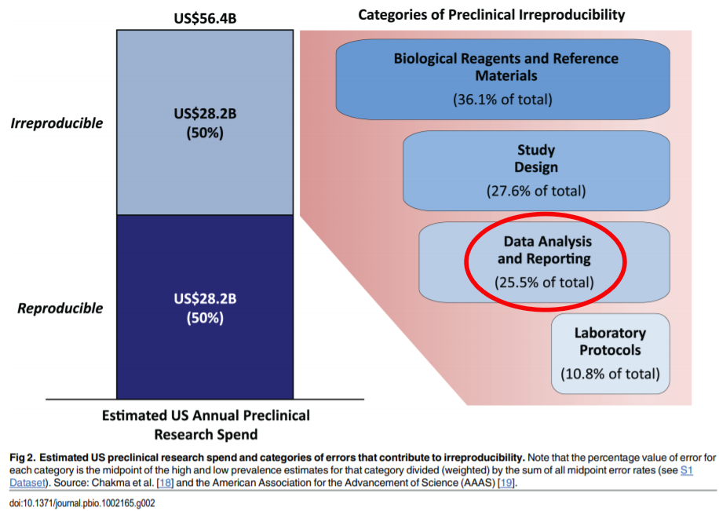

# Introduction {#introduction}

```{r initialSetup, message=FALSE, warning=FALSE, include=F}
library(bookdown)
library(knitr)
# tidy code
#knitr::opts_chunk$set(tidy = TRUE)
# to try to fix issue with ggplotly() not showing htmlwidget properly
knitr::opts_chunk$set(widgetframe_widgets_dir = 'widgets' )
# Get rid of messages and warnings
knitr::opts_chunk$set(warning = FALSE, message = FALSE)
# Try getting rid of extra unwanted outputs
knitr::opts_knit$set(progress=FALSE, verbose = FALSE)
# Avoid scientific notation
options(scipen=999)
```

Welcome to this programming tutorial on machine learning!

In this tutorial we will use live data from the cryptocurrency markets to provide a hands-on and complete example of time-series machine learning for everyone.

## What will I learn?

-   The focus of the tutorial is on supervised machine learning, a process for building models that can predict future events, such as cryptocurrency prices. You will learn how to use the [`caret`](https://topepo.github.io/caret/index.html) package to make many different predictive models, and tools to evaluate their performance.

-   In this tutorial you will primarily learn about tools for the R programming language developed by [RStudio](https://rstudio.com/) and more specifically the [`tidyverse`](https://www.tidyverse.org/). If you are not familiar with these open source products, don't worry. We'll introduce these throughout the tutorial as needed.


-   Before we can make the models themselves, we will need to "clean" the data. You will learn how to perform "group by" operations on your data using the [`dplyr`](https://dplyr.tidyverse.org/) package and to clean and modify grouped data.

<!-- -   You will be exposed to some useful data pre-processing R packages. -->

-   You will learn to visualize data using the [`ggplot2`](https://ggplot2.tidyverse.org/) package, as well as some powerful [tools to extend the functionality of ggplot2](https://exts.ggplot2.tidyverse.org/).

-   You will gain a better understanding of the steps involved in any supervised machine learning process, as well as considerations you might need to keep in mind based on your specific data and the way you plan on acting on the predictions you have made. Each problem comes with a unique set of challenges, but there are steps that are necessary in creating any supervised machine learning model, and questions you should ask yourself regardless of the specific problem at hand.

<!-- - [TODO - Add note on cross validation] -->

-   You will learn about the value of "reproducible" research.

-   You will also learn a little about cryptocurrencies themselves, but **this is not a tutorial centered around trading or blockchain technology**.

## Before Getting Started

You can toggle the sidebar on the left side of the page by clicking on the menu button in the top left, or by pressing on the **s** key on your keyboard. You can read this document as if it were a book, scrolling to the bottom of the page and going to the next "chapter", or navigating between sections using the sidebar.

This document is the tutorial itself, but in order to make the tutorial more accessible to people with less programming experience (or none) we created a [high-level version of this tutorial](https://cryptocurrencyresearch.org/high-level/), which simplifies both the problem at hand (what we want to predict) and the specific programming steps, but uses the same tools and methodology providing easier to digest examples on one cryptocurrency using a static dataset that does not get updated over time.

### High-Level Version {#high-level-version}

We recommend for everyone to run the code in the [high-level version first](https://cryptocurrencyresearch.org/high-level/) to get more comfortable with the tools we will be using. If you are not very familiar with programming in either R or Python, or are not sure what cryptocurrencies are, you should **definitely** work your way through the [high-level version first](https://cryptocurrencyresearch.org/high-level/).

Below is an embedded version of the high-level version, you can click on the presentation below and press the **`f`** button on your keyboard to full-screen it, or use any of the links above to view it in its own window:

```{r embed_high-level, echo=F}
knitr::include_url("https://cryptocurrencyresearch.org/high-level/")
```

```{block2, type='infoicon'}
When following along with the high-level tutorial embedded above, the results will be completely reproducible and the document is static and does not update over time meaning your results will exactly match those shown. The document you are currently reading this text on on the other hand updates every 12 hours. You will be able to access the same data source, but it updates hourly by the 8th minute of every hour with the most recent data, so this document and your results won't perfectly match.
```

<!-- ### Approach taken -->

<!-- It is also worth mentioning that we will be taking a very practical approach to machine learning. Because we are modeling many cryptocurrencies independently at the same time and the dataset evolves as time passes, it becomes difficult to make a decision across the board in terms of what the "best model" to use is because it may change based on the specific cryptocurrency in question and/or over time. -->

<!-- [TODO - KEEP ADDING HERE?] -->

## Format Notes

-   You can hide the sidebar on the left by pressing the ***s*** key on your keyboard.

-   The cryptocurrency data was chosen to produce results that change over time and because these markets don't have any downtime (unlike the stock market).

<!-- [TODO - JUST LIKE THE HIGH LEVEL VERSION, WE WILL USE COLOR CODING] -->

-   Whenever an **R package** is referenced, the text will be [**colored orange**]{style="color: #ae7b11;"}. We will discuss ***R packages*** and the rest of the terms below later in this document, but if you are not familiar with these terms please look through the [high-level version first](https://cryptocurrencyresearch.org/high-level/).

-   Whenever a **function** is referenced, it will be [**colored green**]{style="color: green;"}.

-   Whenever an **R object** is referenced, it will be [**colored blue**]{style="color: blue;"}. We will also refer to the **parameters** of functions in [**blue**]{style="color: blue;"}.

-   When a **term** is particularly common in machine learning or data science, we will call it out with [**purple text**]{style="color: purple;"}, but only the first time it appears.

-   Whenever text is **`highlighted this way`**, that means it is a snippet of R code, which will usually be done to bring attention to specific parts of a longer piece of code.


## Plan of Attack

How will we generate predictive models to predict cryptocurrency prices? At a high level, here are the steps we will be taking:

1.  [Setup guide](#setup). Installation guide on getting the tools used installed on your machine.

2.  [Explore data](#explore-data). What ***is*** the data we are working with? How "good" is the "quality"?

3.  [Prepare the data](#data-prep). Make adjustments to "clean" the data based on the findings from the previous section to avoid running into problems when making models to make predictions.

4.  [Visualize the data](#visualization). Visualizing the data can be an effective way to understand relationships, trends and outliers before creating predictive models, and is generally useful for many different purposes. Definitely the most fun section!

5.  [Make predictive models](#predictive-modeling). Now we are ready to take the data available to us and use it to make predictive models that can be used to make predictions about future price movements using the latest data.

6.  [Evaluate the performance of the models](#evaluate-model-performance). Before we can use the predictive models to make predictions on the latest data, we need to understand how well we expect them to perform, which is also essential in detecting issues.

## Who is this example for?

Are you a Bob, Hosung, or Jessica below? This section provides more information on how to proceed with this tutorial.

-   **Bob (beginner)**: Bob is someone who understands the idea of predictive analytics at a high level and has heard of cryptocurrencies and is interested in learning more about both, but he has never used R. Bob would want to [opt for the more high-level version of this tutorial](https://cryptocurrencyresearch.org/high-level/). Bob might benefit from reading the free book ["R for Data Science"](https://r4ds.had.co.nz/) as well before attempting this tutorial.

-   **Hosung (intermediate)**: Hosung is a statistician who learned to use R 10 years ago. He has heard of the tidyverse, but doesn't regularly use it in his work and he usually sticks to base R as his preference. Hosung should start with the [**high-level version of this tutorial**](https://cryptocurrencyresearch.org/high-level/) and later return to this version.

-   **Jessica (expert)**: Jessica is a business analyst who has experience with both R and the Tidyverse and uses the pipe operator (**`%\>%`**) regularly. Jessica should skim over the high-level version before [**moving onto the next section**](#introduction) for the detailed tutorial.


## Reproducibility

One of the objectives of this document is to showcase the power of [**reproducibility**]{style="color: purple;"}. This tutorial does not provide coded examples on making code reproducible, but it's worth a quick discussion. The term itself is defined in different ways:

-   We can think of something as reproducible if anyone can run the exact same analysis and end up with our exact same results. This is how the [high-level version of the tutorial](#high-level-version) works.

-   Depending on our definition, we may consider something reproducible if we can run the same analysis that is shown on a newer subset of the data without running into problems. This is how this version works, where the analysis done on your own computer would be between 1 and 12 hours newer than the one shown on this document.

### The cost of non-reproducible research

Reproducibility is especially important for research in many fields, but is a valuable tool for anyone who works with data, even within a large corporation. If you work with Excel files or any kind of data, there are tools to be aware of that can save you a lot of time and money. Even if you do things that are "more involved", for example using your data to run your analysis separately and then putting together a presentation with screenshots of your results with commentary, this is also something you can automate for the future. If you do any kind of repeated manual process in Excel, chances are you would be better off creating a script that you can simply kick off to generate new results. 

Reproducibility is all about making the life of anyone who needs to run the analysis as simple as possible, including and especially for the author herself. When creating a one-time analysis, the tool used should be great for the specific task as well as have the side-effect of being able to run again with the click of a button. In our case we are using a tool called [**R Markdown**]{style="color: purple;"} [@R-rmarkdown].
<!-- because if important discoveries are made others will want to perform their own experiments and analysis before they start being accepted as fact. -->

Not being transparent about the methodology and data (when possible) used is a quantifiable cost that should be avoided, both in research and in business. A study conducted in 2015 for example approximated that for preclinical research (mostly on pharmaceuticals) alone the economy suffers a cost of $28 Billion a year associated with non-reproducible research in the United States [@freedman_economics_2015]:

```{r out.height = "460px", out.width='800px', echo=F}
knitr::include_graphics("images/TheEconomicsOfReproducibilityInPreclinicalRe.pdf")
```

Reproducibility as discussed in the paper embedded above relates to many aspects of the specific field of preclinical research, but in their work they identified 4 main categories that drove costs associated with irreproducibility as it pertains to preclinical research in the United States: 



The "Data Analysis and Reporting" aspect (circled in red in the screenshot above) of a project is shared across many disciplines. As it related to preclinical research, in their breakdown they attribute roughly $7.19 Billion of the costs of irreproducible preclinical research to data analysis and reporting, which could potentially be avoided through the usage of open source tools that we are utilizing for this tutorial. These costs should pale in comparison to the other three categories, and this example is meant to show that there currently exists a costly lack of awareness around these tools; the tutorial itself is meant as an example to showcase the power of these open source tools and the fact that a lot of complex analysis, including this one, can be written used reproducible tools that improve the quality and cost-effectiveness of projects.

<!-- In business reproducibility can be really valuable as well, being able to run an analysis with the click of a button can save a business a lot of money, and the open source tools available through R and Python  -->

### GitHub

<!-- To that end, rather than saying "this document can be refreshed at any point", the tutorial itself is not only reproducible (in terms of performing the same analysis for the future), but is in fact run on a recurring schedule. -->

As of 2020, the most popular way of sharing open source data science work is through a website called [[**GitHub**](https://github.com/)]{style="color: purple;"} which allows users to publicly share their code and do much more. This document gets refreshed using a tool called [[**Github Actions**](https://github.com/features/actions)]{style="color: purple;"} that runs some code and updates the file you are looking at on the public **GitHub** [**Repository**]{style="color: purple;"} for the project. The website then updates to show the latest version every time the document is refreshed on the GitHub repository.

<!-- [TODO - INTRODUCE GITHUB HERE] -->

#### GitHub Repository

The public **GitHub Repository** associated with this tutorial is not only a website for us to easily distribute all the code behind this document for others to view and use, but also where it actually runs. By clicking on the option that looks like an eye in the options given at the top of the document, you can view the raw code for the page you are currently viewing on the GitHub repository. Every 12 hours, a process gets kicked off on the page associated with our project on GitHub.com and refreshes these results. Anyone can view the latest runs as they execute over time here: <https://github.com/ries9112/cryptocurrencyresearch-org/actions>

In the [next section](#setup) we will talk more about the GitHub Repository for this tutorial, for now you can check on the latest run history for this document, which is expected to update every 12 hours every day: <https://github.com/ries9112/cryptocurrencyresearch-org/actions>

<!-- If you are seeing ✅ associated with the most recent runs at the link above, that means you are looking at a version that refreshed in the last 12 hours. If you are seeing red ❌ on the latest runs, you may be looking at an older analysis, but that should not be the case, check the timestamp at the top of this document to be sure. -->

If you are running into problems using the code or notice any problems, please let us know by creating an ***issue*** on the GitHub repository: <https://github.com/ries9112/cryptocurrencyresearch-org/issues>

Go to the [next section](#setup) for instruction on getting setup to follow along with the code run in the tutorial. You can run every step either in the cloud on your web browser, or in your own R session. You can even make a copy of the GitHub Repository on your computer and run this "book" on the latest data (updated hourly), and make changes wherever you would like. All explained in the next section ➡️

## Disclaimer

```{block2, note-disclaimer, type='rmdimportant'}
This tutorial is made available for learning and educational purposes only and the information to follow does not constitute trading advice in any way shape or form. We avoid giving any advice when it comes to trading strategies, as this is a very complex ecosystem that is out of the scope of this tutorial; we make no attempt in this regard, and if this, rather than data science, is your interest, your time would be better spent following a different tutorial that aims to answer those questions.
```

It should also be noted that this tutorial has nothing to do with trading itself, and that there is a difference between predicting crypotcurrency prices and creating an effective trading strategy. [**See this later section for more details on why the results shown in this document mean nothing in terms of the effectiveness of a trading strategy**](#considerations).

In this document we aimed to predict the change in cryptocurrency prices, and **it is very important to recognize that this is not the same as being able to successfully make money trading on the cryptocurrency markets**. 


